# 12. 难点专题详解：讲解、配图、例题与公式

这是一份可连续阅读的难点专题合订本。13 个核心难点的讲解、推导、配图、完整例题和自测题都直接放在本文，无需跳转到分散的专题文件。

阅读方式：先理解问题与条件，再看公式推导和图片；完整例题看完后，遮住每节末尾的参考答案，独立做一遍自测题。新增练习均为自编例题，不是未经核验的真题。

公式统一使用 Typora 独立公式块；短说明使用直立文字。图片在本文直接展示，图片文件保存在 `assets` 中；复制笔记时一并复制该目录。

<a id="contents"></a>

## 12.0 内容导航

| 章节 | 核心难点 | 需要弄懂的问题 |
|---|---|---|
| 12.1 | [梅森公式](#topic-01) | 不接触回路与余因子为什么进入公式 |
| 12.2 | [劳斯判据与特殊行](#topic-02) | 不求根怎样计数，特殊行怎么处理 |
| 12.3 | [Nyquist 判据与绕数](#topic-03) | 为何观察负一点，绕数怎样决定稳定 |
| 12.4 | [根轨迹规则的共同来源](#topic-04) | 角度、实轴规则与渐近线怎样来自同一方程 |
| 12.5 | [系统型别与稳态误差](#topic-05) | 积分阶次怎样决定长期跟踪误差 |
| 12.6 | [超前校正公式的来源](#topic-06) | 最大超前角和对应频率怎样推导 |
| 12.7 | [矩阵指数与状态响应](#topic-07) | 耦合为何产生时间乘指数 |
| 12.8 | [能控能观与 PBH 判据](#topic-08) | 矩阵秩如何代表输入与观测方向 |
| 12.9 | [相似变换与最小实现](#topic-09) | 换坐标和删除隐藏状态为何不同 |
| 12.10 | [极点配置与分离原理](#topic-10) | 控制与估计的极点为何能分开设计 |
| 12.11 | [Lyapunov 方程与能量几何](#topic-11) | 二次型为何能证明稳定 |
| 12.12 | [LQR 与 Riccati 方程](#topic-12) | 优化怎样产生 Riccati 二次项 |
| 12.13 | [零阶保持与精确离散化](#topic-13) | 精确采样与欧拉近似为何不同 |

经典控制为 12.1—12.6；现代控制为 12.7—12.13。每节都包含配图、数学表达式、数值例题或完整反例，以及附答案的自测题。

补充入口：[易错诊断与计算技巧训练](#calculation-clinic) · [线控与自控贯通：公式、技巧与难点](#classic-linear-bridge) · [Nyquist 计数、半次穿越与零频处理](#nyquist-conventions) · [其他判据与公式的不同写法对照](#formula-variants)。


---

<a id="topic-01"></a>

## 12.1 梅森公式

### 12.1.0 这份专题解决什么

梅森公式常被教材压缩成一行，但考试真正容易丢分的是：

1. 前向通路是否漏列；
2. 同一回路是否重复计算；
3. 接触回路与不接触回路是否判断正确；
4. 余因子为什么要删除某些回路；
5. 多输入系统是否重新选择源点；
6. 最终结果能否用节点方程验算。

本专题从节点方程出发证明公式，再给出三类完整例题。

#### 先用一张图理解“不接触回路乘积”


图中自回路分别只经过两个不同节点，因此可以同时选择，不会重复占用节点。先不用梅森公式，直接列式：

$$
\begin{aligned}
x&=r+ax,\\
y&=gx+by.
\end{aligned}
$$

依次消元得到：

$$
\frac yr=\frac g{(1-a)(1-b)}
=\frac g{1-a-b+ab}.
$$

分母里的乘积项正是两个不接触回路共同产生的项。若只背“减去全部回路”而漏掉乘积，就连这个两节点系统都算不对。前向通路经过两个节点，两条回路都与它接触，故该通路的余因子为一。

自编数值例：取支路增益为 3、两个自回路增益分别为 0.2 与 0.5，输入为 1。逐节点计算得到：

$$
x=1.25,\qquad y=7.5,\qquad
\Delta=1-0.2-0.5+0.1=0.4,\qquad g/\Delta=7.5.
$$

两种算法一致。图由全局 Python 生成，脚本见 [难点配图脚本](scripts/generate_difficult_concepts.py)。这是代数结构示例，不能把常数支路直接解释成含动态过程的稳定性结论。后文 12.1.5 再用行列式解释一般情况。

---

### 12.1.1 先从结构图的三个基本公式开始

#### 12.1.1.1 串联

$$
X=G_1R,
$$

$$
Y=G_2X.
$$

消去中间变量：

$$
\boxed{
\frac{Y}{R}=G_1G_2.
}
$$

#### 12.1.1.2 并联

$$
Y_1=G_1R,
$$

$$
Y_2=G_2R.
$$

若两支路相加：

$$
Y=Y_1+Y_2.
$$

所以：

$$
\boxed{
\frac{Y}{R}=G_1+G_2.
}
$$

若第二支路在比较点取负号：

$$
\boxed{
\frac{Y}{R}=G_1-G_2.
}
$$

#### 12.1.1.3 负反馈

$$
E=R-HY,
$$

$$
Y=GE.
$$

代入并移项：

$$
Y=G(R-HY),
$$

$$
(1+GH)Y=GR.
$$

因此：

$$
\boxed{
\frac{Y}{R}=\frac{G}{1+GH}.
}
$$

> @重点：这些公式都不是图形口诀，而是消去中间信号的结果。梅森公式只是把大规模消元一次写完。


读图时先沿箭头写节点方程，再消去中间节点。蓝色方框表示传递环节，橙色圆表示比较或求和节点，红色箭头表示反馈支路。

---

### 12.1.2 怎样把结构图变成信号流图

信号流图由节点和有向支路组成：

1. 节点表示信号变量；
2. 箭头表示传递方向；
3. 箭头旁的量是支路增益；
4. 节点值等于所有流入支路贡献之和。

若节点方程为：

$$
X=aR+bY+cZ,
$$

则信号流图中有：

$$
R\xrightarrow{a}X,
$$

$$
Y\xrightarrow{b}X,
$$

$$
Z\xrightarrow{c}X.
$$

负反馈的负号直接写入支路增益。例如：

$$
E=R-HY
$$

对应：

$$
R\xrightarrow{1}E,
$$

$$
Y\xrightarrow{-H}E.
$$

转换步骤：

1. 给每个比较点输出、环节输出和独立输入命名；
2. 对每个节点写一条信号方程；
3. 按方程右侧逐项画入射支路；
4. 检查每个正负号；
5. 确认同一个分支信号没有被误画成两个不同节点。

---

### 12.1.3 四个基本定义

#### 12.1.3.1 前向通路

前向通路是从输入节点到输出节点的有向路径，并且任何节点不重复经过。

第若干条前向通路的增益为沿途支路增益之积：

$$
P_k
=
\prod_{\text{第 }k\text{ 条前向通路}}g_i.
$$

#### 12.1.3.2 回路

回路是从某节点出发又回到该节点的闭合有向路径，除起点与终点外不重复经过节点。

回路增益为：

$$
L_i
=
\prod_{\text{第 }i\text{ 个回路}}g_j.
$$

同一回路从不同节点开始书写，仍是同一个回路，不能重复计数。

#### 12.1.3.3 接触回路

两个回路只要共享至少一个节点，就称为接触回路。

判断接触看的是共享节点，而不是共享支路。

#### 12.1.3.4 余因子

对第若干条前向通路，删除所有与该通路接触的回路。使用剩余回路重新形成的图行列式称为：

$$
\Delta_k.
$$

若所有回路都与该前向通路接触，则：

$$
\Delta_k=1.
$$

---

### 12.1.4 梅森增益公式

输入到输出的总传递增益为：

$$
\boxed{
T
=
\frac{Y}{R}
=
\frac{\displaystyle\sum_{k=1}^{m}P_k\Delta_k}
{\Delta}.
}
$$

其中图行列式为：

$$
\boxed{
\Delta
=
1
-\sum_iL_i
+\sum_{\substack{i<j\\L_i,L_j\text{ 不接触}}}L_iL_j
-\sum_{\substack{i<j<r\\L_i,L_j,L_r\text{ 两两不接触}}}L_iL_jL_r
+\cdots.
}
$$

符号按以下规律交替：

$$
1,\quad -,\quad +,\quad -,\quad \cdots.
$$

> @重点：二阶乘积只取不接触回路对；三阶乘积只取两两不接触的三个回路。

---

### 12.1.5 梅森公式的证明

#### 12.1.5.1 把全部节点方程写成矩阵

设内部节点组成向量：

$$
x=
\begin{bmatrix}
x_1&x_2&\cdots&x_n
\end{bmatrix}^{T}.
$$

信号流图的全部节点方程可以写成：

$$
x=Ax+bR.
$$

移项：

$$
(I-A)x=bR.
$$

若输出为：

$$
Y=c^{T}x+dR,
$$

则：

$$
\frac{Y}{R}
=
d+c^{T}(I-A)^{-1}b.
$$

使用伴随矩阵公式：

$$
(I-A)^{-1}
=
\frac{\operatorname{adj}(I-A)}
{\det(I-A)}.
$$

所以所有节点解具有共同分母：

$$
\det(I-A).
$$

#### 12.1.5.2 为什么分母只出现不接触回路

展开行列式时，每一项必须从每行、每列各选一个元素。

若选中的若干支路形成一个闭合置换，它们在信号流图中正好形成一个回路。选择一个回路产生：

$$
-L_i.
$$

若同时选择两个回路，因为同一行和同一列不能重复使用，这两个回路不能共享节点，所以只能是不接触回路。对应项为：

$$
+L_iL_j.
$$

同时选择三个两两不接触回路，对应：

$$
-L_iL_jL_r.
$$

因此：

$$
\det(I-A)
=
1-\sum L_i+\sum L_iL_j-\sum L_iL_jL_r+\cdots.
$$

所以：

$$
\boxed{
\det(I-A)=\Delta.
}
$$

#### 12.1.5.3 为什么分子出现前向通路和余因子

用克拉默法则或伴随矩阵求输入到输出的关系时，一个非零分子项必须先选出一条从输入到输出的前向通路。

这条前向通路已经占用了沿途节点。行列式剩余部分不能再次使用这些节点，所以所有与该前向通路接触的回路必须删除。

剩余节点上的回路仍按图行列式规则组合，得到：

$$
\Delta_k.
$$

因此第若干条前向通路产生的分子贡献为：

$$
P_k\Delta_k.
$$

对全部前向通路相加：

$$
\sum_kP_k\Delta_k.
$$

最终：

$$
\boxed{
T
=
\frac{\sum_kP_k\Delta_k}{\Delta}.
}
$$

> @理解：不接触回路来自行列式的行列不能重复；余因子删除接触回路，是因为前向通路已经占用了相应节点。

---

### 12.1.6 例一：一条前向通路、两个接触回路


图中的蓝色箭头组成唯一前向通路；两条红色反馈支路分别形成大小两个回路。两个回路共享节点，所以不能把它们的乘积写入图行列式。

设唯一前向通路为：

$$
P_1=G_1G_2.
$$

两个反馈回路为：

$$
L_1=-G_1H_1,
$$

$$
L_2=-G_1G_2H_2.
$$

两个回路共享节点，所以互相接触，不存在二阶不接触回路乘积。

图行列式：

$$
\Delta
=
1-L_1-L_2.
$$

代入：

$$
\Delta
=
1+G_1H_1+G_1G_2H_2.
$$

两个回路都与前向通路接触：

$$
\Delta_1=1.
$$

所以：

$$
\boxed{
T
=
\frac{G_1G_2}
{1+G_1H_1+G_1G_2H_2}.
}
$$

#### 节点方程验算

设第一个环节输入为：

$$
E=R-H_1X-H_2Y.
$$

并有：

$$
X=G_1E,
$$

$$
Y=G_2X.
$$

由：

$$
X=\frac{Y}{G_2}
$$

可得：

$$
Y
=
G_1G_2
\left(
R-H_1\frac{Y}{G_2}-H_2Y
\right).
$$

整理：

$$
\frac{Y}{R}
=
\frac{G_1G_2}
{1+G_1H_1+G_1G_2H_2}.
$$

与梅森公式一致。

---

### 12.1.7 例二：两条前向通路、两个不接触回路


上、下两条前向通路只共享输入和输出节点，两个局部反馈回路位于不同内部节点组。回路之间不共享节点，所以图行列式必须包含二阶乘积项。

设两条前向通路为：

$$
P_1=G_1G_2G_3,
$$

$$
P_2=G_4G_5.
$$

第一条通路上的反馈回路为：

$$
L_1=-G_2H_1.
$$

第二条通路上的局部回路为：

$$
L_2=-K.
$$

两个回路不共享节点，所以：

$$
\Delta
=
1-L_1-L_2+L_1L_2.
$$

代入并因式分解：

$$
\Delta
=
1+G_2H_1+K+KG_2H_1,
$$

$$
\Delta
=
(1+G_2H_1)(1+K).
$$

第一条前向通路只与第一个回路接触：

$$
\Delta_1=1-L_2=1+K.
$$

第二条前向通路只与第二个回路接触：

$$
\Delta_2=1-L_1=1+G_2H_1.
$$

所以：

$$
\boxed{
T
=
\frac{
G_1G_2G_3(1+K)
+G_4G_5(1+G_2H_1)
}{
(1+G_2H_1)(1+K)
}.
}
$$

拆开：

$$
\boxed{
T
=
\frac{G_1G_2G_3}{1+G_2H_1}
+\frac{G_4G_5}{1+K}.
}
$$

这正是两条独立闭环支路输出相加的结果。

#### 数值例

取：

$$
G_1=1,
\qquad
G_2=2,
\qquad
G_3=3,
$$

$$
H_1=\frac12,
\qquad
G_4=1,
\qquad
G_5=4,
\qquad
K=2.
$$

则：

$$
P_1=6,
\qquad
P_2=4,
$$

$$
L_1=-1,
\qquad
L_2=-2.
$$

图行列式：

$$
\Delta
=
1-(-1)-(-2)+(-1)(-2)
=6.
$$

两个余因子：

$$
\Delta_1=3,
\qquad
\Delta_2=2.
$$

总增益：

$$
T
=
\frac{6\cdot3+4\cdot2}{6}
=
\boxed{\frac{13}{3}}.
$$

分别计算两条闭环支路：

$$
\frac{6}{1+1}
+\frac{4}{1+2}
=
3+\frac43
=
\frac{13}{3}.
$$

验算一致。

---

### 12.1.8 例三：多输入系统


求不同输入通道时，图本身不变，只更换源点并把其他独立输入置零。红色反馈回路保持不变，蓝色和绿色前向通路分别对应参考输入与扰动输入。

若参考输入和扰动同时作用：

$$
Y=T_rR+T_nN.
$$

求参考输入通道时，令：

$$
N=0.
$$

以参考输入节点为源点，求：

$$
T_r=\frac{Y}{R}.
$$

求扰动通道时，令：

$$
R=0.
$$

以扰动节点为新的源点，重新寻找前向通路，求：

$$
T_n=\frac{Y}{N}.
$$

回路集合通常不变，所以两个传递函数一般具有相同图行列式：

$$
\Delta.
$$

但两个源点对应的前向通路不同，所以分子一般不同。

例如参考通路只有：

$$
P_r=G_1G_2,
$$

扰动从第二个环节前注入，对应通路为：

$$
P_n=G_2.
$$

若唯一回路为：

$$
L=-G_1G_2H,
$$

则：

$$
\Delta=1-L=1+G_1G_2H.
$$

回路与两条通路均接触：

$$
\Delta_r=\Delta_n=1.
$$

因此：

$$
\boxed{
\frac{Y}{R}
=
\frac{G_1G_2}{1+G_1G_2H}.
}
$$

$$
\boxed{
\frac{Y}{N}
=
\frac{G_2}{1+G_1G_2H}.
}
$$

> @重点：梅森公式一次只计算一个源点到一个汇点。多输入问题必须逐源置零。

---

### 12.1.9 考场书写模板

第一步，列前向通路：

$$
P_1,\ P_2,\ \ldots,\ P_m.
$$

第二步，列全部单回路：

$$
L_1,\ L_2,\ \ldots,\ L_q.
$$

第三步，列不接触回路组：

$$
(L_i,L_j),
$$

$$
(L_i,L_j,L_r).
$$

第四步，计算图行列式：

$$
\Delta
=
1-\sum L_i+\sum L_iL_j-\sum L_iL_jL_r+\cdots.
$$

第五步，对每条前向通路删除接触回路：

$$
\Delta_1,\ \Delta_2,\ \ldots,\ \Delta_m.
$$

第六步，代入：

$$
\boxed{
T
=
\frac{\sum P_k\Delta_k}{\Delta}.
}
$$

第七步，至少做一个验算：

1. 用节点方程消元；
2. 令某个反馈增益为零，检查退化结果；
3. 检查各项量纲；
4. 检查负反馈回路代入负回路增益后，分母是否出现合理的加号。

---

### 12.1.10 高频错误清单

1. 回路增益漏掉反馈支路的负号；
2. 同一回路从不同节点出发被重复计算；
3. 把共享节点的回路误认为不接触；
4. 把接触回路乘积写进图行列式；
5. 计算余因子时删除了不该删除的回路；
6. 忘记前向通路之间即使接触也要分别计入分子；
7. 多输入题没有更换源点重新列前向通路；
8. 只写最终公式，没有列出通路、回路和余因子；
9. 用梅森公式处理含非线性乘积的节点方程；
10. 算完没有用节点方程或特殊参数退化进行验算。

> @重点：梅森公式的真正难点不是代公式，而是完整、无重复地识别图中的路径和回路。

---

### 12.1.11 其他常被教材略去的推导在哪里

本套资料中的类似推导已经集中在第 2 份文档：

- 2.12：负反馈分母为什么出现加号；
- 2.13：系统型别为什么决定不同输入的稳态误差；
- 2.14—2.15：二阶超调量和调节时间公式的来源；
- 2.16：根轨迹角度条件和幅值条件；
- 2.17：Bode 图斜率为什么按每十倍频变化；
- 2.18：Nyquist 判据为什么围绕临界点计数。

这些内容与本专题共同构成“公式来源—应用步骤—例题验算”主线。

### 12.1.练习 自测题（自编，附答案）

**题目**：沿用本节开头的两个不接触自回路图，改取以下增益，求输出与输入之比，并用节点方程核对。

$$
g=3,\qquad a=-0.2,\qquad b=0.5.
$$

**参考答案与检查**：

$$
\Delta=(1+0.2)(1-0.5)=0.6,\qquad y/r=3/0.6=5.
$$

注意第一个回路增益本来就是负数，代入时不能再凭“反馈”二字额外添一个负号。

[返回内容导航](#contents)


---

<a id="topic-02"></a>

## 12.2 劳斯判据与特殊行

需要的基础：多项式、复根成对、三阶方程的系数。完整劳斯定理涉及多项式的实根计数；本篇区分定理本身与能直接验证的表格运算，不把几张根图当证明。

### 12.2.1 先明确判断的对象

稳定性问的是完整闭环特征多项式的根，不是题目给出的开环分母。例如单位负反馈开环的分母和分子相加后才得到闭环特征式。

**劳斯定理**：没有虚轴根且特殊行已正确处理时，劳斯表第一列的符号变化次数等于右半平面根数。它的作用是用系数的代数操作替代逐个求根。

### 12.2.2 表格不是随意拼数

对三阶多项式，表格为：

$$
\begin{array}{c|cc}
s^3&a_3&a_1\\
s^2&a_2&a_0\\
s^1&(a_2a_1-a_3a_0)/a_2&0\\
s^0&a_0&0
\end{array}
$$

前两行分别收集奇数次项和偶数次项；下一行的交叉相乘来自逐步消去最高次项的多项式余式运算。它解释了递推形式，但“余式符号变化等于右半平面根数”仍是所引用定理的内容。

取最高次系数正，三阶严格稳定条件为：

$$
a_3,a_2,a_1,a_0>0,\qquad a_2a_1>a_3a_0.
$$

### 12.2.3 完整例题与边界

自编例题：

$$
D(s)=s^3+3s^2+2s+K.
$$

第一列为：

$$
1,\quad3,\quad(6-K)/3,\quad K.
$$

全部同号得到严格稳定范围：

$$
0<K<6.
$$

取边界代回，不用近似求根：

$$
\begin{aligned}
K=0:&\quad D=s(s+1)(s+2);\\
K=6:&\quad D=(s+3)(s^2+2).
\end{aligned}
$$

前者有原点根，后者有一对纯虚根。正好解释为何不能取等号。取增益为 8，第一列为正、正、负、正，出现两次变号，有两个右半平面根。


图中叉号是真实计算的闭环根，灰色区域是左半平面。三个面板用同一个模型，展示稳定、临界和不稳定。图用于回查结论，不能替代劳斯定理。

### 12.2.4 两种零，处理方法完全不同

仅第一列元素为零而该行不全零时，用趋于零的正数替代，再检查符号极限。整行全零时，从上一行构造辅助多项式，以其导数的系数替换零行，继续计算。

全零行意味着存在关于原点对称的根；并不保证全是纯虚根。例如：

$$
s^4-1=(s-1)(s+1)(s^2+1).
$$

### 12.2.5 实战怎么用

先写完整特征式，再列前两行；特殊值单独处理，最后把严格不等式取交集。题目要求极点位于某条竖线左侧时，先平移变量，再使用劳斯判据。

### 12.2.练习 自测题（自编，附答案）

**题目**：求下列特征多项式的严格稳定增益范围，并解释上边界。

$$
D(s)=s^3+4s^2+3s+K.
$$

**参考答案与检查**：

$$
0<K<12,\qquad K=12:\ D(s)=(s+4)(s^2+3).
$$

第一列为 1、4、四分之一乘以十二减增益、增益；上边界含纯虚根，不取等号。

[返回内容导航](#contents)


---

<a id="topic-03"></a>

## 12.3 Nyquist 判据与绕数

需要的基础：复数、闭环特征方程、零点与极点。绕数的严格桥梁是辩值原理；本篇从它推导控制中的计数关系，不声称用初等代数证明辩值原理。

### 12.3.1 为什么不是观察原点

负反馈闭环特征方程为：

$$
F(s)=1+L(s)=0.
$$

闭环极点是函数 F 的零点。观察 F 绕原点，与观察 L 绕负一点，几何上只差一个单位的平移。

### 12.3.2 辩值原理把“零极点”变成“相角变化”

在不经过零极点的闭合围线上，每个被包围的零点贡献一圈相角变化，每个极点贡献相反一圈。本篇统一采用：右半平面围线顺时针遍历，映射曲线顺时针绕圈数记为正。

$$
N_{\rm cw}=Z-P,\qquad Z=P+N_{\rm cw}.
$$

其中 P 是开环在右半平面的极点数，Z 是闭环在右半平面的极点数。闭环严格稳定还需要没有虚轴根。

$$
Z=0\quad\Rightarrow\quad N_{\rm cw}=-P.
$$

因此开环已有一个不稳定极点时，稳定闭环需要逆时针绕负一点一圈；“不包围负一点就稳定”只适合开环无右半平面极点的相应情形。

### 12.3.3 一个能同时用代数验算的例题

自编例题：

$$
L(s)=\frac{K}{s-1},\qquad K>0.
$$

开环有一个右半平面极点。闭环直接求得：

$$
1+\frac{K}{s-1}=0\quad\Rightarrow\quad s=1-K.
$$

所以增益大于 1 时稳定。频率响应为：

$$
L(j\omega)=\frac{-K}{1+\omega^2}
-j\frac{K\omega}{1+\omega^2}.
$$

消去频率，得到圆：

$$
\left(\operatorname{Re}L+\frac K2\right)^2+
(\operatorname{Im}L)^2=\left(\frac K2\right)^2.
$$


沿完整频率方向从负无穷走到正无穷，圆逆时针走一圈。增益为 2 时包含负一点，计数给出零个右半平面闭环根；增益为 0.5 时不包含负一点，仍有一个不稳定根。增益为 1 时经过临界点，闭环根落在原点。

<a id="nyquist-conventions"></a>

### 12.3.4 教材里的 Z=P−R、R=2(N₊−N₋) 是什么

下列简化计数以实系数、严格真有理的负反馈环路为基本模型，不用不稳定极零约消隐藏内部模态。除单独讨论的边界例外，完整映射不能经过临界点；若有其他虚轴极点或高频非零终点，应根据实际完整围线重新检查补弧与端点。

**先给对应关系**：前文把完整曲线的顺时针净绕数记为 N，本小节为避免撞符号，明确写成带方向下标的形式；你在一些教程里见到的 R，通常表示完整曲线的逆时针净绕数。

$$
\begin{gathered}
N_{\rm cw}=Z-P,\qquad R_{\rm ccw}=-N_{\rm cw}=P-Z,\\
\boxed{Z=P+N_{\rm cw}=P-R_{\rm ccw}.}
\end{gathered}
$$

**这里的 P、Z 都是开右半平面内的根数，按重数计数**：P 属于开环极点，Z 属于闭环特征根；不是全部极点数，更不是零点、极点的英语首字母随意对应。本文将原点极点用向右凹陷排除，所以它不计入 P，影响由映射圆弧补回。

| 教材中的写法 | 该符号必须怎样定义 | 与本文的关系 |
|---|---|---|
| 顺时针圈数加到开环右根数上 | 完整闭合曲线，顺时针为正 | 前文的计数约定 |
| 从开环右根数减去逆时针圈数 | 完整闭合曲线，逆时针为正 | 你记得的 R 写法 |
| 正穿越减负穿越，再乘二 | 只统计正频率一半，包含必要补弧与端点处理 | 换算为完整逆时针净绕数 |
| 正穿越减负穿越，不乘二 | 已经统计完整闭合曲线 | 再乘二会重复计数 |

中文课件确实使用了“正频率穿越次数差乘二”的形式，并规定奈氏图上从上向下为正穿越；英文课程也常用顺时针净绕数形式。区别来自定义，不能只看字母相同就套用。[山东理工大学课程材料，第 28—35 页](https://etcnew.sdut.edu.cn/meol/analytics/resPdfShow.do?lid=39098&resId=180938)、[UIUC ECE486，Lecture 18](https://courses.grainger.illinois.edu/ece486/sp2026/documentation/handbook/lec18.html)。

### 12.3.5 正穿越、负穿越到底朝哪个方向

本节统一沿正频率增加方向观察。**只数临界点左侧的开射线**，不是整条负实轴：

$$
\mathcal R=\{x+j0:x<-1\}.
$$

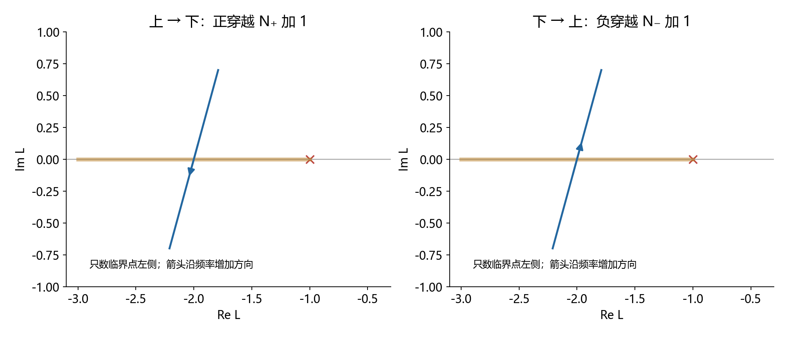

在这条射线上，从上半平面进入下半平面为正穿越，从下进入上为负穿越：

$$
\begin{gathered}
\operatorname{Im}L:\ +\to-\quad\Rightarrow\quad N_+\text{ 加一},\\
\operatorname{Im}L:\ -\to+\quad\Rightarrow\quad N_-\text{ 加一}.
\end{gathered}
$$

**为什么上到下反而叫正？** 以临界点为中心看，向左的向量相角在正负一百八十度处分支；从上向下经过左侧射线时，连续相角从略小于一百八十度增加到略大于一百八十度，属于逆时针增加。切勿把函数库突然跳到负一百八十度误认为角度减少。

完整曲线逆时针绕数可用连续相角总变化表示：

$$
R_{\rm ccw}=\frac1{2\pi}\Delta_\Gamma\arg[1+L(s)].
$$

沿左侧射线的每次上到下穿越记正一下，反向记负一下，净数恰好记录跨过相角分支切口的净次数；一般位置的闭合曲线因而得到同一个绕数。这说明穿越计数是绕数的计算方法，不是另一条独立稳定定理。

只碰到射线又返回原侧时，净贡献为零；高阶切触应检查接触前后虚部符号，不能只看导数恰好为零。经过临界点本身时，连续相角失去定义，必须单独求闭环虚轴根。

### 12.3.6 乘二和半次穿越：从共轭对称推出

对实系数环路：

$$
L(-j\omega)=\overline{L(j\omega)}.
$$

完整围线沿负频率从负无穷走向零，再沿正频率从零走向正无穷。负频率支路既发生共轭镜像，又反转参数方向，这两次反转使每个普通穿越的符号与正频率侧相同。因此，**在已补齐围线、正确处理端点的前提下**：

$$
\boxed{
R_{\rm ccw}=2(N_+-N_-),\qquad
Z=P-2(N_+-N_-).
}
$$

为避免把开口曲线当成完整曲线，这里的正负次数应理解为“正频率半边的有符号计数”，而不是随意画半条曲线后肉眼数闭合圈。

若有限零频起点落在临界点左侧，完整曲线在该点只有一次穿越，却被正、负频率两半共同分担，所以每半边计半次：

$$
\begin{gathered}
L(0)<-1,\quad\omega:0^+\to+\infty,\\
\text{从实轴出发进入下侧}\Rightarrow N_+=\frac12,\\
\text{从实轴出发进入上侧}\Rightarrow N_-=\frac12.
\end{gathered}
$$

若计数的是终止端点，方向相应按“到达”判断：从上侧到达射线是正半次，从下侧到达是负半次。本文普通严格真有理环路的高频终点为零，不在计数射线上，故通常只需考虑零频端点。相切、沿射线重合或穿过临界点的退化情况不要强行分配半次。

**例题 A：完整绕数为一，正频率只计半次。** 对前文开环增益为 2 的例子：

$$
\begin{gathered}
L(s)=\frac2{s-1},\quad L(0)=-2,\quad
\operatorname{Im}L(j\omega)=-\frac{2\omega}{1+\omega^2}<0,\\
N_+=\frac12,\quad N_-=0,\quad R=1,\quad Z=1-1=0.
\end{gathered}
$$

闭环根为负一，代数结果吻合。如果因为正频率曲线上没有“完整穿过去”就记零次，会错误判成不稳定。反过来，将增益改成 0.5，起点为负 0.5，不在计数射线上，不能记半次；此时闭环根为正 0.5。

### 12.3.7 在 Bode 图上，正穿越方向为什么又变成向上

奈氏图的左侧射线对应以下两个条件同时成立：

$$
|L(j\omega)|>1,\qquad
\phi(\omega)=(2k+1)\pi.
$$

幅值条件在对数图上就是高于零分贝。设幅值为正实数 a，则在该相位处：

$$
\frac d{d\omega}\operatorname{Im}L(j\omega)
=a\cos\phi\,\phi'=-a\phi'.
$$

所以奈氏图虚部从正变负，对应连续展开相位向上跨过奇数倍一百八十度：

$$
\begin{gathered}
\phi'>0\Rightarrow N_+\text{ 加一},\qquad
\phi'<0\Rightarrow N_-\text{ 加一},\\
\text{但只在幅值大于一时计数。}
\end{gathered}
$$

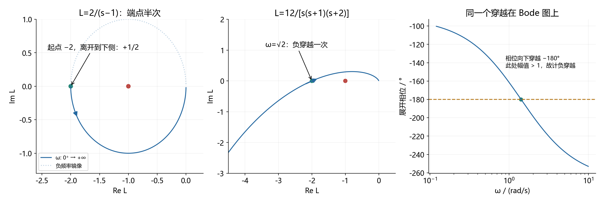

**例题 B：普通负穿越一次对应两个不稳定根。** 取：

$$
L(s)=\frac K{s(s+1)(s+2)},\qquad K>0.
$$

实虚部分离得到虚部的符号：

$$
\begin{gathered}
s=j\omega:\quad s(s+1)(s+2)=-3\omega^2+j\omega(2-\omega^2),\\
\operatorname{Im}L(j\omega)
=\frac{-K\omega(2-\omega^2)}{9\omega^4+\omega^2(2-\omega^2)^2}.
\end{gathered}
$$

正频率交点在根号二；虚部从负变正，属于负穿越。但交点落在临界点左侧还需增益大于 6：

$$
L(j\sqrt2)=-K/6.
$$

当增益为 12 时，负穿越一次给出逆时针净绕数负二，闭环右根数为二。劳斯表也给出同样结论：

$$
D(s)=s^3+3s^2+2s+K,\qquad
\text{第一列为}\quad1,\ 3,\ (6-K)/3,\ K.
$$

当增益为 4 时，交点在负三分之二，不计入射线穿越，闭环稳定；增益为 6 时经过临界点，需单独检查纯虚根。

### 12.3.8 零频第一种情况：原点没有极点，先算起点和出发侧

对原点解析的实系数环路，可直接取值并作 Taylor 展开：

$$
L(j\omega)=L(0)+j\omega L'(0)+O(\omega^2).
$$

起点由直流值决定；若一阶导数非零，其正负决定正频率出发时进入上侧还是下侧。导数为零时继续看第一个非零的虚部项，不能把水平切线当作没有穿越。

| 零频情况 | 可以先做的判断 | 下一步 |
|---|---|---|
| 有限起点在临界点右侧 | 零频端点不贡献左侧射线半次计数 | 继续找后续穿越 |
| 有限起点在临界点左侧 | 可能需要半次计数 | 用虚部的首个非零项判断出发侧 |
| 起点恰好等于临界点 | 闭环在原点有根，严格稳定条件失败 | 检查重数和其他闭环根 |
| 原点有开环极点 | 不能直接代零 | 提取积分因子，计算渐近式并补弧 |

**经过临界点不等于可以一概称为“临界稳定”。** 例如：

$$
L(s)=\frac{-2}{s^2-s+2},\qquad L(0)=-1,\qquad
D_{\rm cl}(s)=s(s-1).
$$

它还有正一这个不稳定根。即使没有右半平面根，也要区分简单虚轴模态、重根及 Jordan 结构，不能只看到零频点就给出有界稳定结论。

### 12.3.9 零频第二种情况：原点有极点，补弧角度的证明

设开环在原点有 ν 重极点，其余因子在原点解析且不为零：

$$
L(s)=\frac{g(s)}{s^\nu},\qquad g(0)=g_0\ne0.
$$

完整右半平面围线从负虚轴走到原点附近时，用**向右凹陷的小半圆**避开极点：

$$
s=\varepsilon e^{j\theta},\qquad
\theta:-\frac\pi2\to+\frac\pi2,\qquad\varepsilon\to0^+.
$$

这段在 s 平面逆时针转半圈，映射后：

$$
\begin{gathered}
L(s)\sim\frac{g_0}{\varepsilon^\nu}e^{-j\nu\theta},\\
|L(s)|\to\infty,\qquad
\Delta\arg L=-\nu\pi.
\end{gathered}
$$

**完整补弧顺时针转 ν×180°**。这个方向和倍数是幂函数直接给出的，不是另记一个口诀。[Swarthmore：虚轴极点的绕避映射](https://lpsa.swarthmore.edu/Nyquist/NyquistStability.html)。

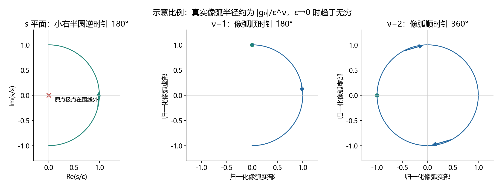

若只画正频率半边，取小半圆的上半部分，即角度从零到正九十度。它的像弧只转完整补弧的一半：

$$
\Delta\arg L=-\nu\pi/2=-\nu\times90^\circ.
$$

因此教程中的“补负转 ν×90°”与“补顺时针 ν×180°”可能都对：前者补正频率一半，后者补完整曲线。必须先问清图画了哪一半。

在 Bode 穿越计数中，相应做法是在零频端加入这段辅助相位变化，并按幅值趋于无穷的条件检查其穿越。它表示绕避圆弧的映射，不是说真实正弦频率响应在零频突然经历了一段物理扫频。接入相位恰好落在奇数倍一百八十度附近时，仍应保留有限小半径或下一阶展开来判断计数。

常见正低频系数情况下，半边补弧从正实无穷远出发，顺时针转到正频率起始方向；若低频系数为负，其初始相角要多偏移半圈，不能仍从正实无穷远机械开始。

$$
\begin{array}{c|c|c|c}
\nu&\text{正频率起始相角，}g_0>0&\text{半边补弧}&\text{完整补弧}\\\hline
1&-90^\circ&-90^\circ&-180^\circ\\
2&-180^\circ&-180^\circ&-360^\circ\\
3&-270^\circ&-270^\circ&-540^\circ
\end{array}
$$

上述相角必须连续展开，不能将负二百七十度简单换成正九十度后丢掉已经转过的圈数。原点以外的虚轴极点也应逐个绕避；它们不属于只补原点一个圆弧的简化情况。

### 12.3.10 只知道起始相角仍不够：再展开一项

这个技巧用于判断轨迹从哪侧走、单积分的垂直渐近线在哪里。把解析因子写成：

$$
g(s)=g_0+g_1s+g_2s^2+\cdots.
$$

对单积分和双积分分别代入，得到：

$$
\begin{aligned}
\nu=1:\quad L(j\omega)
&=-j\frac{g_0}{\omega}+g_1+jg_2\omega+O(\omega^2),\\
\nu=2:\quad L(j\omega)
&=-\frac{g_0}{\omega^2}-j\frac{g_1}{\omega}+g_2+O(\omega).
\end{aligned}
$$

因此单积分的低频实部趋向常数，而不是必然等于零；双积分从负实无穷远的上侧还是下侧出发，通常由下一项的符号决定：

$$
\begin{gathered}
\nu=1:\quad\operatorname{Re}L(j\omega)\to g_1,\\
\nu=2,\ g_0>0:\quad
g_1<0\Rightarrow\operatorname{Im}L>0,\qquad
g_1>0\Rightarrow\operatorname{Im}L<0.
\end{gathered}
$$

当第二个系数为零时，继续展开到首个决定虚部的非零项。对常见归一化零极点因子，可以用乘积的一阶展开快速得到它：

$$
\begin{gathered}
g(s)=k\frac{\prod_i(1+T_{zi}s)}{\prod_j(1+T_{pj}s)},\\
g_0=k,\qquad g_1=k\left(\sum_iT_{zi}-\sum_jT_{pj}\right).
\end{gathered}
$$

**三个对照例子**：

$$
\begin{aligned}
\frac1{s(s+1)}&=\frac1s-1+s+\cdots
&&\Rightarrow\operatorname{Re}L\to-1;\\
\frac1{s^2(s+1)}&=\frac1{s^2}-\frac1s+1+\cdots
&&\Rightarrow\operatorname{Im}L\sim+1/\omega;\\
\frac{1+s}{s^2}&=\frac1{s^2}+\frac1s
&&\Rightarrow\operatorname{Im}L=-1/\omega.
\end{aligned}
$$

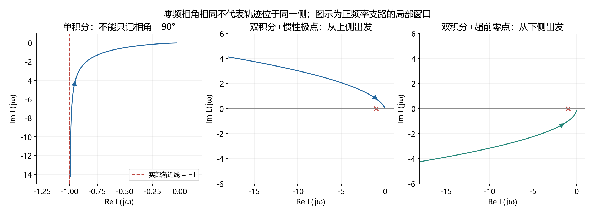

三张图只显示正频率支路，不能把它们当作已经闭合的完整 Nyquist 图。第二、三张虽然起始展开相角都趋向负一百八十度附近，轨迹却在不同侧，稳定性也不同。

### 12.3.11 完整反例：漏掉零频补弧会把不稳定算成稳定

取双积分加一个惯性极点：

$$
L(s)=\frac1{s^2(s+1)}.
$$

开右半平面无极点，正频率支路始终在上半平面，不存在普通有限频率的左射线穿越。若直接记零次，就会误判。

补正频率一半的小绕避映射后，低频补弧顺时针接近负实轴，但真实接入点在上侧；有限小半径下补弧已经从下侧穿过了负实射线一次。这是一次**负穿越**，不是漏掉不算，也不是把无穷远起点随意当作有限端点半次。

$$
N_+=0,\qquad N_-=1,\qquad R=-2,\qquad Z=0-(-2)=2.
$$

直接核验闭环：

$$
D(s)=s^3+s^2+1,\qquad
\text{劳斯第一列}\quad1,\ 1,\ -1,\ 1.
$$

两次变号，确有两个右半平面根。相反，对带超前零点的双积分环路，补弧接入下侧，不发生这次负穿越：

$$
L(s)=\frac{1+s}{s^2},\qquad
D(s)=s^2+s+1,\qquad Z=0.
$$

两个闭环根的实部均为负二分之一。**用有限小圆计算后取极限**，比看一条画在无穷远的抽象圆弧猜半次可靠。

另一个边界必须区分：纯双积分的闭环没有右半平面根，却有虚轴根，不能宣布严格稳定：

$$
L(s)=1/s^2,\qquad D(s)=s^2+1,\qquad s=\pm j.
$$

### 12.3.12 零频与计数的实战顺序

1. 写完整环路和负反馈特征式，先数开右半平面极点，明确方向约定。
2. 判断原点是否为极点：无极点就算直流值与出发侧；有极点就提取积分阶次并展开下一项。
3. 明确画完整频率还是正频率半边，分别补完整圆弧或半边圆弧；其他虚轴极点另行绕避。
4. 只统计临界点左侧的穿越；上到下为正，下到上为负；有限端点按实际穿越分担半次。
5. 检查是否经过临界点；存在闭环虚轴根时，先处理边界，不能仅凭右根数为零判严格稳定。
6. 用闭环求根或劳斯表回查。若算出非整数、负的右根数，优先检查乘二、方向、半次和补弧。

全局 Python 验证脚本 [verify_formula_conventions.py](scripts/verify_formula_conventions.py) 沿完整凹陷围线计算连续相角变化，并独立求闭环根；验证结果在 [verification.json](assets/conventions/verification.json)。数值绕数是核查工具，不替代上面的辩值原理证明。

### 12.3.练习 自测题（自编，附答案）

**题目**：单位负反馈开环如下，求稳定范围，并给出顺时针为正约定下的稳定绕数。

$$
L(s)=\frac K{s-2},\qquad K>0.
$$

**参考答案与检查**：

$$
s_{\rm cl}=2-K,\qquad K>2,\qquad P=1,\quad N_{\rm cw}=-1.
$$

临界增益为 2，此时闭环根在原点。逆时针绕负一点一圈对应稳定，不是不绕圈。

[返回内容导航](#contents)


---

<a id="topic-04"></a>

## 12.4 根轨迹规则的共同来源

需要的基础：复数的模与角度、多项式重根。默认正增益、负反馈，开环分子分母已经明确。

### 12.4.1 所有规则的起点

$$
1+KG_0(s)=0\quad\Rightarrow\quad KG_0(s)=-1.
$$

右侧模为 1、相角为奇数倍圆周率，因此：

$$
\angle G_0(s)=(2k+1)\pi,\qquad K=\frac1{|G_0(s)|}.
$$

角度决定点能否在轨迹上，幅值决定走到该点所需的增益。这不是两套互不相关的公式。

### 12.4.2 实轴奇数规则与渐近线

在实轴测试点处，其右侧每个实零点或实极点对应一个负实向量，贡献半圈角度；左侧贡献零，共轭复数对的贡献抵消。于是右侧实零极点总数为奇数时满足角度条件，重数也计入。

设开环有 n 个极点、m 个零点，且前导系数已归入正增益。当 n 大于 m，远处的开环近似为幂函数：

$$
G_0(s)\sim s^{m-n},\qquad
\theta_k=\frac{(2k+1)\pi}{n-m}.
$$

再保留展开中的下一阶项，选择一个平移中心使该项消失，得到：

$$
\sigma_a=\frac{\sum p_i-\sum z_i}{n-m}.
$$

渐近线描述无穷远分支，不表示整条根轨迹就是直线。

上面的中心公式可以继续展开核对。令极点比零点多的个数为 d，并把首项系数归一化，分子分母按大变量展开：

$$
\begin{gathered}
d=n-m,\qquad
G_0(s)=s^{-d}\left[1+\frac{\sum p_i-\sum z_i}{s}+O(s^{-2})\right],\\
s=w+\sigma,\qquad
G_0(w+\sigma)=w^{-d}\left[1+
\frac{\sum p_i-\sum z_i-d\sigma}{w}+O(w^{-2})\right].
\end{gathered}
$$

让括号内的一阶修正项消失，就得到上述渐近线中心。这一步说明取平均并非经验口诀，而是在寻找远处轨迹最自然的平移原点。

### 12.4.3 分离点为什么求导

写特征式和增益函数：

$$
D_0(s)+KN_0(s)=0,\qquad K(s)=-\frac{D_0(s)}{N_0(s)}.
$$

重根还满足特征式对变量的导数为零。消去增益后，恰好是增益函数导数为零；这里要求分子因子在候选点非零。

$$
\frac{dK}{ds}=0.
$$

所以求导给的是候选重根，仍须检查轨迹角度、增益符号和题目规定的稳定范围。

### 12.4.4 一题连起全部规则

自编例题：

$$
G_0(s)=\frac1{s(s+2)},\qquad D=s^2+2s+K.
$$

实轴区段为负二到零；渐近线中心为负一、角度为正负九十度。由求导得到分离点和对应增益：

$$
K=-s(s+2),\qquad K'=-2s-2=0
\Rightarrow s=-1,\ K=1.
$$

直接求根验证：

$$
s=-1\pm\sqrt{1-K}.
$$


增益从零增大时，两根从零与负二出发，汇合于负一，再向上下两支移动。图中箭头代表增益增加，不是时间流逝。

### 12.4.5 实战边界

负增益或正反馈会改变角度条件；高阶系统指定一对极点后，还要检查其他极点。不能只因一对根阻尼比合适就套整个系统的标准二阶超调公式。

### 12.4.练习 自测题（自编，附答案）

**题目**：求分离点及对应增益，再求增益为 8 时的闭环极点。

$$
L(s)=\frac K{s(s+4)}.
$$

**参考答案与检查**：

$$
s_b=-2,\qquad K_b=4,\qquad K=8:\ s=-2\pm2j.
$$

从增益函数的导数求候选点，再代回二阶特征式验证。

[返回内容导航](#contents)


---

<a id="topic-05"></a>

## 12.5 系统型别与稳态误差

需要的基础：拉普拉斯变换、终值定理。默认单位负反馈，误差是参考减输出，先确认闭环内部稳定。

### 12.5.1 从误差通道开始，而不是背表

$$
E(s)=\frac{R(s)}{1+L(s)}.
$$

低频下，假设开环有若干个有效积分环节：

$$
L(s)\sim\frac{k}{s^\nu},\qquad k\ne0.
$$

对阶数为 q 的多项式输入，采用带阶乘的归一化：

$$
r(t)=\frac{a t^q}{q!},\qquad R(s)=\frac a{s^{q+1}}.
$$

当积分阶次至少为 1，低频主要项为：

$$
sE(s)\sim\frac ak s^{\nu-q}.
$$

在没有其他妨碍收敛的极点时：积分阶次高于输入阶数则误差趋于零；两者相等则有限常差；积分阶次不足则没有有限误差终值。这就是型别表的来源。

零型系统的低频开环并不趋于无穷，不能把分母中的 1 删掉。阶跃误差因此是：

$$
e_\infty=\frac a{1+k}.
$$

### 12.5.2 完整例题：有限常差与发散只差输入阶数

自编例题，取稳定单位负反馈环路：

$$
L(s)=\frac2s,\qquad \frac E R=\frac{s}{s+2}.
$$

单位斜坡输入下：

$$
E(s)=\frac1{s(s+2)},\qquad
e(t)=\frac12(1-e^{-2t})\longrightarrow\frac12.
$$

输入改为二分之一时间平方：

$$
E(s)=\frac1{s^2(s+2)},\qquad
e(t)=\frac t2-\frac14+\frac14e^{-2t}.
$$

误差现在随时间增长；闭环极点仍在负二，所以“闭环稳定”与“所有输入都有有限误差”显然不是一回事。


看图应比较误差的长期趋势，不是只比较最开始几秒谁更小。零型曲线取另一稳定环路，图例给出模型，不能把三条曲线误认为完全相同的系统。

### 12.5.3 实战边界

非单位反馈先区分比较点误差和输出跟踪误差；扰动输入先按注入点推导通道。系统型别描述的是所分析环路的低频结构，不能替代整个内部系统的稳定性检查。

### 12.5.练习 自测题（自编，附答案）

**题目**：单位负反馈、零初值，求以下斜坡输入的误差响应和终值。

$$
L(s)=\frac4s,\qquad r(t)=2t.
$$

**参考答案与检查**：

$$
E(s)=\frac2{s(s+4)},\qquad e(t)=\frac12(1-e^{-4t}),\qquad e_\infty=\frac12.
$$

斜坡幅值为 2，不能只把速度误差系数取倒数。

[返回内容导航](#contents)


---

<a id="topic-06"></a>

## 12.6 超前校正公式的来源

需要的基础：复数相角、反正切求导、频率响应。讨论直流增益为一的超前网络。

### 12.6.1 一个零点先起作用，一个极点后起作用

$$
C(s)=\frac{1+Ts}{1+\alpha Ts},\qquad T>0,\quad0<\alpha<1.
$$

零点转折频率比极点低。因此中间频段先获得零点的正相位，极点的负相位还没全部出现。

$$
\phi(\omega)=\arctan(\omega T)-\arctan(\alpha\omega T).
$$

### 12.6.2 最大相位频率来自求导

$$
\frac{d\phi}{d\omega}
=\frac{T}{1+\omega^2T^2}
-\frac{\alpha T}{1+\alpha^2\omega^2T^2}=0.
$$

交叉相乘、约去非零项后：

$$
(1-\alpha)(1-\alpha\omega^2T^2)=0
\Rightarrow\omega_m=\frac1{T\sqrt\alpha}.
$$

这也就是零点与极点转折频率的几何平均。将它代入反正切差的正切公式：

$$
\tan\phi_m=\frac{1-\alpha}{2\sqrt\alpha},\qquad
\sin\phi_m=\frac{1-\alpha}{1+\alpha}.
$$

由此解出常背的设计式，并在同一频率计算幅值：

$$
\alpha=\frac{1-\sin\phi_m}{1+\sin\phi_m},\qquad
|C(j\omega_m)|=\frac1{\sqrt\alpha}.
$$

### 12.6.3 带数字算一次

自编例题，取时间常数为 1 秒、比例参数为四分之一。则最大相位频率为每秒 2 弧度，最大超前角约为 36.87 度，幅值为 2，即约 6.02 分贝。


两张图共享频率轴。最大相位处幅值也改变了，所以不能只把超前角加到原穿越频率的相位裕度上就结束。

### 12.6.4 真正的设计步骤

稳态指标先确定低频增益；选候选新穿越频率，再用幅值方程与相位要求选网络参数；最后重新求完整环路的真实穿越频率和相位裕度。

最大相位频率不天然等于闭环设计所用的增益穿越频率，必须通过设计主动令它们重合，或接受两者不同并精确验算。图只画校正网络本身，不能从这张图判断完整闭环稳定。

### 12.6.练习 自测题（自编，附答案）

**题目**：求该超前网络的最大相位频率、最大超前角及该频率的幅值。

$$
C(s)=\frac{1+3s}{1+s/3}.
$$

**参考答案与检查**：

$$
T=3,\quad\alpha=\frac19,\quad\omega_m=1,\quad\phi_m\approx53.13^\circ,\quad|C(j\omega_m)|=3.
$$

分母时间常数是三分之一，它等于参数 α 与 T 的乘积，不是 α 本身。

[返回内容导航](#contents)


---

<a id="topic-07"></a>

## 12.7 矩阵指数与状态响应

需要的基础：矩阵乘法、指数的幂级数、常数变易法。讨论有限维线性定常连续系统。

### 12.7.1 为什么要定义矩阵指数

标量齐次方程的解是指数；希望状态传播矩阵同样满足微分方程和单位初值，因此定义：

$$
e^{At}=I+At+\frac{A^2t^2}{2!}+\cdots.
$$

逐项求导后可直接验证：

$$
\frac d{dt}e^{At}=Ae^{At},\qquad e^{A0}=I.
$$

矩阵乘法传播的是状态间的耦合。给每个元素单独取指数，会把本应为零的初始非对角元素变成 1，不满足单位初值。

### 12.7.2 重根为什么出现时间乘指数

自编例题：

$$
A=\begin{bmatrix}-1&1\\0&-1\end{bmatrix}=-I+N,
\qquad N^2=0.
$$

因为这两个矩阵可交换，指数可拆开，幂级数又在一次项后截断：

$$
e^{At}=e^{-t}(I+tN)
=e^{-t}\begin{bmatrix}1&t\\0&1\end{bmatrix}.
$$

初态为第二个坐标方向时：

$$
x(0)=\begin{bmatrix}0\\1\end{bmatrix}
\Rightarrow x(t)=\begin{bmatrix}te^{-t}\\e^{-t}\end{bmatrix}.
$$

第一状态先上升再下降，是第二状态通过耦合不断向它输送影响；不是出现了不稳定特征值。


图左是时间响应，图右是状态轨迹。所有特征值都在负一，状态仍可能暂时增大；渐近稳定不要求每个分量每时每刻都下降。

### 12.7.3 输入项为什么是卷积

对非齐次方程，令状态等于传播矩阵乘一个待定向量，求导后消去齐次项并积分：

$$
\begin{aligned}
x(t)&=e^{At}v(t),\\
e^{At}\dot v(t)&=Bu(t),\\
v(t)&=x(0)+\int_0^t e^{-A\tau}Bu(\tau)\,d\tau.
\end{aligned}
$$

所以：

$$
x(t)=e^{At}x(0)+\int_0^t e^{A(t-\tau)}Bu(\tau)\,d\tau.
$$

每个输入时刻的作用先注入，再从该时刻传播到当前时刻，最后叠加。这就是卷积的物理意义。

### 12.7.4 边界与实战

两个任意矩阵的指数不能随便拆乘；需检查可交换性。时变状态矩阵一般也不能直接把积分放进指数，必须使用相应状态转移矩阵。算完至少代入零时刻与微分方程验算。

### 12.7.练习 自测题（自编，附答案）

**题目**：求零输入状态响应，并验算初值。

$$
A=\begin{bmatrix}-2&1\\0&-2\end{bmatrix},\qquad x(0)=\begin{bmatrix}0\\1\end{bmatrix}.
$$

**参考答案与检查**：

$$
e^{At}=e^{-2t}\begin{bmatrix}1&t\\0&1\end{bmatrix},\qquad x(t)=e^{-2t}\begin{bmatrix}t\\1\end{bmatrix}.
$$

代入零时刻得到原初值；对响应求导并左乘状态矩阵，两者一致。

[返回内容导航](#contents)


---

<a id="topic-08"></a>

## 12.8 能控能观与 PBH 判据

需要的基础：向量张成空间、秩、特征向量。先用离散系统看传播方向，再连接连续系统；不是把两者的响应公式混用。

### 12.8.1 能控矩阵的列从哪里来

从零初态展开两步离散响应：

$$
x_1=Bu_0,\qquad x_2=ABu_0+Bu_1.
$$

第一步输入沿输入矩阵方向进入，早一步的输入额外经过一次状态矩阵传播。更多步就产生更多次幂。由 Cayley–Hamilton 定理，更高次幂不再提供超过状态维数的新方向，所以检查：

$$
\mathcal C=[B\ AB\ \cdots\ A^{n-1}B],\qquad
\operatorname{rank}\mathcal C=n.
$$

连续系统的输入积分也落在这些传播方向张成的空间中；该秩条件同样适用，但不能直接把上面的离散输入序列当作连续控制。


图中具体模型与两步可达状态是：

$$
A=\begin{bmatrix}1&1\\0&1\end{bmatrix},\qquad
B=\begin{bmatrix}0\\1\end{bmatrix},\qquad
x(2)=\begin{bmatrix}u_0\\u_0+u_1\end{bmatrix}.
$$

图中采用二阶积分链的离散形式，两个独立输入时刻生成两个方向。图上的有界区域来自人为限制两次输入幅值，能控性本身讨论的是不施加该幅值限制时能否覆盖整个状态空间。

### 12.8.2 PBH 为什么寻找“输入碰不到的模态”

若有非零左特征向量满足：

$$
w^TA=\lambda w^T,\qquad w^TB=0,
$$

把连续状态方程左乘它：

$$
\frac d{dt}(w^Tx)=\lambda w^Tx.
$$

这个模态完全不受输入影响，因此不可能完全能控。PBH 定理给出其逆命题，等价写成：

$$
\operatorname{rank}[\lambda I-A\ \ B]=n
\quad\text{对每个特征值成立。}
$$

这段模态解释证明了缺失方向为何导致不可控；完整等价性是 PBH 定理，不只靠画箭头得到。

### 12.8.3 能观是相反的问题

已知输入时可以扣除输入对输出的影响。齐次输出及其导数依次给出状态的不同投影，因此：

$$
\mathcal O=\begin{bmatrix}C\\CA\\\vdots\\CA^{n-1}\end{bmatrix}.
$$

若有右特征向量满足：

$$
Av=\lambda v,\qquad Cv=0,
$$

该模态无论怎样自然演化，输出始终看不见。PBH 能观判据于是检查竖向拼接矩阵是否满秩。

### 12.8.4 完整反例

$$
A=\begin{bmatrix}-1&0\\0&2\end{bmatrix},\quad
B=\begin{bmatrix}1\\0\end{bmatrix},\quad
C=\begin{bmatrix}1&0\end{bmatrix}.
$$

能控矩阵与能观矩阵的秩都为 1。第二状态指数增长，却既无法控制又无法从输出观察。系统既不可稳定化，也不可检测。

把第二个特征值改成负二后，秩仍不满，但隐藏模态自己衰减，因此变成可稳定化、可检测。满秩与稳定性是两类不同问题。

### 12.8.练习 自测题（自编，附答案）

**题目**：判断完全能控、完全能观、可稳定化与可检测。

$$
A=\operatorname{diag}(-1,-2),\quad B=[1,0]^T,\quad C=[0,1].
$$

**参考答案与检查**：

$$
\operatorname{rank}\mathcal C=1,\qquad\operatorname{rank}\mathcal O=1.
$$

既不完全能控，也不完全能观；但不可控与不可观模态都稳定，因此可稳定化、可检测。

[返回内容导航](#contents)


---

<a id="topic-09"></a>

## 12.9 相似变换与最小实现

需要的基础：可逆矩阵、状态空间到传递函数、能控能观。

### 12.9.1 相似变换只是换一套坐标

定义可逆的坐标变换，代入状态方程：

$$
\begin{gathered}
x=Tz,\qquad \dot x=Ax+Bu,\\
\dot z=T^{-1}ATz+T^{-1}Bu,\qquad y=CTz+Du.
\end{gathered}
$$

三个矩阵必须一起变；只换状态矩阵而不换输入、输出矩阵，通常是在更换系统而不是换坐标。

代入传递函数可验证：

$$
CT(sI-T^{-1}AT)^{-1}T^{-1}B+D
=C(sI-A)^{-1}B+D.
$$

由于左右乘可逆矩阵不改变秩，能控性与能观性也不变。

### 12.9.2 相同传递函数可能隐藏不同内部状态

自编例题：

$$
A=\operatorname{diag}(-1,2),\quad B=[1,0]^T,\quad C=[1,0],\quad D=0.
$$

零初值的输入输出传递函数为：

$$
G(s)=\frac1{s+1}.
$$

但若第二状态初值为 1，完整内部状态含有：

$$
x_2(t)=e^{2t}.
$$


图中的输出看起来衰减，隐藏状态却增长。只看传递函数或者输出曲线，无法断言整个状态模型内部稳定。

### 12.9.3 最小实现到底删了什么

上面的输入输出关系可用一阶模型实现：

$$
\dot z=-z+u,\qquad y=z.
$$

它删除了对零初值输入输出关系没有贡献的状态，不是用一个可逆矩阵把二阶坐标变成一阶。有限维有理传递函数的最小实现等价于同时完全能控、完全能观；两个最小实现描述同一传递函数时可通过相似变换联系。

### 12.9.4 实战检查

题目问“是否同一系统”时，先说明讨论的是输入输出关系还是完整内部模型。约消一个不稳定因子不能让物理内部模态自动消失；非零初值响应更不能只用约消后的传递函数计算。

### 12.9.练习 自测题（自编，附答案）

**题目**：求零初值传递函数及一个最小实现；说明非零第二状态初值能否直接丢掉。

$$
A=\operatorname{diag}(-1,-3),\quad B=[1,0]^T,\quad C=[1,1],\quad D=0.
$$

**参考答案与检查**：

$$
G(s)=\frac1{s+1},\qquad\dot z=-z+u,\quad y=z.
$$

第二状态不可控但可在输出中看见。若它的初值非零，输出还有相应的三倍衰减率指数项，不能用零初值传递函数将其丢掉。

[返回内容导航](#contents)


---

<a id="topic-10"></a>

## 12.10 极点配置与分离原理

需要的基础：特征多项式、能控能观、块三角矩阵。采用负状态反馈，输出无直通项。

### 12.10.1 增益是在改闭环微分方程

$$
u=-Kx+Nr\quad\Rightarrow\quad
\dot x=(A-BK)x+BNr.
$$

因此配置极点就是让闭环状态矩阵具有目标特征多项式。任意配置前先查完全能控，不能只因为能解出若干增益就假定所有目标都可实现。

### 12.10.2 用一个二阶系统完成设计

自编例题：

$$
A=\begin{bmatrix}0&1\\-2&-3\end{bmatrix},\quad
B=\begin{bmatrix}0\\1\end{bmatrix},\quad C=[1,0].
$$

能控与能观矩阵均满秩。令目标极点为负二和负四，则：

$$
\begin{aligned}
\det[sI-(A-BK)]&=s^2+(3+k_2)s+2+k_1,\\
(s+2)(s+4)&=s^2+6s+8.
\end{aligned}
$$

比较系数得反馈增益；再由参考通道的直流增益求前馈：

$$
K=[6,3],\qquad \frac Y R=\frac N{s^2+6s+8},\qquad N=8.
$$

极点只决定动态，分子前馈系数另管名义阶跃终值。

### 12.10.3 观测器的关键是误差方程

$$
\dot{\hat x}=A\hat x+Bu+L(y-C\hat x),\qquad e=x-\hat x.
$$

真状态方程减去估计方程，输入项抵消：

$$
\dot e=(A-LC)e.
$$

取误差极点为负五、负六，同样比较二阶特征多项式，得到：

$$
L=[8,4]^T.
$$

### 12.10.4 分离原理不是“估计误差没有影响”

用估计状态代替真状态反馈后：

$$
\begin{bmatrix}\dot x\\\dot e\end{bmatrix}
=\begin{bmatrix}A-BK&BK\\0&A-LC\end{bmatrix}
\begin{bmatrix}x\\e\end{bmatrix}
+\begin{bmatrix}BN\\0\end{bmatrix}r.
$$

块三角矩阵的行列式等于对角块行列式之积，所以联合极点是两组极点的并集。右上角并不为零，估计误差仍会影响控制瞬态。


图使用非零初始估计误差。两种输出最终都跟踪到 1，但瞬态不同；不能从分离原理推出两者在所有时刻都相同。

### 12.10.5 实战边界

观测器更快可能放大噪声和控制峰值，不能盲目把极点移得很远。模型有直通项时，创新信号必须扣除已知输入的直通贡献。名义前馈不能代替积分反馈对未知恒值扰动的作用。

### 12.10.练习 自测题（自编，附答案）

**题目**：沿用本节二阶对象，把反馈极点改为负三、负四，观测器极点改为负六、负七；求反馈、前馈及观测器增益。

$$
A=\begin{bmatrix}0&1\\-2&-3\end{bmatrix},\quad B=[0,1]^T,\quad C=[1,0].
$$

**参考答案与检查**：

$$
K=[10,4],\qquad N=12,\qquad L=[10,10]^T.
$$

反馈特征式为平方项加七倍一次项加十二；观测误差特征式为平方项加十三倍一次项加四十二，联合极点为两组的并集。

[返回内容导航](#contents)


---

<a id="topic-11"></a>

## 12.11 Lyapunov 方程与能量几何

需要的基础：二次型、正定矩阵、链式求导。这里讨论线性定常连续系统，非线性系统不能直接照搬矩阵充要条件。

### 12.11.1 欧氏长度不一定每时每刻下降

稳定系统可以存在耦合导致的暂时增长。我们需要的不是固定的圆形距离，而是适合这个系统的椭圆形度量：

$$
V(x)=x^TPx,\qquad P=P^T>0.
$$

沿系统轨迹求导：

$$
\dot V=\dot x^TPx+x^TP\dot x=x^T(A^TP+PA)x.
$$

若能使括号内为负定矩阵，就得到了严格下降的量。

### 12.11.2 方程为什么总能在稳定时找到解

对 Hurwitz 状态矩阵，给定正定矩阵 Q，定义：

$$
P=\int_0^\infty e^{A^Tt}Qe^{At}\,dt.
$$

稳定性使积分收敛。任何非零向量对应的二次型积分严格为正，所以 P 正定。再对被积函数求导并使用无穷远衰减边界：

$$
\begin{aligned}
A^TP+PA
&=\int_0^\infty\frac d{dt}(e^{A^Tt}Qe^{At})\,dt\\
&=-Q.
\end{aligned}
$$

反过来，若有正定 P 使该式成立，二次型严格下降可证明渐近稳定。这就把稳定性和矩阵方程连接起来。

### 12.11.3 完整算例

取：

$$
A=\begin{bmatrix}-1&2\\0&-2\end{bmatrix},\qquad Q=I,\qquad
P=\begin{bmatrix}p&q\\q&r\end{bmatrix}.
$$

展开矩阵方程得到：

$$
-2p=-1,\qquad2p-3q=0,\qquad4q-4r=-1.
$$

因此：

$$
P=\begin{bmatrix}1/2&1/3\\1/3&7/12\end{bmatrix},\qquad
\det P=13/72>0.
$$

第一个顺序主子式与行列式都为正，故 P 正定；回代矩阵方程得到：

$$
\dot V=-x_1^2-x_2^2<0\quad(x\ne0).
$$


图中的轨迹穿过越来越小的椭圆。圆形距离未必单调，但该椭圆度量严格下降。右图直接计算这个量，帮助核查几何解释。

### 12.11.4 实战边界

解出矩阵后必须检验正定，不能只写“方程有解，所以稳定”。随便选一个候选函数未成功，也不能据此断言不稳定。离散系统使用的是下一步差值，矩阵方程应改为离散形式。

### 12.11.练习 自测题（自编，附答案）

**题目**：取单位正定矩阵作为右端，解连续 Lyapunov 方程并检验正定。

$$
A=\operatorname{diag}(-1,-2),\qquad A^TP+PA=-I.
$$

**参考答案与检查**：

$$
P=\operatorname{diag}(1/2,1/4),\qquad\dot V=-x_1^2-x_2^2.
$$

非对角方程要求对应元素为零，两个对角元素都正。注意没有使用离散 Lyapunov 方程。

[返回内容导航](#contents)


---

<a id="topic-12"></a>

## 12.12 LQR 与 Riccati 方程

需要的基础：二次型、矩阵求导、最优性原理。采用无限时域连续 LQR；模型线性，控制输入暂不设幅值约束。

### 12.12.1 要最小化的是状态偏差与控制代价的总和

$$
J=\int_0^\infty(x^TQx+u^TRu)\,dt,
\qquad Q\succeq0,\quad R\succ0.
$$

状态罚得重，倾向于更快纠偏；输入罚得重，倾向于节省控制动作。矩阵的数值依赖状态与输入的单位，不能脱离量纲比较大小。

### 12.12.2 用最优性方程代入二次型

引用连续时间最优性方程，设最优剩余代价为二次型：

$$
V(x)=x^TPx,\qquad P=P^T.
$$

代入后，对输入最小化：

$$
0=\min_u\left[x^TQx+u^TRu+2x^TP(Ax+Bu)\right].
$$

对输入求导为零，因为 R 正定，此驻点就是唯一最小点：

$$
2Ru+2B^TPx=0\quad\Rightarrow\quad u_*=-R^{-1}B^TPx.
$$

把输入项配方可以看清负二次项的来源：

$$
\begin{aligned}
u^TRu+2x^TPBu
&=(u+R^{-1}B^TPx)^TR(u+R^{-1}B^TPx)\\
&\quad-x^TPBR^{-1}B^TPx.
\end{aligned}
$$

最优输入使平方项为零；对任意状态都成立，得到代数 Riccati 方程：

$$
A^TP+PA-PBR^{-1}B^TP+Q=0.
$$

这不是“猜出一个复杂矩阵公式”，而是把最优输入消去后留下的二次型系数条件。

### 12.12.3 一阶系统就能看出为什么要选稳定化解

自编例题：

$$
\dot x=u,\qquad Q=q>0,\quad R=r>0.
$$

Riccati 方程、两根和正确反馈为：

$$
-P^2/r+q=0,\qquad P=\pm\sqrt{qr},\qquad
P_* =\sqrt{qr},\quad K=\sqrt{q/r}.
$$

负根会产生正反馈，不是需要的稳定化解。取初态为 1、输入权重为 1，则：

$$
x(t)=e^{-\sqrt q\,t},\qquad u(t)=-\sqrt q\,e^{-\sqrt q\,t},\qquad J_* =\sqrt q.
$$


图显示状态权重提高时收敛变快，但初始控制更大。不同权重定义了不同的目标函数，不能直接比较图上各方案的代价数值并宣布某个“总体更优”。

### 12.12.4 实战边界

标准稳定化结论需可稳定化、以及状态代价对应的可检测条件。执行器饱和后不再是这个无约束问题的精确最优解。求出代数解后检查对称性、半正定性和闭环特征值。

### 12.12.练习 自测题（自编，附答案）

**题目**：对积分对象求无限时域连续 LQR 稳定化解、反馈增益及初态为 1 时的最优代价。

$$
\dot x=u,\qquad q=9,\quad r=4.
$$

**参考答案与检查**：

$$
P=\sqrt{qr}=6,\qquad K=P/r=1.5,\qquad J_*=6.
$$

另一代数根为负六，会得到不稳定反馈，不能当作最优代价矩阵。

[返回内容导航](#contents)


---

<a id="topic-13"></a>

## 12.13 零阶保持与精确离散化

需要的基础：连续状态响应、采样、矩阵指数。零阶保持表示相邻采样时刻之间的输入恒定，不表示系统状态不变。

### 12.13.1 在一个采样区间积分

连续系统为线性定常模型。每个采样区间输入保持上一采样时刻计算的值，直接使用状态响应公式：

$$
x((k+1)T)=e^{AT}x(kT)
+\int_0^T e^{A(T-\tau)}B u_k\,d\tau.
$$

输入与积分变量无关，提出积分并换元：

$$
x_{k+1}=A_dx_k+B_du_k,\qquad
A_d=e^{AT},\quad B_d=\int_0^T e^{A\tau}B\,d\tau.
$$

状态矩阵可逆时可简写输入矩阵；不可逆时积分仍然成立，但不能使用逆矩阵式。

$$
B_d=A^{-1}(e^{AT}-I)B\quad\text{仅在 A 可逆时使用。}
$$

### 12.13.2 为什么欧拉离散化有时把稳定系统变不稳定

自编例题：

$$
\dot x=-2x+u,\qquad
A_d=e^{-2T},\qquad B_d=\frac{1-e^{-2T}}2.
$$

对正采样周期，精确齐次离散极点总在单位圆内。前向欧拉却给出：

$$
x_{k+1}=(1-2T)x_k+Tu_k.
$$

其渐近稳定条件为：

$$
|1-2T|<1\quad\Rightarrow\quad0<T<1.
$$

取采样周期为 1.2 秒，精确极点约为 0.0907，而欧拉极点为负 1.4，产生交替发散。


左图说明连续左半平面特征值通过指数映射到单位圆内；右图使用相同初态与零输入，展示近似离散方法引入的不稳定。这里不是说实际数字控制器可以任意降低采样频率。

### 12.13.3 连续闭环与数字闭环不是同一个运算顺序

精确采样一个已闭环的连续系统，与先离散对象、再用保持输入实现数字反馈，得到的矩阵一般不同。后者在采样间隔内没有持续更新控制量：

$$
e^{(A-BK)T}\ \text{一般不等于}\ A_d-B_dK.
$$

因此数字反馈设计应检验实际离散闭环矩阵，且考虑一拍计算延迟；不能只检验原连续反馈极点。

### 12.13.4 实战检查

先标采样周期与保持器位置；用积分求精确模型；再构造数字闭环；最后检查单位圆稳定条件。不要把连续传递函数中的字母直接换成离散变量。

### 12.13.练习 自测题（自编，附答案）

**题目**：积分对象经零阶保持采样后，采用数字比例状态反馈。求精确离散模型及严格稳定条件。

$$
\dot x=u,\qquad u_k=-Kx_k,\qquad T>0.
$$

**参考答案与检查**：

$$
A_d=1,\qquad B_d=T,\qquad x_{k+1}=(1-KT)x_k,\qquad0<KT<2.
$$

连续状态矩阵为零、不可逆，但输入矩阵积分照样可算。两个边界分别对应离散极点正一和负一。

[返回内容导航](#contents)


---

## 12.14 延伸阅读与配图重建

### 其他难点的已有推导
以下已有正文推导，先回查这些位置，不再另复制一套：

| 内容 | 要弄懂的问题 | 现有入口 |
|---|---|---|
| 二阶超调量与调节时间 | 峰值从导数为零得到，包络界不等于精确调节时间 | 第 2 份 2.14—2.15；第 11 份 11.3 |
| Bode 斜率与相位 | 斜率如何来自对数，幅值为何不能唯一确定相位 | 第 2 份 2.17；第 11 份 11.7 |
| Jury 与双线性变换 | 单位圆怎样映到半平面，边界点怎么处理 | 第 3 份 3.15 |
| 描述函数 | 为什么只保留基波，极限环预测为何只是近似 | 第 3 份 3.16 |
| 前馈与积分伺服 | 配置极点为何不自动保证无静差 | 第 5 份第 10、15 节；第 11 份 11.9 |
| Gramian | 积分矩阵如何描述可达方向和控制能量 | 第 5 份 14.3 |

本文使用 13 张全局 Python 配图及梅森原有结构图。配图脚本见 [generate_difficult_concepts.py](scripts/generate_difficult_concepts.py)，编写规范见 [0.编写规则](0.编写规则.md)，总目录见 [1.文档目录](1.文档目录.md)。

本次另补充 5 张判据约定与零频图，由 [verify_formula_conventions.py](scripts/verify_formula_conventions.py) 生成；同一脚本保存围线绕数与闭环求根的核验结果。

---

<a id="formula-variants"></a>

## 12.15 不只是 Nyquist：不同教程的公式怎样对照

### 12.15.1 先辨认“同一个公式换符号”还是“换了问题”

| 差异来源 | 常见表现 | 应先检查什么 |
|---|---|---|
| 计数方向或范围改变 | 绕数加号变减号，多出二倍系数 | 顺逆时针、完整频率还是半边 |
| 参数取倒数、归一化不同 | 超前系数有时小于一、有时大于一 | 实际零极点与直流增益 |
| 状态或误差定义不同 | 变换矩阵位置、反馈符号不同 | 坐标定义、输入控制律、误差方向 |
| 同一定理的等价条件 | 劳斯、Hurwitz、Jury 的条件长得不同 | 系数阶次、实系数、首项归一化 |
| 连续和离散系统不同 | 微分方程变差分方程，左半平面变单位圆 | 时间类型与实际闭环模型 |
| 精确关系换成近似指标 | 调节时间中出现 3、4 或其他系数 | 误差带、模型零点和近似假设 |

不要靠字母认公式。对照顺序是：先写问题定义，再把符号换成本笔记约定，最后做一行代数变换或代入同一数字例子。

### 12.15.2 劳斯、Hurwitz、二阶迹行列式为什么一致

同一个实三阶多项式，最高次系数取正：

$$
p(s)=a_3s^3+a_2s^2+a_1s+a_0,\qquad a_3>0.
$$

劳斯第一列与 Hurwitz 行列式分别为：

$$
\begin{gathered}
\text{劳斯第一列}:\quad a_3,\ a_2,\ \frac{a_2a_1-a_3a_0}{a_2},\ a_0,\\
\Delta_1=a_2,\qquad\Delta_2=a_2a_1-a_3a_0,\qquad\Delta_3=a_0\Delta_2.
\end{gathered}
$$

所以前三个 Hurwitz 行列式为正，与劳斯第一列为正等价，也等价于常见的“全部系数正，且中间系数乘积大于两端系数乘积”。这个乘积口诀是三阶特殊结论，不能照搬到任意高阶。

有些书把最高次系数记为第一下标，有些从常数项开始编号；必须根据幂次对应，不能原样抄下标。

对实二阶状态矩阵，特征式为：

$$
\det(sI-A)=s^2-\operatorname{tr}(A)s+\det A.
$$

二阶 Hurwitz 条件就是两个非首项系数正，因此得到熟悉的状态空间判据：

$$
\operatorname{tr}(A)<0,\qquad\det A>0.
$$

例如特征式为平方项加三倍一次项加二，与“迹为负三、行列式为二”描述同一组根。二阶迹与行列式两条件不能推广为高阶充分条件。

### 12.15.3 Jury、Schur 与双线性变换：两套二阶条件的证明

对实首一二阶离散特征多项式，以下两组严格稳定条件等价：

$$
\begin{gathered}
p(z)=z^2+a_1z+a_0,\\
\text{写法一}:\quad |a_0|<1,\quad1+a_1+a_0>0,\quad1-a_1+a_0>0,\\
\text{写法二}:\quad1-a_0>0,\quad1+a_1+a_0>0,\quad1-a_1+a_0>0.
\end{gathered}
$$

为什么第二组没有显式写常数项大于负一？把最后两个不等式相加，已经得到它；再加第一条就恢复绝对值条件：

$$
2+2a_0>0\Rightarrow a_0>-1,\qquad1-a_0>0\Rightarrow a_0<1.
$$

**进一步证明判据来源**：使用把单位圆内映到左半平面的变量变换：

$$
w=\frac{z-1}{z+1},\qquad z=\frac{1+w}{1-w},\qquad
\operatorname{Re}w=\frac{|z|^2-1}{|z+1|^2}.
$$

所以单位圆内恰好对应实部负。代入二阶多项式并清分母：

$$
\begin{aligned}
(1-w)^2p\!\left(\frac{1+w}{1-w}\right)
&=(1-a_1+a_0)w^2\\
&\quad+2(1-a_0)w+(1+a_1+a_0).
\end{aligned}
$$

对这个二阶式用连续 Hurwitz 条件，就得到三项同号；三项的首项、一次项、常数项之和恒为 4，因此同号只能全正。这证明了第二组条件。边界点负一在变量变换中位于无穷远，必须通过原多项式单独检查，不能在清分母时丢掉。

有的教材使用带采样周期的变换，只是额外做正比例缩放，不改变半平面符号：

$$
s_b=\frac2T\frac{z-1}{z+1},\qquad T>0.
$$

但若写成分子为一减离散变量，映射方向会反转，不能仍按左半平面条件不加修改地套用。

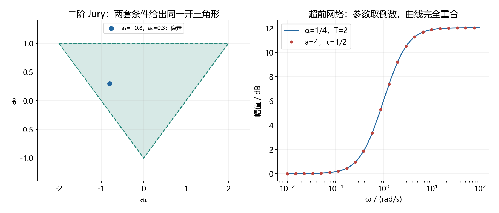

图左的虚线三角形边界都不包含在严格稳定区域内。自编例子：一次项系数为负 0.8、常数项为 0.3，三项不等式均满足，根的模为根号 0.3，约为 0.548。

### 12.15.4 相位裕度、增益裕度：频率名字不同，定义不能换

常见增益穿越频率也写作截止频率、幅值交越频率；相位穿越频率也写作相角交越频率。某些书对下标的使用不同，因此本笔记按方程识别它们：

$$
\begin{gathered}
|L(j\omega_{gc})|=1,\qquad
\mathrm{PM}=180^\circ+\phi(\omega_{gc}),\\
\phi(\omega_{pc})=-180^\circ,\qquad
\mathrm{GM}=\frac1{|L(j\omega_{pc})|}.
\end{gathered}
$$

这里相位裕度写法适用于围绕负一百八十度的相应连续相位分支。存在多次交越时要逐次检查，不能随意选一个看起来为正的裕度。

增益裕度的“倍数”和“分贝”是同一个量的不同表示：

$$
\mathrm{GM}_{\rm dB}=20\log_{10}\mathrm{GM}
=-20\log_{10}|L(j\omega_{pc})|.
$$

例：相位交越处幅值为 0.2，倍数裕度为 5，分贝裕度约为 13.98，绝不是“裕度 0.2”。

另外，若单独将可变增益留在环路外，画的是不含增益的函数，临界点就随增益移动：

$$
L=KG_0,\quad1+KG_0=0\quad\Rightarrow\quad
\text{画 L 看 }-1;\quad\text{画 }G_0\text{ 看 }-1/K.
$$

### 12.15.5 超前、滞后：参数小于一与大于一并不矛盾

前文超前网络与另一常见写法如下：

$$
\begin{gathered}
C(s)=K_0\frac{1+Ts}{1+\alpha Ts},\qquad0<\alpha<1,\\
C(s)=K_0\frac{1+a\tau s}{1+\tau s},\qquad a>1,\\
a=1/\alpha,\qquad\tau=\alpha T.
\end{gathered}
$$

把最后一行代进去，两者分子分母完全相同，因此最大相位和频率只是换了参数：

$$
\begin{gathered}
\sin\phi_m=\frac{1-\alpha}{1+\alpha}=\frac{a-1}{a+1},\\
\omega_m=\frac1{T\sqrt\alpha}=\frac1{\tau\sqrt a},\qquad
|C(j\omega_m)|=K_0\sqrt a.
\end{gathered}
$$

这里假定直流增益为正。以正转折频率写零极点时，要区分直流增益与最高频增益：

$$
C(s)=K_0\frac{1+s/\omega_z}{1+s/\omega_p}
=K_0\frac{\omega_p}{\omega_z}\frac{s+\omega_z}{s+\omega_p}.
$$

所以“常数乘带一的因子比”与“常数乘首一次式比”的常数通常不同。相同参数数值照抄，会意外改变低频增益与稳态误差。

图右用时间常数 2、比例系数四分之一，与比值参数 4、另一时间常数二分之一验证两种写法重合。美国密歇根大学的课程例题使用了小于一的参数约定，可作为这一写法的对照。[CTMS 超前校正示例](https://ctms.engin.umich.edu/CTMS/?example=AircraftPitch&section=ControlFrequency)。

滞后判断同样先看实际零极点：极点转折频率低于零点。若直流归一化为 1，网络高频会衰减；若额外把直流增益乘上衰减比，才会获得“高频约为一、低频提高”的另一常用形式。两种设计目标不同，不能漏看外面的常数。

### 12.15.6 正反馈、负反馈与根轨迹的角度条件

负反馈且变化增益为正时：

$$
1+KG_0=0\Rightarrow\angle G_0=(2k+1)\pi.
$$

正反馈且变化增益为正时：

$$
1-KG_0=0\Rightarrow\angle G_0=2k\pi.
$$

负反馈中若允许增益为负，把增益写成负的正数，也会得到偶数倍相角条件；对应的实轴区段规则会从奇数变成偶数。不要在题目规定正增益的情况下，把求导得到的负增益候选点也画进同一轨迹。

结构图与梅森公式也要遵守同一原则：支路标成负反馈增益时，负号已经进入回路乘积；图行列式仍按“一减回路和”计算，不能再凭反馈字样重复加负号。

### 12.15.7 状态反馈、观测误差与坐标变换的符号

若教材把控制律写成加号，反馈矩阵就与本笔记约定差一个负号：

$$
\begin{gathered}
u=-Kx\Rightarrow A_{\rm cl}=A-BK,\\
u=Fx\Rightarrow A_{\rm cl}=A+BF,\qquad F=-K.
\end{gathered}
$$

例如同一目标闭环在本笔记算出行向量六、三，采用加号控制律的答案应为负六、负三；判断答案要把增益代回控制律，不能仅比较矩阵正负。

观测误差改成估计减真实，不会凭空把误差矩阵的减号改成加号。若新误差是旧误差的相反数：

$$
e=x-\hat x,\quad\tilde e=-e
\Rightarrow\dot{\tilde e}=(A-LC)\tilde e.
$$

只有创新项本身的符号约定改变，例如改用预测输出减测量输出而仍取加号注入时，增益矩阵才需要相应换号。

相似变换有两种常见定义，同一个字母在两种定义中代表互逆矩阵：

$$
\begin{gathered}
x=Tz:\quad A_z=T^{-1}AT,\ B_z=T^{-1}B,\ C_z=CT;\\
z=Sx:\quad A_z=SAS^{-1},\ B_z=SB,\ C_z=CS^{-1};\\
S=T^{-1}.
\end{gathered}
$$

推导只需对状态变换求导再代入原方程。不能从一本书取状态矩阵变换，从另一本取输出矩阵变换，却不核对坐标定义。

### 12.15.8 Lyapunov：等号两边移项是等价，连续变离散不是

连续系统沿轨迹求导，离散系统计算相邻时刻之差：

$$
\begin{aligned}
\dot V&=x^T(A^TP+PA)x&&\text{连续},\\
V_{k+1}-V_k&=x_k^T(A^TPA-P)x_k&&\text{离散}.
\end{aligned}
$$

于是各自的方程为：

$$
\begin{gathered}
A^TP+PA=-Q\quad\text{连续},\\
A^TPA-P=-Q\ \Longleftrightarrow\ P-A^TPA=Q\quad\text{离散}.
\end{gathered}
$$

两条离散式只是移项，完全等价；连续与离散两种形式却不是互换记号。连续要求状态矩阵 Hurwitz，离散要求特征值模都小于一。

还有常见的转置位置差异：

$$
AW+WA^T=-Q.
$$

它是对偶形式，常见于能控 Gramian；即使两者的存在性都对应同一稳定条件，矩阵解也一般不相同。用能量函数证明时应回到实际求导式，不能直接把对偶方程的解当作同一个 P。

自编一阶例子：离散状态系数为二分之一、右端为一，得到：

$$
P-\frac14P=1\Rightarrow P=\frac43.
$$

若把同一个正二分之一错误当作连续状态矩阵代入连续方程，会得到负的解；这正好说明连续模型本身不稳定，不能混用。

### 12.15.9 PBH：完全能控与可稳定化要检查的特征值范围不同

完全能控要求对所有特征值满秩；连续可稳定化只要求对实部非负的特征值满秩，离散可稳定化则只要求对模不小于一的特征值满秩：

$$
\begin{gathered}
\operatorname{rank}[\lambda I-A\ \ B]=n,\\
\text{完全能控：所有}\ \lambda\in\sigma(A),\\
\text{连续可稳定化：}\operatorname{Re}\lambda\ge0,\qquad
\text{离散可稳定化：}|\lambda|\ge1.
\end{gathered}
$$

能观与可检测使用竖向拼接矩阵，检查范围按同样方式改变。边界也必须检查，因为不能控制或观察的原点模态、单位圆模态不会自动衰减。

有限步控制还有一种“看起来只是矩阵顺序不同”的陷阱：

$$
\begin{gathered}
\mathcal C=[B\ AB\ \cdots\ A^{N-1}B],\\
x_N-A^Nx_0=[A^{N-1}B\ \cdots\ AB\ B]
\begin{bmatrix}u_0\\\vdots\\u_{N-2}\\u_{N-1}\end{bmatrix}.
\end{gathered}
$$

列逆序不改变秩，却会改变控制量对应的时刻。判断能控性时顺序可调整，求具体输入时必须同步排列输入向量。

### 12.15.10 LQR：闭环写法、二分之一系数与离散 Riccati

连续代数 Riccati 方程可以写成开环矩阵形式，也可以写成闭环 Lyapunov 形式：

$$
\begin{gathered}
A^TP+PA-PBR^{-1}B^TP+Q=0,\qquad K=R^{-1}B^TP,\\
(A-BK)^TP+P(A-BK)+Q+K^TRK=0.
\end{gathered}
$$

**等价证明**：将闭环式展开，两个交叉项各给一个负二次项，最后一个控制代价项抵消其中一个，正好留下开环式的单个负二次项。这里必须使用同一个反馈增益定义和对称代价矩阵。

有的教程把整个代价积分和价值函数同时乘二分之一，最优控制不变，因为目标函数整体乘一个正常数不改变最小点；但如果只改了状态或控制其中一项，那是在改变权重，最优增益通常会变。不要跨越不同价值函数归一化抄取矩阵 P。

离散 LQR 则使用另一条方程，不能仅将连续状态矩阵换成离散矩阵：

$$
\begin{gathered}
P=Q+A^TPA-A^TPB(R+B^TPB)^{-1}B^TPA,\\
K=(R+B^TPB)^{-1}B^TPA.
\end{gathered}
$$

它来自下一步价值函数代入差分方程后的配方，控制二次项多出传播后的状态代价，因此分母中出现额外矩阵项。

### 12.15.11 二阶指标、稳态误差：差一个系数可能是定义不同

标准无零点欠阻尼二阶模型的超调率是比例值，百分数需再乘一百：

$$
M_p=e^{-\pi\zeta/\sqrt{1-\zeta^2}},\qquad
\sigma\%=100M_p\%.
$$

峰值高度则还包含终值，不等于超调率。对非单位幅值阶跃，先用相对终值增量定义超调率，再反求阻尼比。

调节时间的 3 与 4 分别是常用 5% 与 2% 近似。更明确的包络保证式为：

$$
t\ge\frac{-\ln(\delta\sqrt{1-\zeta^2})}{\zeta\omega_n},\qquad0<\zeta<1.
$$

它来自误差指数包络不超过规定误差带；仍不等于响应最后一次越界的精确时刻。高阶零点、其他慢模态存在时，标准二阶指标不能直接当作精确关系。

抛物线输入也常有二倍差异：

$$
\mathcal L\{at^2/2\}=a/s^3,\qquad
\mathcal L\{at^2\}=2a/s^3.
$$

同样，比较点误差与输出误差在非单位反馈下不同。看见两份答案差一个倍数或常数时，先核对输入归一化和误差定义，再判断是不是计算错误。

### 12.15.12 自测题：先对照定义，再计算

1. 某实系数环路有一个开右半平面极点，正频率有限起点位于负二并向下侧离开，没有其他有效穿越。求完整逆时针绕数与闭环右根数。
2. 某教程已统计完整曲线的正穿越两次、负穿越三次，开环右根数为零。是否还应乘二？求闭环右根数。
3. 比较以下两个超前网络是否相同，说明外面常数的含义：

$$
C_1(s)=\frac{1+2s}{1+0.5s},\qquad C_2(s)=\frac{s+0.5}{s+2}.
$$

4. 对以下离散多项式，分别用两种 Jury 条件和双线性变换检查稳定：

$$
p(z)=z^2-0.8z+0.3.
$$

**参考答案**：第 1 题正半次给出完整逆时针一圈，右根数为零，但严格稳定仍需排除虚轴闭环根；第 2 题已统计完整曲线，不再乘二，净逆时针绕数为负一，故闭环右根数为一。

第 3 题第一个网络是第二个的四倍，两者零极点相同、直流增益不同。第 4 题三项严格不等式均成立，变换后的二阶系数全正：

$$
\widetilde p(w)=2.1w^2+1.4w+0.5.
$$

补充资料只用于核对记号与约定；本节等价变换、例题和 Python 数据为依据已列模型的独立推导。源码与结果见 [验证脚本](scripts/verify_formula_conventions.py)、[数值核验记录](assets/conventions/verification.json)。

[返回内容导航](#contents)


<a id="classic-linear-bridge"></a>

## 12.16 线控与自控贯通：同一个系统的公式、技巧和难点

这里把“线控”按线性系统理论／现代控制理解，“自控”按经典自动控制原理理解。本节限定有限维线性定常系统；未特别说明时是连续时间、单输入单输出、负反馈。所有数字例题均为自编。

不要分别背两套结论。先问：题目描述的是同一个系统吗？输入、输出、初值和反馈位置一样吗？这四项对齐后，才能互相代换。

| 自控中的入口 | 线控中的对应对象 | 能互相检查什么 | 本节 |
|---|---|---|---|
| 微分方程、传递函数 | 状态方程、预解式 | 分子分母、初值响应 | 12.16.1 |
| 闭环特征方程、根轨迹 | 闭环状态矩阵 | 极点、阻尼、反馈可调自由度 | 12.16.2 |
| 劳斯、Nyquist 稳定判据 | 特征值、Lyapunov 方程 | 同一完整系统的稳定结论 | 12.16.3 |
| 极零相消、约分 | 能控能观、最小实现 | 被传递函数遗漏的内部模态 | 12.16.4 |
| 型别、终值定理、PI | 平衡点、前馈、积分增广 | 跟踪误差与常值抗扰 | 12.16.5 |
| 反馈校正器 | 状态反馈加观测器 | 动态补偿器与分离原理 | 12.16.6 |
| 脉冲传函、Jury | 精确离散化、离散特征值 | 保持器与反馈顺序 | 12.16.7 |
| 环路增益、灵敏度 | 闭环各输入通道 | 跟踪、抗扰、测量噪声 | 12.16.8 |

统一用下面这个二阶对象串联计算：

$$
\begin{gathered}
\ddot y+3\dot y+2y=u,\qquad
x=\begin{bmatrix}y\\\dot y\end{bmatrix},\\
A=\begin{bmatrix}0&1\\-2&-3\end{bmatrix},\quad
B=\begin{bmatrix}0\\1\end{bmatrix},\quad
C=\begin{bmatrix}1&0\end{bmatrix},\quad D=0.
\end{gathered}
$$

### 12.16.1 微分方程、传递函数、矩阵指数：初值是分界线

对状态方程做单边拉普拉斯变换，初值必须保留：

$$
\begin{aligned}
(sI-A)X&=x(0)+BU,\\
Y&=\underbrace{C(sI-A)^{-1}x(0)}_{\text{零输入响应}}
+\underbrace{[C(sI-A)^{-1}B+D]U}_{\text{零状态响应}}.
\end{aligned}
$$

因此传递函数只负责零初值输入输出关系。回到时域，完全相同的分解是：

$$
x(t)=e^{At}x(0)+\int_0^t e^{A(t-\tau)}Bu(\tau)\,d\tau.
$$

**自编例题**：求统一对象的传递函数，并求输入为零、初态为第一坐标向量时的输出。

$$
\begin{gathered}
(sI-A)^{-1}=\frac1{s^2+3s+2}
\begin{bmatrix}s+3&1\\-2&s\end{bmatrix},\\
G(s)=\frac1{(s+1)(s+2)},\\
x(0)=\begin{bmatrix}1\\0\end{bmatrix}
\Rightarrow Y(s)=\frac{s+3}{(s+1)(s+2)}
=\frac2{s+1}-\frac1{s+2},\\
\boxed{y(t)=2e^{-t}-e^{-2t}}.
\end{gathered}
$$

检查：初始输出为一，初始导数为零，代回齐次微分方程成立。若机械写“输入为零，所以输出为零”，就是漏掉零输入响应。

**技巧**：只问传函就算预解式乘输入列，不必求整个矩阵逆；求完整响应先把“初值项＋输入项”写出来。两种时域表达不同，但应有相同初值和相同微分方程。

回查：[数学预备 2.0.2、2.5](2.数学预备与教材常略去的“为什么”（隐含推导）.md)；[矩阵指数专题](#topic-07)。

### 12.16.2 根轨迹与状态反馈：一个调增益，一个改系数

先取静态输出负反馈。这里小写增益是标量：

$$
u=k(r-y),\qquad A_{\rm cl}=A-BkC.
$$

利用矩阵行列式引理，在预解式存在处有下式；消去分母后按多项式恒等式延拓：

$$
\begin{aligned}
\det(sI-A+BkC)
&=\det(sI-A)\left[1+kC(sI-A)^{-1}B\right]\\
&=\det(sI-A)[1+kG(s)].
\end{aligned}
$$

这就是“根轨迹的闭环根”和“闭环矩阵特征值”相同的原因。这里直接项为零；有直接项时必须先检查代数反馈是否适定。

**自编例题**：统一对象取正增益输出反馈。

$$
\begin{gathered}
A_{\rm cl}=\begin{bmatrix}0&1\\-(2+k)&-3\end{bmatrix},\qquad
p(s)=s^2+3s+2+k,\\
\omega_n=\sqrt{2+k},\qquad
\zeta=\frac3{2\sqrt{2+k}},\\
k=7\Rightarrow
s=-\frac32\pm j\frac{3\sqrt3}{2},\quad\omega_n=3,\quad\zeta=\frac12.
\end{gathered}
$$

增大增益能改变自然频率，却不能改变根的实部和为负三这一约束。因而不能仅靠这个标量增益把两个极点放到负三和负四。

若允许测量全部状态，使用向量反馈：

$$
\begin{gathered}
u=-K_xx+v,\qquad K_x=\begin{bmatrix}k_1&k_2\end{bmatrix},\\
p_K(s)=s^2+(3+k_2)s+(2+k_1).
\end{gathered}
$$

目标为负三、负四时，匹配目标多项式得到：

$$
p_*(s)=(s+3)(s+4)=s^2+7s+12
\Rightarrow\boxed{K_x=\begin{bmatrix}10&4\end{bmatrix}}.
$$

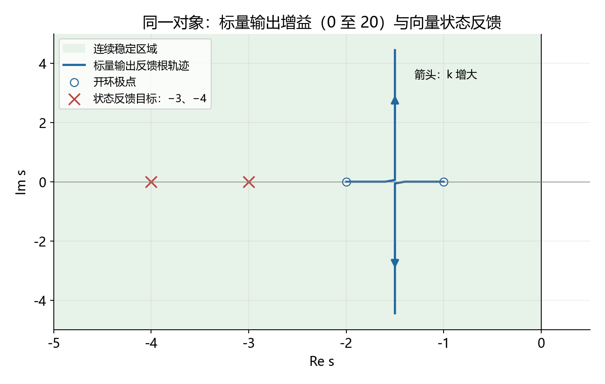

**怎么看图**：蓝线表示只有一个输出增益时能到达的位置；红叉是两个状态增益得到的目标极点。图不能推出任意系统均能任意配置；完全极点配置还要求能控，且这里并未加入执行器限幅等约束。

**难点**：该对象的第二状态恰是输出导数，所以向量反馈在这套坐标下就是位置与速度两项反馈。若改用另一套状态坐标，这种直接物理解释就不一定成立。它也不是对参考误差求导的理想 PD 控制器，参考通道可能不同。

回查：[根轨迹](#topic-04)；[极点配置](#topic-10)；[模拟卷第四、九题](13.厦大844风格自编模拟卷一（题目、详解与知识点定位）.md)。

### 12.16.3 劳斯、特征值、Lyapunov：结论相通，证据不同

对有限维连续线性定常系统，下面三种表述等价；Lyapunov 的量词不能省略：

$$
\begin{gathered}
A\text{ 为 Hurwitz 矩阵}
\Longleftrightarrow \Re\lambda_i(A)<0\quad\text{对所有模态},\\
\Longleftrightarrow\quad
\text{任给 }Q=Q^T>0,\ \text{存在唯一 }P=P^T>0,\\
A^TP+PA=-Q.
\end{gathered}
$$

劳斯／Hurwitz 判据作用于完整特征多项式；Nyquist 则从环路映射计数闭环右根。它们是不同入口，不能在约分掉隐藏不稳定状态后，把输入输出结论直接提升为内部稳定。

**自编例题**：统一对象的特征式分解为两个稳定一次因子。取单位正定矩阵，设对称未知矩阵，代入得：

$$
\begin{gathered}
P=\begin{bmatrix}p&q\\q&r\end{bmatrix},\qquad Q=I,\\
-4q=-1,\quad p-3q-2r=0,\quad 2q-6r=-1,\\
P=\begin{bmatrix}5/4&1/4\\1/4&1/4\end{bmatrix},\qquad
p=5/4>0,\quad\det P=1/4>0,\\
V=x^TPx\Rightarrow\dot V=-x^Tx<0\quad(x\ne0).
\end{gathered}
$$

这与特征值负一、负二相互核验。注意：欧氏长度可以暂时增加。例如初态取第一分量一、第二分量负十分之一：

$$
\left.\frac{d}{dt}(x^Tx)\right|_{t=0}
=x(0)^T(A^T+A)x(0)=\frac7{50}>0.
$$

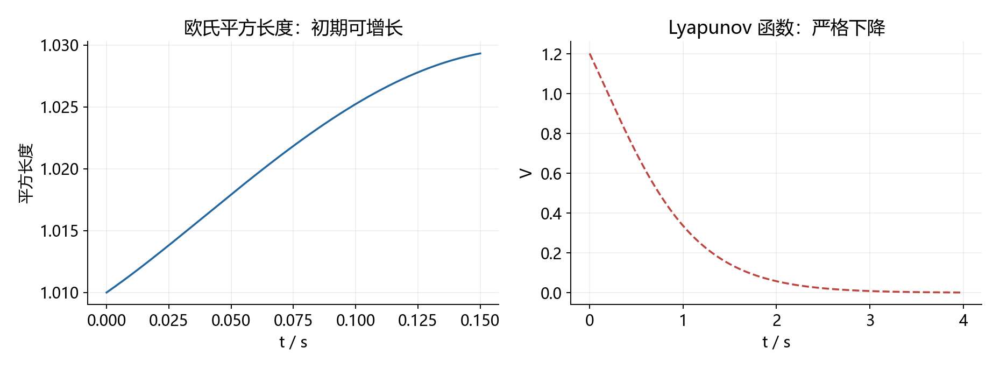

**怎么看图**：左图放大短时间的欧氏平方长度增长，右图显示构造的能量下降。证明来自正定矩阵和导数恒等式，不能仅凭有限仿真曲线宣布全局稳定。稳定也不等于每个状态都单调下降。

**考场技巧**：参数范围优先劳斯；低阶明确数值可求特征值；要求构造证明时才解 Lyapunov 方程。只有解出的矩阵正定，才完成这类证明。Nyquist 的符号及零频补弧回查 [12.3.4—12.3.12](#nyquist-conventions)。

### 12.16.4 极零相消、能控能观：为什么分母阶数会变小

传函分母来自特征多项式，但实际约分后的极点只保留输入能激发、输出能看到的模态。完整能控且能观的实现才是最小实现。

**自编反例**：给统一对象附加一个独立的不稳定状态，它既没有输入，也不进入输出：

$$
\begin{gathered}
\widetilde A=\operatorname{diag}(A,1),\qquad
\widetilde B=\begin{bmatrix}0\\1\\0\end{bmatrix},\qquad
\widetilde C=\begin{bmatrix}1&0&0\end{bmatrix},\\
\det(sI-\widetilde A)=(s-1)(s+1)(s+2),\\
\widetilde G(s)=\frac{s-1}{(s-1)(s+1)(s+2)}
=\frac1{(s+1)(s+2)}.
\end{gathered}
$$

外部传函与原对象完全一样，第三状态却按正指数增长。PBH 在正一模态处均不满秩，故该系统既不可稳定化也不可检测。这个例子中无法通过输入改变隐藏的不稳定模态。

**技巧**：题目给了状态矩阵，就先保留完整特征式。发现阶数减少，再检查能控能观及约消模态的位置；约消稳定模态和约消不稳定模态，对内部稳定判断的影响不同。最小实现解决零初值输入输出等价，不保证保留原模型所有非零初态响应。

回查：[PBH](#topic-08)；[最小实现](#topic-09)；[模拟卷第十题](13.厦大844风格自编模拟卷一（题目、详解与知识点定位）.md#solution-10)。

### 12.16.5 终值定理、前馈与积分：配好极点不等于误差为零

沿用已配到负三、负四的状态反馈。参考进入方式设为：

$$
u=-K_xx+Nr,\qquad A_K=A-BK_x.
$$

对常值参考，稳定闭环的平衡方程与传函直流增益给出同一结果：

$$
\begin{gathered}
0=A_Kx_{\rm ss}+BNr,\\
y_{\rm ss}=-CA_K^{-1}BNr,\\
\boxed{N=-\frac1{CA_K^{-1}B}}.
\end{gathered}
$$

前提：单输入单输出、直接项为零、闭环 Hurwitz，且分母标量不为零。直接项非零或多输入输出时需改用完整稳态调节方程。

**自编例题**：本例反馈后从附加输入到输出的传函为：

$$
G_K(s)=\frac1{s^2+7s+12}
\Rightarrow N=12.
$$

不加前馈、直接令附加输入等于单位参考时，终值只有十二分之一。加十二倍前馈后，名义单位阶跃终值为一；但若对象输入端额外加入恒定扰动，误差又出现：

$$
u=-K_xx+12r+d,\qquad
 y_{\rm ss}=r+\frac d{12}.
$$

前馈的局限来自它没有根据长期残余误差调整输入。引入误差积分状态：

$$
\begin{gathered}
\dot\xi=r-Cx,\qquad u=-K_ix+k_I\xi+d,\\
\frac{d}{dt}\begin{bmatrix}x\\\xi\end{bmatrix}
=\begin{bmatrix}A-BK_i&Bk_I\\-C&0\end{bmatrix}
\begin{bmatrix}x\\\xi\end{bmatrix}
+\begin{bmatrix}0\\0\\1\end{bmatrix}r
+\begin{bmatrix}B\\0\end{bmatrix}d.
\end{gathered}
$$

注意这里重新设计状态反馈，不能把前一个反馈增益直接与任意积分增益拼接。设目标极点负一、负二、负三：

$$
\begin{gathered}
p_I(s)=s^3+(3+k_2)s^2+(2+k_1)s+k_I,\\
p_*(s)=(s+1)(s+2)(s+3)=s^3+6s^2+11s+6,\\
\boxed{K_i=\begin{bmatrix}9&3\end{bmatrix},\qquad k_I=6}.
\end{gathered}
$$

闭环渐近稳定，常值参考和常值扰动使状态收敛到平衡点。积分状态平衡条件强制参考等于输出，因此稳态误差为零。

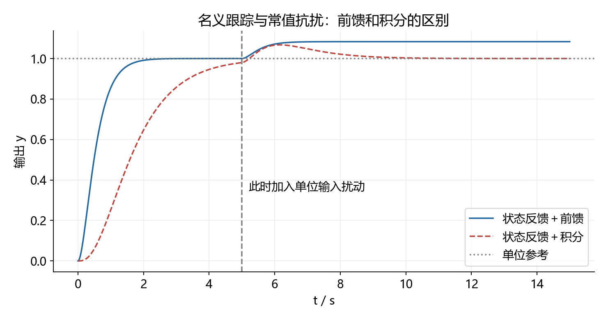

**怎么看图**：单位参考从零时刻加入，五秒时对象输入端加入幅值一的扰动。前馈方案最终偏高十二分之一；积分方案恢复到一。图不能支持“积分越强越好”；积分增广必须可稳定化，且执行器饱和会破坏这里的线性假设。

**联系型别的难点**：积分器给环路增加原点极点，是在内部保存持续误差；但积分器被零点抵消、闭环不稳定或积分增广不可稳定化时，不能保证零误差。单输入单输出的原点调节还要检查下式是否满秩：

$$
\operatorname{rank}\begin{bmatrix}A&B\\C&0\end{bmatrix}=n+1.
$$

回查：[型别与误差](#topic-05)；[现代控制 10.2、15.1—15.2](5.现代控制理论（公理化推导与简例）.md)。

### 12.16.6 观测器就是动态补偿器，但闭环阶数要算全

若只测量输出，不能直接把不可测状态塞进反馈律。用观测器估计状态：

$$
\begin{gathered}
\dot{\hat x}=A\hat x+Bu+L_o(y-C\hat x),\\
u=-K_x\hat x+Nr.
\end{gathered}
$$

代入控制律即可看到控制器自身有状态，从输出到控制作用是一个动态系统：

$$
\begin{gathered}
\dot{\hat x}=(A-BK_x-L_oC)\hat x+L_oy+BNr,\\
\left.\frac{U(s)}{Y(s)}\right|_{R=0}
=-K_x[sI-(A-BK_x-L_oC)]^{-1}L_o.
\end{gathered}
$$

这是控制器的端口关系，不能把它当作完整闭环传函。令估计误差为真实状态减估计状态，可得上三角闭环结构：

$$
\frac{d}{dt}\begin{bmatrix}x\\e_o\end{bmatrix}
=\begin{bmatrix}A-BK_x&BK_x\\0&A-L_oC\end{bmatrix}
\begin{bmatrix}x\\e_o\end{bmatrix}
+\begin{bmatrix}BN\\0\end{bmatrix}r.
$$

因此全部闭环极点是两块对角矩阵的特征值并集。

**自编例题**：保留控制极点负三、负四，希望观测误差极点为负五、负六。

$$
\begin{gathered}
L_o=\begin{bmatrix}\ell_1\\\ell_2\end{bmatrix},\qquad
p_o(s)=s^2+(3+\ell_1)s+3\ell_1+2+\ell_2,\\
p_o(s)=s^2+11s+30\Rightarrow
\boxed{L_o=\begin{bmatrix}8\\4\end{bmatrix}}.
\end{gathered}
$$

完整四阶闭环极点为负三、负四、负五、负六。若初始估计误差恰为零，某个参考传函可能看不见观测误差模态，但这不代表四阶内部模型自动变成二阶。

**技巧**：先检查可稳定化与可检测，再独立配置两组极点，最后用增广矩阵验证。观测器越快越容易放大测量噪声，不能只凭“极点更靠左”判断实际效果。

回查：[分离原理与完整设计](#topic-10)；[实战技巧 11.9](11.实战技巧手册（题型识别、完整步骤与易错补全）.md)。

### 12.16.7 连续极点与离散极点：采样和闭环不能随便交换

连续对象在零阶保持输入下精确离散为：

$$
A_d=e^{AT},\qquad B_d=\int_0^T e^{A\tau}B\,d\tau,\qquad
G_d(z)=C(zI-A_d)^{-1}B_d+D.
$$

指数的谱映射告诉我们，连续自主模态位于左半平面，当且仅当对应的精确采样模态位于单位圆内：

$$
z_i=e^{\lambda_iT},\qquad |z_i|=e^{\Re(\lambda_i)T}.
$$

但这个等式不能拿来计算任意数字闭环的极点。连续反馈一直使用当前输出；数字反馈只在采样时更新并保持：

$$
\begin{aligned}
\text{先连续闭环再采样：}\quad&M_c=e^{(A-BkC)T},\\
\text{先离散对象再数字反馈：}\quad&M_d=A_d-B_dkC.
\end{aligned}
$$

**自编例题**：用更短的一阶反例，连续对象衰减率为一，输入系数为一，比例负反馈增益为二，采样周期一秒。

$$
\begin{gathered}
\dot x=-x+u,\qquad u=-2x,\qquad
M_c=e^{-3}\approx0.049787,\\
u_k=-2x_k\Rightarrow
M_d=e^{-1}-2(1-e^{-1})=3e^{-1}-2\approx-0.896362.
\end{gathered}
$$

两种都稳定，但一个同号衰减，一个采样点交替振荡。数字模型的稳定范围由一阶 Jury 条件给出：

$$
|e^{-T}-k(1-e^{-T})|<1
\Rightarrow -1<k<\frac{1+e^{-T}}{1-e^{-T}}.
$$

对增益二，数字闭环必须满足采样周期小于自然对数三；连续闭环则对任意正采样周期的被动记录都衰减。

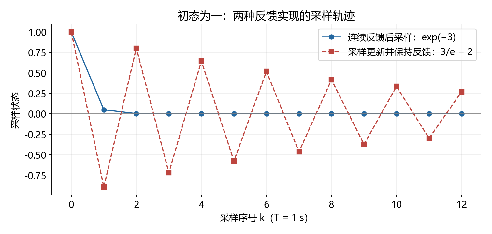

**怎么看图**：横轴是采样时刻序号，纵轴是初态为一时的采样状态。两条线的差异来自控制实现，不是指数映射公式失效。该图仅比较采样点；需要采样间轨迹时还要回到保持区间解。

**技巧**：先写控制律何时更新，再写状态递推，最后用单位圆判据；离散 Lyapunov 对应的是状态每一步的变化：

$$
A_d^TPA_d-P=-Q,\qquad\Delta V=-x_k^TQx_k.
$$

回查：[零阶保持](#topic-13)；[Jury 写法对照](#formula-variants)；[模拟卷第八题](13.厦大844风格自编模拟卷一（题目、详解与知识点定位）.md#solution-08)。

### 12.16.8 灵敏度与状态通道：跟踪、抗扰、噪声不是同一个传函

这里对象记为传函 G，控制器记为传函 F，避免与前面的状态输出矩阵混淆。输入扰动加在对象之前，测量噪声加在反馈测量上：

$$
u=F(r-y-n),\qquad y=G(u+d).
$$

移项后得到三个不同通道：

$$
\begin{gathered}
L=GF,\quad S=\frac1{1+L},\quad T_c=\frac L{1+L},\quad S+T_c=1,\\
y=T_cr+GSd-T_cn.
\end{gathered}
$$

**自编例题**：统一对象取比例控制器七，令公共闭环分母为二次项加三倍一次项加九：

$$
\begin{gathered}
S=\frac{s^2+3s+2}{s^2+3s+9},\quad
T_c=\frac7{s^2+3s+9},\quad
GS=\frac1{s^2+3s+9},\\
T_c(0)=\frac79,\qquad GS(0)=\frac19,\qquad S(0)=\frac29.
\end{gathered}
$$

单位参考单独作用时输出终值为九分之七；单位输入扰动单独作用时输出终值九分之一；单位测量偏置单独作用时真实输出终值负九分之七。每次都先写清注入点，再应用终值定理。

同一结果可由闭环状态方程直接核验：

$$
\dot x=(A-B7C)x+B7r+Bd-B7n.
$$

它的三个输入列不同，所以即使共用闭环极点，分子也不同。只研究极点不能推出所有跟踪、抗扰和噪声性能。增加低频环路增益会降低低频灵敏度，但同时互补灵敏度趋近一，测量偏置不会凭空消失。

回查：[误差与扰动通道](11.实战技巧手册（题型识别、完整步骤与易错补全）.md)；[模拟卷第五题](13.厦大844风格自编模拟卷一（题目、详解与知识点定位）.md#solution-05)。

### 12.16.9 自测与实战最短路线

下面均为自编题，先做再核对。

1. 对统一对象，仅用正的输出反馈增益，使阻尼比等于一，求增益及闭环根。
2. 要把统一对象的状态反馈极点放到负二、负五，求状态反馈行向量及单位阶跃前馈系数。
3. 上题对象输入端另加幅值二的常值扰动，仅用上述前馈，稳态输出偏差是多少？
4. 对一阶对象，数字比例增益二、采样周期为自然对数三，判断稳定性；写清等号边界。
5. 若稳定传函来自一个含不可控正实特征值的非最小实现，能否靠状态反馈使整个内部系统稳定？

**答案与必要步骤**：

$$
\begin{gathered}
1.\quad\frac3{2\sqrt{2+k}}=1
\Rightarrow k=\frac14,\qquad p(s)=(s+3/2)^2.\\
2.\quad(s+2)(s+5)=s^2+7s+10
\Rightarrow K_x=\begin{bmatrix}8&4\end{bmatrix},\quad N=10.\\
3.\quad y_{\rm ss}-r=\frac2{10}=\frac15.\\
4.\quad M_d=3e^{-\ln3}-2=-1.
\end{gathered}
$$

第四题在单位圆上，初态响应持续交替、不趋零，因此不是渐近稳定／严格 Schur 稳定。第五题不能，不可控的不稳定模态违反可稳定化条件，外部传函的稳定性无法改变这一点。

**实战路线**：先明确输入输出与初值 → 写完整模型 → 区分标量输出反馈和向量状态反馈 → 用完整特征式判稳定 → 单独算各通道分子 → 最后算终值或响应。若题目混合连续和离散，先核对保持器、采样时刻和控制更新顺序。

### 12.16.10 配图、核验和来源

本节使用全局 Python 的符号计算核验传函、初值解、行列式恒等式、反馈与观测器极点、Lyapunov 方程、积分增广及多输入通道；数值检查前馈／积分终值、能量导数和采样边界。图形为自编模型计算结果。

脚本：[generate_control_bridges.py](scripts/generate_control_bridges.py)；结果：[verification.json](assets/bridges/verification.json)。

```powershell
& 'D:\Python310\python.exe' scripts/generate_control_bridges.py
```

符号解释可对照 Åström 与 Murray 教材配套的 [Transfer Functions](https://www.cds.caltech.edu/~murray/books/AM05/wiki/Chapter_8_-_Transfer_Functions.html) 和 [State Feedback](https://www.cds.caltech.edu/~murray/FBS/State_Feedback.html)：分别连接状态表示与传递函数、状态反馈与积分作用。本节各数字例题、推导及脚本均为自编。

[返回内容导航](#contents)


<a id="calculation-clinic"></a>

## 12.17 接下来该补什么：易错诊断与计算技巧训练

这是根据本目录内容做的学习建议，不是对你个人能力的测评。已有笔记不能证明你“不会”，必须用闭卷作答判断。第 7、11 份已经覆盖主要解题流程；第 12.16 节已经贯通两门课；本节重点补“会说原理，但下笔计算容易卡住”的环节。

### 12.17.0 按文件覆盖情况确定优先级

| 优先级 | 建议自测的环节 | 当前文件依据 | 达标表现 |
|---|---|---|---|
| 第一轮 | 部分分式、重根、初终值验算 | 第 11.2 节有完整响应，仍需专练重极点计算 | 能分辨极点阶次，展开后会回乘 |
| 第一轮 | 平移稳定区域、阻尼比转代数 | 第 7.1、11.6 节有方法，需要变参数练习 | 先翻译区域，再列条件，不靠图猜 |
| 第一轮 | 频率方程、相位象限、边界 | 第 7.4、12.3 节有判据，需要代数练习 | 分开算幅值与相位，筛正频率 |
| 第二轮 | 矩阵指数的低成本算法 | 已介绍 Cayley–Hamilton，应用计算不足 | 能识别二阶、重根和幂零结构 |
| 第二轮 | 奇异矩阵的保持器离散化 | 第 12.13 节有积分来源，需要奇异例题 | 不会在不可逆时强行用逆矩阵 |
| 第二轮 | 参数能控性与大增益 | 已有 PBH 和秩，接近退化的例题较少 | 分清秩退化、可稳定化和弱输入作用 |
| 第三轮 | 零点、留数与主导极点 | 第 3、4、11 份有非最小相位提示，定量响应例题较少 | 不把极点位置当作全部响应信息 |
| 第三轮 | 有限步控制的输入次序 | 第 11.10 节已有，建议换模型复算 | 按时间顺序展开并逐步回代 |

先完成下面各节的遮答案自测。某一节能独立写出“条件、计算、验算”，就直接跳过，不必重复抄公式。所有例题均为自编，不代表厦大必考范围。

### 12.17.1 部分分式：重极点不能只用一次遮盖法

**触发信号**：反拉普拉斯、非零初值响应、矩阵预解式出现重复因子。先做多项式除法确认是否为真分式；非真分式的多项式项可能对应冲激及其导数，不能直接按普通指数函数处理。

若某点是二重极点，令消去重复分母后的函数为 H：

$$
\begin{gathered}
F(s)=\frac{a_2}{(s-p)^2}+\frac{a_1}{s-p}+\text{该点解析的项},\\
H(s)=(s-p)^2F(s),\qquad a_2=H(p),\quad a_1=H'(p).
\end{gathered}
$$

**为什么**：消去重复因子后，对该点作 Taylor 展开；常数项和一次项正好对应二重项、一次项。普通遮盖法只能得到最高阶项系数。

**自编例题**：

$$
F(s)=\frac{s+3}{(s+1)^2(s+2)}.
$$

在负一处，消去二重分母，计算函数及导数；在负二处使用简单极点公式：

$$
\begin{gathered}
H(s)=\frac{s+3}{s+2},\quad H(-1)=2,\quad H'(-1)=-1,\\
\left.(s+2)F(s)\right|_{s=-2}=1,\\
\boxed{F(s)=-\frac1{s+1}+\frac2{(s+1)^2}+\frac1{s+2}},\\
\boxed{f(t)=-e^{-t}+2te^{-t}+e^{-2t}}.
\end{gathered}
$$

**验算技巧**：回乘公共分母；再用高频首项检查初值。本例初值为零，初始导数为一。不能因为所有极点为负就把每个部分分式系数也强行取正。

**自测**：把分子改为常数一，求展开及反变换。

$$
\boxed{\frac1{(s+1)^2(s+2)}=-\frac1{s+1}+\frac1{(s+1)^2}+\frac1{s+2}}.
$$

答案为负的一次指数项，加时间乘指数项，再加衰减率二的指数项。回查：[完整响应](11.实战技巧手册（题型识别、完整步骤与易错补全）.md)。

### 12.17.2 矩阵指数：先降次，不要一上来求 Jordan 变换

**触发信号**：二阶矩阵、求状态转移矩阵、特征值重合。Cayley–Hamilton 表明高次幂可用低次幂表示，因此二阶矩阵指数可写为：

$$
e^{At}=a(t)I+b(t)A.
$$

特征值互异时，在两个特征值处匹配指数函数：

$$
\begin{gathered}
a+b\lambda_1=e^{\lambda_1t},\qquad a+b\lambda_2=e^{\lambda_2t},\\
b=\frac{e^{\lambda_1t}-e^{\lambda_2t}}{\lambda_1-\lambda_2},\qquad
a=\frac{\lambda_1e^{\lambda_2t}-\lambda_2e^{\lambda_1t}}{\lambda_1-\lambda_2}.
\end{gathered}
$$

**自编例题**：仍取第 12.16 节的二阶对象，特征值负一、负二。无需求特征向量：

$$
e^{At}=(2e^{-t}-e^{-2t})I+(e^{-t}-e^{-2t})A.
$$

**重根处理**：不能把相同特征值直接代入上面的零分母。二阶矩阵只有一个重复特征值时，Cayley–Hamilton 给出：

$$
N=A-\lambda I,\quad N^2=0
\Rightarrow\boxed{e^{At}=e^{\lambda t}(I+tN)}.
$$

例如：

$$
A=\begin{bmatrix}-1&2\\0&-1\end{bmatrix}
\Rightarrow e^{At}=e^{-t}\begin{bmatrix}1&2t\\0&1\end{bmatrix}.
$$

**验算技巧**：初始矩阵必须为单位阵；时间导数必须等于原矩阵乘状态转移矩阵。仅检查初值不足以证明公式正确。高阶矩阵不能仅凭一个重复特征值就断言幂零部分平方为零。

**自测**：把例中非对角元改为三。答案只把右上角改为三倍时间，其他项不变。回查：[矩阵指数](#topic-07)。

### 12.17.3 指定稳定区域：先平移，再做劳斯

**触发信号**：“所有根实部小于某个负数”“衰减速度至少……”；普通左半平面稳定不够。

**自编例题**：求以下三阶多项式所有根严格位于实部负一左侧的参数范围。

$$
p(s)=s^3+6s^2+11s+K.
$$

令新变量等于原变量加一，即代入原变量等于新变量减一：

$$
z=s+1,\qquad p(z-1)=z^3+3z^2+2z+(K-6).
$$

现在才对新多项式做 Hurwitz／劳斯。首列与范围为：

$$
1,\quad3,\quad\frac{12-K}{3},\quad K-6
\Rightarrow\boxed{6<K<12}.
$$

两端单独检查：下端原系统有根负一；上端新多项式分解为一次因子乘虚轴二阶因子。

$$
K=12:\quad p(z-1)=(z+3)(z^2+2),\quad s=-1\pm j\sqrt2.
$$

因此两端不能取等号。如果只对原多项式做劳斯，会得到更宽的稳定范围，却不满足本题的衰减区域。

**难点**：特征值位于某竖线左侧描述渐近指数衰减率，不保证每个状态从起点就单调减少；非正规矩阵仍可短时放大。

**自测**：二阶多项式的根也要求严格位于负一左侧。

$$
p(s)=s^2+4s+K\Rightarrow p(z-1)=z^2+2z+K-3
\Rightarrow\boxed{K>3}.
$$

回查：[第 7.1 节移轴劳斯](7.考研真题通法（从条件翻译到验算）.md)。

### 12.17.4 频率计算：幅值平方化，相位保留象限

**触发信号**：求穿越频率、增益裕度、相位裕度。幅值方程中根号很多时先取模平方，再令频率平方为新变量；相位不能通过取模获得。

**自编例题**：

$$
L(s)=\frac K{s(s+1)(s+2)},\qquad K>0.
$$

幅值为一时：

$$
\begin{gathered}
K^2=\omega^2(1+\omega^2)(4+\omega^2),\\
x=\omega^2>0\Rightarrow x(x+1)(x+4)=K^2.
\end{gathered}
$$

正区间左侧函数的导数严格正，因此增益穿越频率唯一。开方恢复正频率，不保留负值或复数候选。

寻找负实轴交点时，比累加反正切更省事的方法是直接展开复分母：

$$
(j\omega)(j\omega+1)(j\omega+2)
=-3\omega^2+j\omega(2-\omega^2).
$$

虚部为零还必须检查实部为负。本例正频率解为平方根二，分母实部负六：

$$
\omega_\pi=\sqrt2,\qquad L(j\omega_\pi)=-\frac K6,\qquad
\boxed{\mathrm{GM}=\frac6K}.
$$

取增益三，幅值裕度二，对应约六点零二分贝；取增益六，闭环出现虚轴根，是临界情况，不是严格稳定。

**相位易错**：计算器的一元反正切无法区分相反象限；优先用实虚部的双参数相角，再沿频率展开连续相位。软件给出的正一百八十度可能对应连续分支的负一百八十度，不是相位超前。

**自测**：增益十二的增益裕度为二分之一，分贝值约负六点零二，闭环不稳定。本例可由三阶劳斯独立核验；其他模型若有多个穿越点，不能仅挑一个看起来裕度为正的交点。

回查：[裕度公式写法](#formula-variants)；[Nyquist 与零频处理](#nyquist-conventions)。

### 12.17.5 指定阻尼比：先设共轭二次因子，再匹配系数

**触发信号**：三阶根轨迹要求一对根有指定阻尼。把目标根写成一个二次因子，未知第三根写成一次因子，通常比复数代入展开省事。

**自编例题**：

$$
p(s)=s^3+6s^2+8s+K,\qquad\zeta=\frac12,\qquad K>0.
$$

令第三根为负的正数 p，并用正的自然频率表示共轭因子：

$$
(s+p)(s^2+\omega_ns+\omega_n^2).
$$

对应系数逐项相等：

$$
\begin{gathered}
p+\omega_n=6,\qquad p\omega_n+\omega_n^2=8,\qquad p\omega_n^2=K,\\
6\omega_n=8\Rightarrow\omega_n=\frac43,\quad p=\frac{14}3,\\
\boxed{K=\frac{224}{27}},\qquad
s=-\frac23\pm j\frac{2\sqrt3}3,\quad s_3=-\frac{14}3.
\end{gathered}
$$

**验算**：三根之和负六、两两乘积和八、乘积负增益；劳斯稳定范围为零到四十八，本结果在其中。

**边界**：第三极点较远仅提示可以考虑二阶近似；若传函零点接近主导极点，或响应留数差异显著，时域指标仍须另算。指定一对根的阻尼比不自动确定全系统的超调率。

**自测**：保持前两项系数，将一次项系数八换成十。

$$
\omega_n=\frac53,\quad p=\frac{13}3,\quad\boxed{K=\frac{325}{27}}.
$$

回查：[根轨迹](#topic-04)；[第 11.6 节阻尼比技巧](11.实战技巧手册（题型识别、完整步骤与易错补全）.md)。

### 12.17.6 零点与留数：极点相同，曲线仍可能完全不同

**自编反例**：两个稳定系统有相同的二重负一极点和相同单位直流增益：

$$
G_0(s)=\frac1{(s+1)^2},\qquad G_1(s)=\frac{1-s}{(s+1)^2}.
$$

单位阶跃下，将输入的积分因子乘进去再展开：

$$
\begin{gathered}
y_0(t)=1-(1+t)e^{-t},\\
y_1(t)=1-(1+2t)e^{-t},\quad
\dot y_1(t)=(2t-1)e^{-t},\\
\dot y_1(0^+)=-1,\qquad
 y_1(1/2)=1-2e^{-1/2}<0,\qquad y_1(\infty)=1.
\end{gathered}
$$

第二个系统有右半平面零点，本例先往负方向走，再恢复到正终值。稳定性没有改变，但不能再套“无零点标准二阶系统”的完整时域指标。不是每个高阶非最小相位系统都必须在最初一瞬间反向；这里的起始方向来自本例的明确计算。

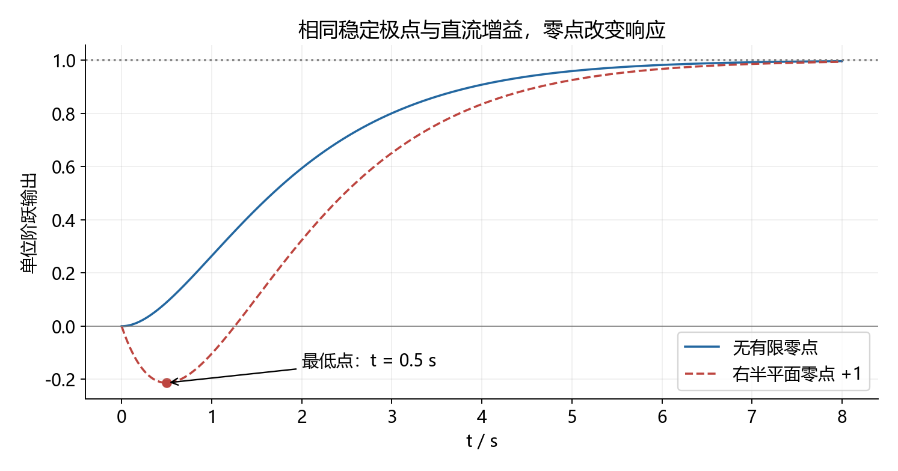

**怎么看图**：最低点在半秒，两条曲线最终都趋于一。图用于解释零点影响，不代表根据某一段曲线就能唯一反推全部零极点。

**留数补充**：离虚轴最近的极点决定可能的慢时间尺度，但还要看它在所研究输入输出通道中的系数。例如脉冲响应：

$$
h(t)=10^{-3}e^{-0.1t}+e^{-2t}.
$$

慢项起始只占很小比例；两项相等发生在：

$$
t_*=\frac{\ln1000}{1.9}\approx3.636\,\mathrm{s}.
$$

此后慢项相对占优，但那时总幅值也已很小。所谓“主导”应说明是早期响应、长时间尾部还是给定误差带下的调节时间。

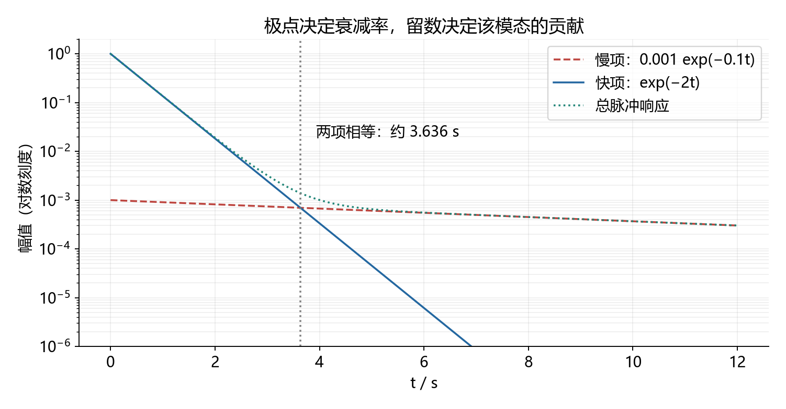

图采用对数纵轴，适合看贡献交替；不能只看对数图中的尾部显眼就判断它造成很大的绝对误差。

回查：[二阶指标前提](#formula-variants)；[极零相消与最小实现](#topic-09)。

### 12.17.7 奇异矩阵离散化：积分公式永远比强行求逆可靠

**触发信号**：积分器、零特征值、状态矩阵行列式为零。只有状态矩阵可逆时，才能把零阶保持积分写成矩阵逆乘指数差。

**自编例题**：双积分对象。

$$
A=\begin{bmatrix}0&1\\0&0\end{bmatrix},\qquad
B=\begin{bmatrix}0\\1\end{bmatrix},\qquad A^2=0.
$$

指数级数直接截断，再对输入列积分：

$$
\begin{gathered}
A_d=I+AT=\begin{bmatrix}1&T\\0&1\end{bmatrix},\\
B_d=\int_0^T(I+A\tau)B\,d\tau
=\begin{bmatrix}T^2/2\\T\end{bmatrix}.
\end{gathered}
$$

第一状态是位置，第二状态是速度。保持输入为常数时，一个区间内位置增量包含半倍加速度乘时间平方，不能误写成时间平方或零。

一般数值计算可用块矩阵指数避免逆矩阵：

$$
\exp\left(T\begin{bmatrix}A&B\\0&0\end{bmatrix}\right)
=\begin{bmatrix}A_d&B_d\\0&I\end{bmatrix}.
$$

**自测**：周期为半秒，答案为：

$$
A_d=\begin{bmatrix}1&1/2\\0&1\end{bmatrix},\quad
B_d=\begin{bmatrix}1/8\\1/2\end{bmatrix}.
$$

不要用逐元素指数代替矩阵指数；数字反馈后的矩阵也不能不加区分地直接套连续闭环谱映射。回查：[精确离散化](#topic-13)。

### 12.17.8 参数能控性：非零时能控，不等于所需增益温和

**自编例题**：

$$
A=\operatorname{diag}(-1,-2),\qquad
B=\begin{bmatrix}1\\\beta\end{bmatrix},\qquad
\mathcal C=\begin{bmatrix}1&-1\\\beta&-2\beta\end{bmatrix},\quad
\det\mathcal C=-\beta.
$$

参数非零时完全能控；参数为零时第二模态不可控，但该模态稳定，系统仍可稳定化。完全能控与可稳定化不能混用。

要求状态反馈后极点为负三、负四，列完整特征多项式并匹配：

$$
\begin{gathered}
u=-\begin{bmatrix}k_1&k_2\end{bmatrix}x,\\
p_K(s)=s^2+(3+k_1+\beta k_2)s+2+2k_1+\beta k_2,\\
k_1+\beta k_2=4,\quad2k_1+\beta k_2=10,\\
\boxed{k_1=6,\quad k_2=-2/\beta}\quad(\beta\ne0).
\end{gathered}
$$

参数很小时，第二状态通过输入受到的作用很弱，精确指定极点需要很大的反馈系数。例如参数为千分之一，第二增益为负两千。到参数零时，目标配置不可能，因为负二的不可控模态必须保留。

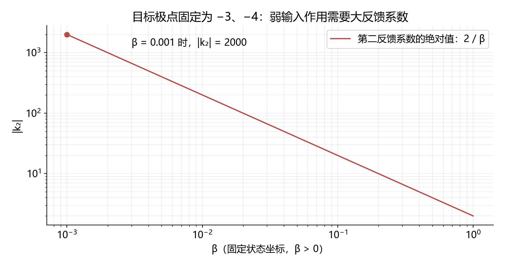

**怎么看图**：横纵轴都取对数，曲线展示固定状态坐标下增益随输入系数变化。反馈系数也受状态单位缩放影响，不能跨不同坐标直接比较数值大小。可稳定化并不要求任意指定所有稳定模态。

**计算技巧**：参数问题优先符号行列式或 PBH 分情况；浮点秩受容差影响，不能把一次软件输出当成精确退化边界。数值求解线性方程优先直接解方程，不必显式求逆。

**自测**：参数为零，希望闭环极点为负三、负二。可以取第一增益二，第二增益任意；不可控负二模态保留。回查：[PBH](#topic-08)。

### 12.17.9 有限步控制：最早输入对应最高次传播

**自编例题**：离散系统及初末状态为：

$$
A=\begin{bmatrix}1&1\\0&1\end{bmatrix},\quad B=\begin{bmatrix}0\\1\end{bmatrix},\quad
x_0=\begin{bmatrix}1\\0\end{bmatrix},\quad x_2=0.
$$

先展开两次递推，再排列输入，不要直接凭记忆搬能控矩阵：

$$
\begin{gathered}
x_2=A^2x_0+ABu_0+Bu_1,\\
\begin{bmatrix}AB&B\end{bmatrix}
\begin{bmatrix}u_0\\u_1\end{bmatrix}
=\begin{bmatrix}1&0\\1&1\end{bmatrix}
\begin{bmatrix}u_0\\u_1\end{bmatrix}
=\begin{bmatrix}-1\\0\end{bmatrix},\\
\boxed{u_0=-1,\quad u_1=1}.
\end{gathered}
$$

逐步回代得到中间状态第一分量一、第二分量负一，再一步到零。用于判断秩时，把列倒序不改变秩；用于求时序输入时，列倒序必须同步改变未知量顺序。

**自测**：初态改为第一分量零、第二分量一，终态仍为零。

$$
A^2x_0=\begin{bmatrix}2\\1\end{bmatrix}
\Rightarrow\boxed{u_0=-2,\quad u_1=1}.
$$

到零后若继续输入非零，当然可能再次离开零；有限步到达题只规定给定时刻。回查：[第 11.10 节](11.实战技巧手册（题型识别、完整步骤与易错补全）.md)。

### 12.17.10 怎样安排下一轮学习

建议先按下表练，不按“又学了多少公式”计进度。这是学习顺序建议，不是考试权重预测。

| 轮次 | 练习组合 | 闭卷结束后只记录什么 |
|---|---|---|
| 一 | 12.17.1、12.17.3—12.17.5 | 重根、平移方向、相位象限、候选筛选 |
| 二 | 12.17.2、12.17.7—12.17.9 | 矩阵结构、可逆条件、参数边界、输入时序 |
| 三 | 12.17.6，再回做模拟卷第三、六、十题 | 是否滥用二阶公式，是否漏掉零点或隐藏模态 |
| 四 | 第 13 份完整模拟卷限时作答 | 知识缺口、方法选择、代数运算、条件遗漏分别标记 |

每题交卷前用最适合它的两个检查，避免机械做一大串无关运算：

- 部分分式：回乘分母＋初值／高频阶次。
- 参数范围：一个区间内值＋两端边界；数值抽样不能证明整个范围，证明仍靠符号不等式。
- 根与反馈：特征式系数＋根的和积。
- 状态转移：初始单位阵＋微分方程。
- 频域：模平方方程＋实虚部和相位象限。
- 跟踪误差：通道注入位置＋终值条件。
- 离散控制：单位圆＋逐步递推。

**暂不优先堆叠的新内容**：现有 LQR、观测器与 Lyapunov 章节已经足够支撑一轮基础训练。先确认这些计算能独立完成，再考虑多变量频域、鲁棒控制、最优估计等更大范围内容。补充核对：厦大已查到的官方范围明确包含简单非线性与时变系统分析，这两项不能直接略过，当前训练仍需补足；具体题型深度再对照教材与可靠原卷。官方来源和目标 80% 的学习路线见 [第 1.12 节](1.文档目录.md#study-80)。

### 12.17.11 全局 Python 核验与资料

[生成及核验脚本](scripts/generate_calculation_clinic.py)；[计算结果](assets/calculation/verification.json)。

```powershell
& 'D:\Python310\python.exe' scripts/generate_calculation_clinic.py
```

脚本独立检查部分分式、矩阵指数微分方程、平移多项式、幅值／相位交点、阻尼比因式分解、零点响应、块指数离散化、参数反馈和有限步递推，生成三张配图。数值抽样只作旁证，不替代文中的符号推导。

补充原理资料：[MIT 的 Cayley–Hamilton 与矩阵指数讲义](https://web.mit.edu/course/2/2.151/www/Handouts/CayleyHamilton.pdf)；[Caltech 的右半平面零点与性能限制课程讲义](https://www.cds.caltech.edu/~murray/courses/cds110/sp2024/L8-1_limits-20May2024.pdf)。本节数字、练习与计算为自编。

[返回内容导航](#contents)
