# 12. 难点专题详解：讲解、配图、例题与公式

这是一份可连续阅读的难点专题合订本。13 个核心难点的讲解、推导、配图、完整例题和自测题都直接放在本文，无需跳转到分散的专题文件。

阅读方式：先理解问题与条件，再看公式推导和图片；完整例题看完后，遮住每节末尾的参考答案，独立做一遍自测题。新增练习均为自编例题，不是未经核验的真题。

公式统一使用 Typora 独立公式块；短说明使用直立文字。图片在本文直接展示，图片文件保存在 `assets` 中；复制笔记时一并复制该目录。

## 12.0 内容导航

| 章节 | 核心难点 | 需要弄懂的问题 |
|---|---|---|
| 12.1 | [梅森公式](#topic-01) | 不接触回路与余因子为什么进入公式 |
| 12.2 | [劳斯判据与特殊行](#topic-02) | 不求根怎样计数，特殊行怎么处理 |
| 12.3 | [Nyquist 判据与绕数](#topic-03) | 为何观察负一点，绕数怎样决定稳定 |
| 12.4 | [根轨迹规则的共同来源](#topic-04) | 角度、实轴规则与渐近线怎样来自同一方程 |
| 12.5 | [系统型别与稳态误差](#topic-05) | 积分阶次怎样决定长期跟踪误差 |
| 12.6 | [超前校正公式的来源](#topic-06) | 最大超前角和对应频率怎样推导 |
| 12.7 | [矩阵指数与状态响应](#topic-07) | 耦合为何产生时间乘指数 |
| 12.8 | [能控能观与 PBH 判据](#topic-08) | 矩阵秩如何代表输入与观测方向 |
| 12.9 | [相似变换与最小实现](#topic-09) | 换坐标和删除隐藏状态为何不同 |
| 12.10 | [极点配置与分离原理](#topic-10) | 控制与估计的极点为何能分开设计 |
| 12.11 | [Lyapunov 方程与能量几何](#topic-11) | 二次型为何能证明稳定 |
| 12.12 | [LQR 与 Riccati 方程](#topic-12) | 优化怎样产生 Riccati 二次项 |
| 12.13 | [零阶保持与精确离散化](#topic-13) | 精确采样与欧拉近似为何不同 |

经典控制为 12.1—12.6；现代控制为 12.7—12.13。每节都包含配图、数学表达式、数值例题或完整反例，以及附答案的自测题。

---

## 12.1 梅森公式

### 12.1.0 这份专题解决什么

梅森公式常被教材压缩成一行，但考试真正容易丢分的是：

1. 前向通路是否漏列；
2. 同一回路是否重复计算；
3. 接触回路与不接触回路是否判断正确；
4. 余因子为什么要删除某些回路；
5. 多输入系统是否重新选择源点；
6. 最终结果能否用节点方程验算。

本专题从节点方程出发证明公式，再给出三类完整例题。

#### 先用一张图理解“不接触回路乘积”

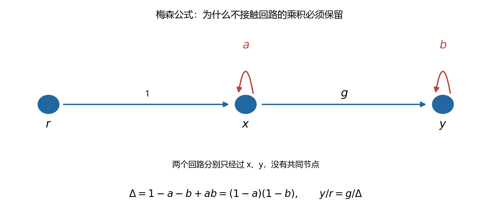

图中自回路分别只经过两个不同节点，因此可以同时选择，不会重复占用节点。先不用梅森公式，直接列式：

$$
\begin{aligned}
x&=r+ax,\\
y&=gx+by.
\end{aligned}
$$

依次消元得到：

$$
\frac yr=\frac g{(1-a)(1-b)}
=\frac g{1-a-b+ab}.
$$

分母里的乘积项正是两个不接触回路共同产生的项。若只背“减去全部回路”而漏掉乘积，就连这个两节点系统都算不对。前向通路经过两个节点，两条回路都与它接触，故该通路的余因子为一。

自编数值例：取支路增益为 3、两个自回路增益分别为 0.2 与 0.5，输入为 1。逐节点计算得到：

$$
x=1.25,\qquad y=7.5,\qquad
\Delta=1-0.2-0.5+0.1=0.4,\qquad g/\Delta=7.5.
$$

两种算法一致。图由全局 Python 生成，脚本见 [难点配图脚本](scripts/generate_difficult_concepts.py)。这是代数结构示例，不能把常数支路直接解释成含动态过程的稳定性结论。后文 12.1.5 再用行列式解释一般情况。

---

### 12.1.1 先从结构图的三个基本公式开始

#### 12.1.1.1 串联

$$
X=G_1R,
$$

$$
Y=G_2X.
$$

消去中间变量：

$$
\boxed{
\frac{Y}{R}=G_1G_2.
}
$$

#### 12.1.1.2 并联

$$
Y_1=G_1R,
$$

$$
Y_2=G_2R.
$$

若两支路相加：

$$
Y=Y_1+Y_2.
$$

所以：

$$
\boxed{
\frac{Y}{R}=G_1+G_2.
}
$$

若第二支路在比较点取负号：

$$
\boxed{
\frac{Y}{R}=G_1-G_2.
}
$$

#### 12.1.1.3 负反馈

$$
E=R-HY,
$$

$$
Y=GE.
$$

代入并移项：

$$
Y=G(R-HY),
$$

$$
(1+GH)Y=GR.
$$

因此：

$$
\boxed{
\frac{Y}{R}=\frac{G}{1+GH}.
}
$$

> @重点：这些公式都不是图形口诀，而是消去中间信号的结果。梅森公式只是把大规模消元一次写完。

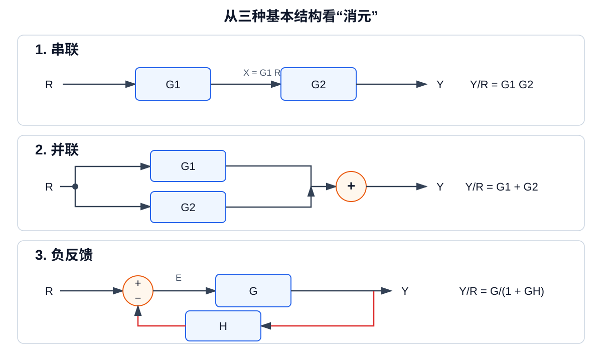

读图时先沿箭头写节点方程，再消去中间节点。蓝色方框表示传递环节，橙色圆表示比较或求和节点，红色箭头表示反馈支路。

---

### 12.1.2 怎样把结构图变成信号流图

信号流图由节点和有向支路组成：

1. 节点表示信号变量；
2. 箭头表示传递方向；
3. 箭头旁的量是支路增益；
4. 节点值等于所有流入支路贡献之和。

若节点方程为：

$$
X=aR+bY+cZ,
$$

则信号流图中有：

$$
R\xrightarrow{a}X,
$$

$$
Y\xrightarrow{b}X,
$$

$$
Z\xrightarrow{c}X.
$$

负反馈的负号直接写入支路增益。例如：

$$
E=R-HY
$$

对应：

$$
R\xrightarrow{1}E,
$$

$$
Y\xrightarrow{-H}E.
$$

转换步骤：

1. 给每个比较点输出、环节输出和独立输入命名；
2. 对每个节点写一条信号方程；
3. 按方程右侧逐项画入射支路；
4. 检查每个正负号；
5. 确认同一个分支信号没有被误画成两个不同节点。

---

### 12.1.3 四个基本定义

#### 12.1.3.1 前向通路

前向通路是从输入节点到输出节点的有向路径，并且任何节点不重复经过。

第若干条前向通路的增益为沿途支路增益之积：

$$
P_k
=
\prod_{\text{第 }k\text{ 条前向通路}}g_i.
$$

#### 12.1.3.2 回路

回路是从某节点出发又回到该节点的闭合有向路径，除起点与终点外不重复经过节点。

回路增益为：

$$
L_i
=
\prod_{\text{第 }i\text{ 个回路}}g_j.
$$

同一回路从不同节点开始书写，仍是同一个回路，不能重复计数。

#### 12.1.3.3 接触回路

两个回路只要共享至少一个节点，就称为接触回路。

判断接触看的是共享节点，而不是共享支路。

#### 12.1.3.4 余因子

对第若干条前向通路，删除所有与该通路接触的回路。使用剩余回路重新形成的图行列式称为：

$$
\Delta_k.
$$

若所有回路都与该前向通路接触，则：

$$
\Delta_k=1.
$$

---

### 12.1.4 梅森增益公式

输入到输出的总传递增益为：

$$
\boxed{
T
=
\frac{Y}{R}
=
\frac{\displaystyle\sum_{k=1}^{m}P_k\Delta_k}
{\Delta}.
}
$$

其中图行列式为：

$$
\boxed{
\Delta
=
1
-\sum_iL_i
+\sum_{\substack{i<j\\L_i,L_j\text{ 不接触}}}L_iL_j
-\sum_{\substack{i<j<r\\L_i,L_j,L_r\text{ 两两不接触}}}L_iL_jL_r
+\cdots.
}
$$

符号按以下规律交替：

$$
1,\quad -,\quad +,\quad -,\quad \cdots.
$$

> @重点：二阶乘积只取不接触回路对；三阶乘积只取两两不接触的三个回路。

---

### 12.1.5 梅森公式的证明

#### 12.1.5.1 把全部节点方程写成矩阵

设内部节点组成向量：

$$
x=
\begin{bmatrix}
x_1&x_2&\cdots&x_n
\end{bmatrix}^{T}.
$$

信号流图的全部节点方程可以写成：

$$
x=Ax+bR.
$$

移项：

$$
(I-A)x=bR.
$$

若输出为：

$$
Y=c^{T}x+dR,
$$

则：

$$
\frac{Y}{R}
=
d+c^{T}(I-A)^{-1}b.
$$

使用伴随矩阵公式：

$$
(I-A)^{-1}
=
\frac{\operatorname{adj}(I-A)}
{\det(I-A)}.
$$

所以所有节点解具有共同分母：

$$
\det(I-A).
$$

#### 12.1.5.2 为什么分母只出现不接触回路

展开行列式时，每一项必须从每行、每列各选一个元素。

若选中的若干支路形成一个闭合置换，它们在信号流图中正好形成一个回路。选择一个回路产生：

$$
-L_i.
$$

若同时选择两个回路，因为同一行和同一列不能重复使用，这两个回路不能共享节点，所以只能是不接触回路。对应项为：

$$
+L_iL_j.
$$

同时选择三个两两不接触回路，对应：

$$
-L_iL_jL_r.
$$

因此：

$$
\det(I-A)
=
1-\sum L_i+\sum L_iL_j-\sum L_iL_jL_r+\cdots.
$$

所以：

$$
\boxed{
\det(I-A)=\Delta.
}
$$

#### 12.1.5.3 为什么分子出现前向通路和余因子

用克拉默法则或伴随矩阵求输入到输出的关系时，一个非零分子项必须先选出一条从输入到输出的前向通路。

这条前向通路已经占用了沿途节点。行列式剩余部分不能再次使用这些节点，所以所有与该前向通路接触的回路必须删除。

剩余节点上的回路仍按图行列式规则组合，得到：

$$
\Delta_k.
$$

因此第若干条前向通路产生的分子贡献为：

$$
P_k\Delta_k.
$$

对全部前向通路相加：

$$
\sum_kP_k\Delta_k.
$$

最终：

$$
\boxed{
T
=
\frac{\sum_kP_k\Delta_k}{\Delta}.
}
$$

> @理解：不接触回路来自行列式的行列不能重复；余因子删除接触回路，是因为前向通路已经占用了相应节点。

---

### 12.1.6 例一：一条前向通路、两个接触回路

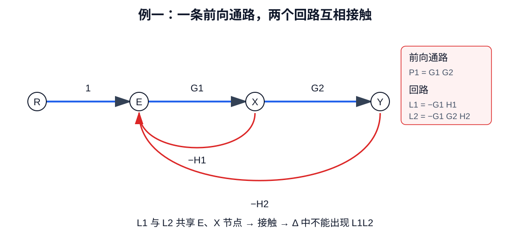

图中的蓝色箭头组成唯一前向通路；两条红色反馈支路分别形成大小两个回路。两个回路共享节点，所以不能把它们的乘积写入图行列式。

设唯一前向通路为：

$$
P_1=G_1G_2.
$$

两个反馈回路为：

$$
L_1=-G_1H_1,
$$

$$
L_2=-G_1G_2H_2.
$$

两个回路共享节点，所以互相接触，不存在二阶不接触回路乘积。

图行列式：

$$
\Delta
=
1-L_1-L_2.
$$

代入：

$$
\Delta
=
1+G_1H_1+G_1G_2H_2.
$$

两个回路都与前向通路接触：

$$
\Delta_1=1.
$$

所以：

$$
\boxed{
T
=
\frac{G_1G_2}
{1+G_1H_1+G_1G_2H_2}.
}
$$

#### 节点方程验算

设第一个环节输入为：

$$
E=R-H_1X-H_2Y.
$$

并有：

$$
X=G_1E,
$$

$$
Y=G_2X.
$$

由：

$$
X=\frac{Y}{G_2}
$$

可得：

$$
Y
=
G_1G_2
\left(
R-H_1\frac{Y}{G_2}-H_2Y
\right).
$$

整理：

$$
\frac{Y}{R}
=
\frac{G_1G_2}
{1+G_1H_1+G_1G_2H_2}.
$$

与梅森公式一致。

---

### 12.1.7 例二：两条前向通路、两个不接触回路

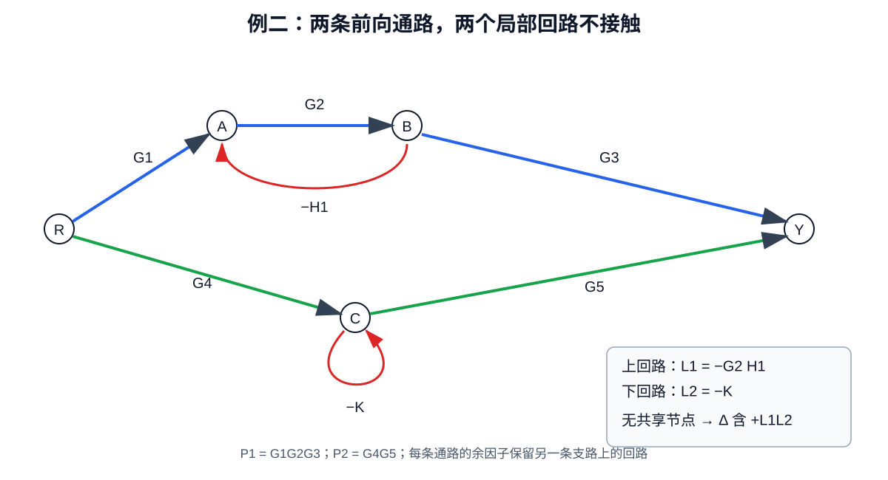

上、下两条前向通路只共享输入和输出节点，两个局部反馈回路位于不同内部节点组。回路之间不共享节点，所以图行列式必须包含二阶乘积项。

设两条前向通路为：

$$
P_1=G_1G_2G_3,
$$

$$
P_2=G_4G_5.
$$

第一条通路上的反馈回路为：

$$
L_1=-G_2H_1.
$$

第二条通路上的局部回路为：

$$
L_2=-K.
$$

两个回路不共享节点，所以：

$$
\Delta
=
1-L_1-L_2+L_1L_2.
$$

代入并因式分解：

$$
\Delta
=
1+G_2H_1+K+KG_2H_1,
$$

$$
\Delta
=
(1+G_2H_1)(1+K).
$$

第一条前向通路只与第一个回路接触：

$$
\Delta_1=1-L_2=1+K.
$$

第二条前向通路只与第二个回路接触：

$$
\Delta_2=1-L_1=1+G_2H_1.
$$

所以：

$$
\boxed{
T
=
\frac{
G_1G_2G_3(1+K)
+G_4G_5(1+G_2H_1)
}{
(1+G_2H_1)(1+K)
}.
}
$$

拆开：

$$
\boxed{
T
=
\frac{G_1G_2G_3}{1+G_2H_1}
+\frac{G_4G_5}{1+K}.
}
$$

这正是两条独立闭环支路输出相加的结果。

#### 数值例

取：

$$
G_1=1,
\qquad
G_2=2,
\qquad
G_3=3,
$$

$$
H_1=\frac12,
\qquad
G_4=1,
\qquad
G_5=4,
\qquad
K=2.
$$

则：

$$
P_1=6,
\qquad
P_2=4,
$$

$$
L_1=-1,
\qquad
L_2=-2.
$$

图行列式：

$$
\Delta
=
1-(-1)-(-2)+(-1)(-2)
=6.
$$

两个余因子：

$$
\Delta_1=3,
\qquad
\Delta_2=2.
$$

总增益：

$$
T
=
\frac{6\cdot3+4\cdot2}{6}
=
\boxed{\frac{13}{3}}.
$$

分别计算两条闭环支路：

$$
\frac{6}{1+1}
+\frac{4}{1+2}
=
3+\frac43
=
\frac{13}{3}.
$$

验算一致。

---

### 12.1.8 例三：多输入系统

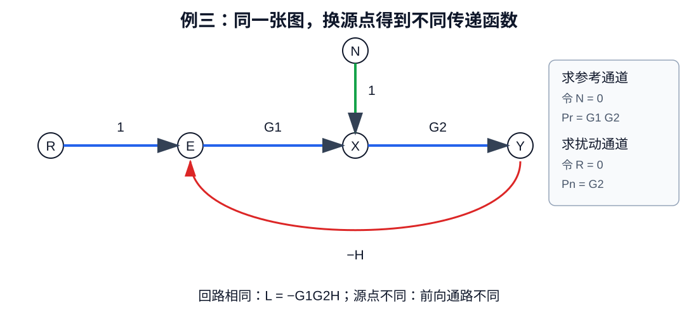

求不同输入通道时，图本身不变，只更换源点并把其他独立输入置零。红色反馈回路保持不变，蓝色和绿色前向通路分别对应参考输入与扰动输入。

若参考输入和扰动同时作用：

$$
Y=T_rR+T_nN.
$$

求参考输入通道时，令：

$$
N=0.
$$

以参考输入节点为源点，求：

$$
T_r=\frac{Y}{R}.
$$

求扰动通道时，令：

$$
R=0.
$$

以扰动节点为新的源点，重新寻找前向通路，求：

$$
T_n=\frac{Y}{N}.
$$

回路集合通常不变，所以两个传递函数一般具有相同图行列式：

$$
\Delta.
$$

但两个源点对应的前向通路不同，所以分子一般不同。

例如参考通路只有：

$$
P_r=G_1G_2,
$$

扰动从第二个环节前注入，对应通路为：

$$
P_n=G_2.
$$

若唯一回路为：

$$
L=-G_1G_2H,
$$

则：

$$
\Delta=1-L=1+G_1G_2H.
$$

回路与两条通路均接触：

$$
\Delta_r=\Delta_n=1.
$$

因此：

$$
\boxed{
\frac{Y}{R}
=
\frac{G_1G_2}{1+G_1G_2H}.
}
$$

$$
\boxed{
\frac{Y}{N}
=
\frac{G_2}{1+G_1G_2H}.
}
$$

> @重点：梅森公式一次只计算一个源点到一个汇点。多输入问题必须逐源置零。

---

### 12.1.9 考场书写模板

第一步，列前向通路：

$$
P_1,\ P_2,\ \ldots,\ P_m.
$$

第二步，列全部单回路：

$$
L_1,\ L_2,\ \ldots,\ L_q.
$$

第三步，列不接触回路组：

$$
(L_i,L_j),
$$

$$
(L_i,L_j,L_r).
$$

第四步，计算图行列式：

$$
\Delta
=
1-\sum L_i+\sum L_iL_j-\sum L_iL_jL_r+\cdots.
$$

第五步，对每条前向通路删除接触回路：

$$
\Delta_1,\ \Delta_2,\ \ldots,\ \Delta_m.
$$

第六步，代入：

$$
\boxed{
T
=
\frac{\sum P_k\Delta_k}{\Delta}.
}
$$

第七步，至少做一个验算：

1. 用节点方程消元；
2. 令某个反馈增益为零，检查退化结果；
3. 检查各项量纲；
4. 检查负反馈回路代入负回路增益后，分母是否出现合理的加号。

---

### 12.1.10 高频错误清单

1. 回路增益漏掉反馈支路的负号；
2. 同一回路从不同节点出发被重复计算；
3. 把共享节点的回路误认为不接触；
4. 把接触回路乘积写进图行列式；
5. 计算余因子时删除了不该删除的回路；
6. 忘记前向通路之间即使接触也要分别计入分子；
7. 多输入题没有更换源点重新列前向通路；
8. 只写最终公式，没有列出通路、回路和余因子；
9. 用梅森公式处理含非线性乘积的节点方程；
10. 算完没有用节点方程或特殊参数退化进行验算。

> @重点：梅森公式的真正难点不是代公式，而是完整、无重复地识别图中的路径和回路。

---

### 12.1.11 其他常被教材略去的推导在哪里

本套资料中的类似推导已经集中在第 2 份文档：

- 2.12：负反馈分母为什么出现加号；
- 2.13：系统型别为什么决定不同输入的稳态误差；
- 2.14—2.15：二阶超调量和调节时间公式的来源；
- 2.16：根轨迹角度条件和幅值条件；
- 2.17：Bode 图斜率为什么按每十倍频变化；
- 2.18：Nyquist 判据为什么围绕临界点计数。

这些内容与本专题共同构成“公式来源—应用步骤—例题验算”主线。

### 12.1.练习 自测题（自编，附答案）

**题目**：沿用本节开头的两个不接触自回路图，改取以下增益，求输出与输入之比，并用节点方程核对。

$$
g=3,\qquad a=-0.2,\qquad b=0.5.
$$

**参考答案与检查**：

$$
\Delta=(1+0.2)(1-0.5)=0.6,\qquad y/r=3/0.6=5.
$$

注意第一个回路增益本来就是负数，代入时不能再凭“反馈”二字额外添一个负号。

[返回内容导航](#contents)

---

## 12.2 劳斯判据与特殊行

需要的基础：多项式、复根成对、三阶方程的系数。完整劳斯定理涉及多项式的实根计数；本篇区分定理本身与能直接验证的表格运算，不把几张根图当证明。

### 12.2.1 先明确判断的对象

稳定性问的是完整闭环特征多项式的根，不是题目给出的开环分母。例如单位负反馈开环的分母和分子相加后才得到闭环特征式。

**劳斯定理**：没有虚轴根且特殊行已正确处理时，劳斯表第一列的符号变化次数等于右半平面根数。它的作用是用系数的代数操作替代逐个求根。

### 12.2.2 表格不是随意拼数

对三阶多项式，表格为：

$$
\begin{array}{c|cc}
s^3&a_3&a_1\\
s^2&a_2&a_0\\
s^1&(a_2a_1-a_3a_0)/a_2&0\\
s^0&a_0&0
\end{array}
$$

前两行分别收集奇数次项和偶数次项；下一行的交叉相乘来自逐步消去最高次项的多项式余式运算。它解释了递推形式，但“余式符号变化等于右半平面根数”仍是所引用定理的内容。

取最高次系数正，三阶严格稳定条件为：

$$
a_3,a_2,a_1,a_0>0,\qquad a_2a_1>a_3a_0.
$$

### 12.2.3 完整例题与边界

自编例题：

$$
D(s)=s^3+3s^2+2s+K.
$$

第一列为：

$$
1,\quad3,\quad(6-K)/3,\quad K.
$$

全部同号得到严格稳定范围：

$$
0<K<6.
$$

取边界代回，不用近似求根：

$$
\begin{aligned}
K=0:&\quad D=s(s+1)(s+2);\\
K=6:&\quad D=(s+3)(s^2+2).
\end{aligned}
$$

前者有原点根，后者有一对纯虚根。正好解释为何不能取等号。取增益为 8，第一列为正、正、负、正，出现两次变号，有两个右半平面根。

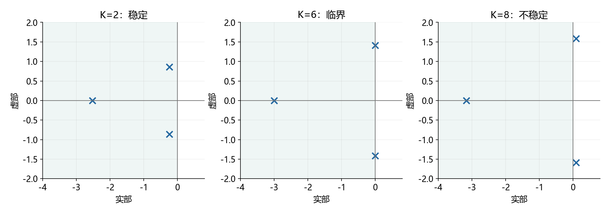

图中叉号是真实计算的闭环根，灰色区域是左半平面。三个面板用同一个模型，展示稳定、临界和不稳定。图用于回查结论，不能替代劳斯定理。

### 12.2.4 两种零，处理方法完全不同

仅第一列元素为零而该行不全零时，用趋于零的正数替代，再检查符号极限。整行全零时，从上一行构造辅助多项式，以其导数的系数替换零行，继续计算。

全零行意味着存在关于原点对称的根；并不保证全是纯虚根。例如：

$$
s^4-1=(s-1)(s+1)(s^2+1).
$$

### 12.2.5 实战怎么用

先写完整特征式，再列前两行；特殊值单独处理，最后把严格不等式取交集。题目要求极点位于某条竖线左侧时，先平移变量，再使用劳斯判据。

### 12.2.练习 自测题（自编，附答案）

**题目**：求下列特征多项式的严格稳定增益范围，并解释上边界。

$$
D(s)=s^3+4s^2+3s+K.
$$

**参考答案与检查**：

$$
0<K<12,\qquad K=12:\ D(s)=(s+4)(s^2+3).
$$

第一列为 1、4、四分之一乘以十二减增益、增益；上边界含纯虚根，不取等号。

[返回内容导航](#contents)

---

## 12.3 Nyquist 判据与绕数

需要的基础：复数、闭环特征方程、零点与极点。绕数的严格桥梁是辩值原理；本篇从它推导控制中的计数关系，不声称用初等代数证明辩值原理。

### 12.3.1 为什么不是观察原点

负反馈闭环特征方程为：

$$
F(s)=1+L(s)=0.
$$

闭环极点是函数 F 的零点。观察 F 绕原点，与观察 L 绕负一点，几何上只差一个单位的平移。

### 12.3.2 辩值原理把“零极点”变成“相角变化”

在不经过零极点的闭合围线上，每个被包围的零点贡献一圈相角变化，每个极点贡献相反一圈。本篇统一采用：右半平面围线顺时针遍历，映射曲线顺时针绕圈数记为正。

$$
N_{\rm cw}=Z-P,\qquad Z=P+N_{\rm cw}.
$$

其中 P 是开环在右半平面的极点数，Z 是闭环在右半平面的极点数。闭环严格稳定还需要没有虚轴根。

$$
Z=0\quad\Rightarrow\quad N_{\rm cw}=-P.
$$

因此开环已有一个不稳定极点时，稳定闭环需要逆时针绕负一点一圈；“不包围负一点就稳定”只适合开环无右半平面极点的相应情形。

### 12.3.3 一个能同时用代数验算的例题

自编例题：

$$
L(s)=\frac{K}{s-1},\qquad K>0.
$$

开环有一个右半平面极点。闭环直接求得：

$$
1+\frac{K}{s-1}=0\quad\Rightarrow\quad s=1-K.
$$

所以增益大于 1 时稳定。频率响应为：

$$
L(j\omega)=\frac{-K}{1+\omega^2}
-j\frac{K\omega}{1+\omega^2}.
$$

消去频率，得到圆：

$$
\left(\operatorname{Re}L+\frac K2\right)^2+
(\operatorname{Im}L)^2=\left(\frac K2\right)^2.
$$

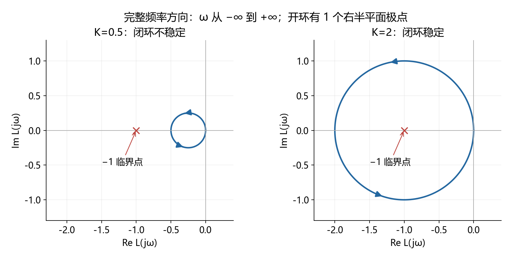

沿完整频率方向从负无穷走到正无穷，圆逆时针走一圈。增益为 2 时包含负一点，计数给出零个右半平面闭环根；增益为 0.5 时不包含负一点，仍有一个不稳定根。增益为 1 时经过临界点，闭环根落在原点。

### 12.3.4 哪些细节不能省

开环在虚轴有极点时，需要凹陷围线并补相应映射，不能把奇点两边直接连线。只画正频率半支时，还要补共轭半支与无穷远映射；箭头方向不可省。

如果改变“顺时针为正”的约定，计数公式必须一起改变。考试开始先写约定，比最后凭图猜正负稳妥。

### 12.3.练习 自测题（自编，附答案）

**题目**：单位负反馈开环如下，求稳定范围，并给出顺时针为正约定下的稳定绕数。

$$
L(s)=\frac K{s-2},\qquad K>0.
$$

**参考答案与检查**：

$$
s_{\rm cl}=2-K,\qquad K>2,\qquad P=1,\quad N_{\rm cw}=-1.
$$

临界增益为 2，此时闭环根在原点。逆时针绕负一点一圈对应稳定，不是不绕圈。

[返回内容导航](#contents)

---

## 12.4 根轨迹规则的共同来源

需要的基础：复数的模与角度、多项式重根。默认正增益、负反馈，开环分子分母已经明确。

### 12.4.1 所有规则的起点

$$
1+KG_0(s)=0\quad\Rightarrow\quad KG_0(s)=-1.
$$

右侧模为 1、相角为奇数倍圆周率，因此：

$$
\angle G_0(s)=(2k+1)\pi,\qquad K=\frac1{|G_0(s)|}.
$$

角度决定点能否在轨迹上，幅值决定走到该点所需的增益。这不是两套互不相关的公式。

### 12.4.2 实轴奇数规则与渐近线

在实轴测试点处，其右侧每个实零点或实极点对应一个负实向量，贡献半圈角度；左侧贡献零，共轭复数对的贡献抵消。于是右侧实零极点总数为奇数时满足角度条件，重数也计入。

设开环有 n 个极点、m 个零点，且前导系数已归入正增益。当 n 大于 m，远处的开环近似为幂函数：

$$
G_0(s)\sim s^{m-n},\qquad
\theta_k=\frac{(2k+1)\pi}{n-m}.
$$

再保留展开中的下一阶项，选择一个平移中心使该项消失，得到：

$$
\sigma_a=\frac{\sum p_i-\sum z_i}{n-m}.
$$

渐近线描述无穷远分支，不表示整条根轨迹就是直线。

上面的中心公式可以继续展开核对。令极点比零点多的个数为 d，并把首项系数归一化，分子分母按大变量展开：

$$
\begin{gathered}
d=n-m,\qquad
G_0(s)=s^{-d}\left[1+\frac{\sum p_i-\sum z_i}{s}+O(s^{-2})\right],\\
s=w+\sigma,\qquad
G_0(w+\sigma)=w^{-d}\left[1+
\frac{\sum p_i-\sum z_i-d\sigma}{w}+O(w^{-2})\right].
\end{gathered}
$$

让括号内的一阶修正项消失，就得到上述渐近线中心。这一步说明取平均并非经验口诀，而是在寻找远处轨迹最自然的平移原点。

### 12.4.3 分离点为什么求导

写特征式和增益函数：

$$
D_0(s)+KN_0(s)=0,\qquad K(s)=-\frac{D_0(s)}{N_0(s)}.
$$

重根还满足特征式对变量的导数为零。消去增益后，恰好是增益函数导数为零；这里要求分子因子在候选点非零。

$$
\frac{dK}{ds}=0.
$$

所以求导给的是候选重根，仍须检查轨迹角度、增益符号和题目规定的稳定范围。

### 12.4.4 一题连起全部规则

自编例题：

$$
G_0(s)=\frac1{s(s+2)},\qquad D=s^2+2s+K.
$$

实轴区段为负二到零；渐近线中心为负一、角度为正负九十度。由求导得到分离点和对应增益：

$$
K=-s(s+2),\qquad K'=-2s-2=0
\Rightarrow s=-1,\ K=1.
$$

直接求根验证：

$$
s=-1\pm\sqrt{1-K}.
$$

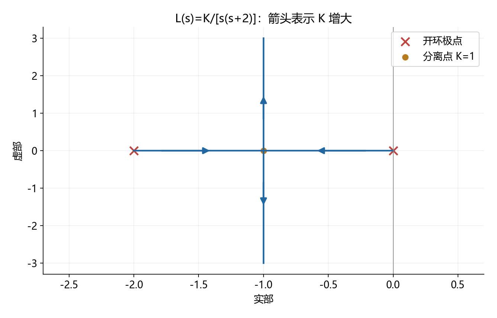

增益从零增大时，两根从零与负二出发，汇合于负一，再向上下两支移动。图中箭头代表增益增加，不是时间流逝。

### 12.4.5 实战边界

负增益或正反馈会改变角度条件；高阶系统指定一对极点后，还要检查其他极点。不能只因一对根阻尼比合适就套整个系统的标准二阶超调公式。

### 12.4.练习 自测题（自编，附答案）

**题目**：求分离点及对应增益，再求增益为 8 时的闭环极点。

$$
L(s)=\frac K{s(s+4)}.
$$

**参考答案与检查**：

$$
s_b=-2,\qquad K_b=4,\qquad K=8:\ s=-2\pm2j.
$$

从增益函数的导数求候选点，再代回二阶特征式验证。

[返回内容导航](#contents)

---

## 12.5 系统型别与稳态误差

需要的基础：拉普拉斯变换、终值定理。默认单位负反馈，误差是参考减输出，先确认闭环内部稳定。

### 12.5.1 从误差通道开始，而不是背表

$$
E(s)=\frac{R(s)}{1+L(s)}.
$$

低频下，假设开环有若干个有效积分环节：

$$
L(s)\sim\frac{k}{s^\nu},\qquad k\ne0.
$$

对阶数为 q 的多项式输入，采用带阶乘的归一化：

$$
r(t)=\frac{a t^q}{q!},\qquad R(s)=\frac a{s^{q+1}}.
$$

当积分阶次至少为 1，低频主要项为：

$$
sE(s)\sim\frac ak s^{\nu-q}.
$$

在没有其他妨碍收敛的极点时：积分阶次高于输入阶数则误差趋于零；两者相等则有限常差；积分阶次不足则没有有限误差终值。这就是型别表的来源。

零型系统的低频开环并不趋于无穷，不能把分母中的 1 删掉。阶跃误差因此是：

$$
e_\infty=\frac a{1+k}.
$$

### 12.5.2 完整例题：有限常差与发散只差输入阶数

自编例题，取稳定单位负反馈环路：

$$
L(s)=\frac2s,\qquad \frac E R=\frac{s}{s+2}.
$$

单位斜坡输入下：

$$
E(s)=\frac1{s(s+2)},\qquad
e(t)=\frac12(1-e^{-2t})\longrightarrow\frac12.
$$

输入改为二分之一时间平方：

$$
E(s)=\frac1{s^2(s+2)},\qquad
e(t)=\frac t2-\frac14+\frac14e^{-2t}.
$$

误差现在随时间增长；闭环极点仍在负二，所以“闭环稳定”与“所有输入都有有限误差”显然不是一回事。

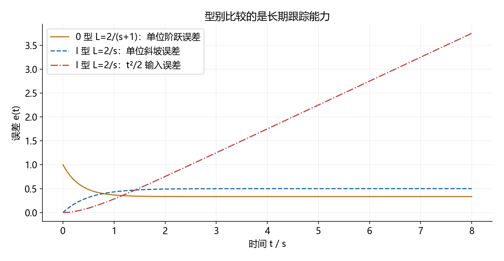

看图应比较误差的长期趋势，不是只比较最开始几秒谁更小。零型曲线取另一稳定环路，图例给出模型，不能把三条曲线误认为完全相同的系统。

### 12.5.3 实战边界

非单位反馈先区分比较点误差和输出跟踪误差；扰动输入先按注入点推导通道。系统型别描述的是所分析环路的低频结构，不能替代整个内部系统的稳定性检查。

### 12.5.练习 自测题（自编，附答案）

**题目**：单位负反馈、零初值，求以下斜坡输入的误差响应和终值。

$$
L(s)=\frac4s,\qquad r(t)=2t.
$$

**参考答案与检查**：

$$
E(s)=\frac2{s(s+4)},\qquad e(t)=\frac12(1-e^{-4t}),\qquad e_\infty=\frac12.
$$

斜坡幅值为 2，不能只把速度误差系数取倒数。

[返回内容导航](#contents)

---

## 12.6 超前校正公式的来源

需要的基础：复数相角、反正切求导、频率响应。讨论直流增益为一的超前网络。

### 12.6.1 一个零点先起作用，一个极点后起作用

$$
C(s)=\frac{1+Ts}{1+\alpha Ts},\qquad T>0,\quad0<\alpha<1.
$$

零点转折频率比极点低。因此中间频段先获得零点的正相位，极点的负相位还没全部出现。

$$
\phi(\omega)=\arctan(\omega T)-\arctan(\alpha\omega T).
$$

### 12.6.2 最大相位频率来自求导

$$
\frac{d\phi}{d\omega}
=\frac{T}{1+\omega^2T^2}
-\frac{\alpha T}{1+\alpha^2\omega^2T^2}=0.
$$

交叉相乘、约去非零项后：

$$
(1-\alpha)(1-\alpha\omega^2T^2)=0
\Rightarrow\omega_m=\frac1{T\sqrt\alpha}.
$$

这也就是零点与极点转折频率的几何平均。将它代入反正切差的正切公式：

$$
\tan\phi_m=\frac{1-\alpha}{2\sqrt\alpha},\qquad
\sin\phi_m=\frac{1-\alpha}{1+\alpha}.
$$

由此解出常背的设计式，并在同一频率计算幅值：

$$
\alpha=\frac{1-\sin\phi_m}{1+\sin\phi_m},\qquad
|C(j\omega_m)|=\frac1{\sqrt\alpha}.
$$

### 12.6.3 带数字算一次

自编例题，取时间常数为 1 秒、比例参数为四分之一。则最大相位频率为每秒 2 弧度，最大超前角约为 36.87 度，幅值为 2，即约 6.02 分贝。

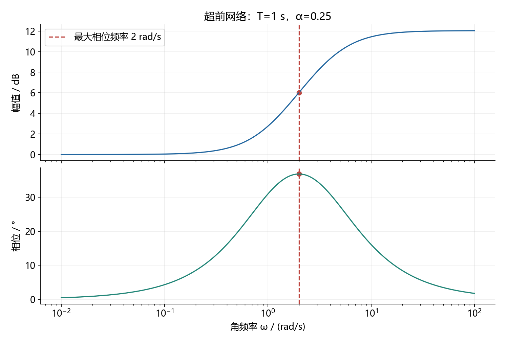

两张图共享频率轴。最大相位处幅值也改变了，所以不能只把超前角加到原穿越频率的相位裕度上就结束。

### 12.6.4 真正的设计步骤

稳态指标先确定低频增益；选候选新穿越频率，再用幅值方程与相位要求选网络参数；最后重新求完整环路的真实穿越频率和相位裕度。

最大相位频率不天然等于闭环设计所用的增益穿越频率，必须通过设计主动令它们重合，或接受两者不同并精确验算。图只画校正网络本身，不能从这张图判断完整闭环稳定。

### 12.6.练习 自测题（自编，附答案）

**题目**：求该超前网络的最大相位频率、最大超前角及该频率的幅值。

$$
C(s)=\frac{1+3s}{1+s/3}.
$$

**参考答案与检查**：

$$
T=3,\quad\alpha=\frac19,\quad\omega_m=1,\quad\phi_m\approx53.13^\circ,\quad|C(j\omega_m)|=3.
$$

分母时间常数是三分之一，它等于参数 α 与 T 的乘积，不是 α 本身。

[返回内容导航](#contents)

---

## 12.7 矩阵指数与状态响应

需要的基础：矩阵乘法、指数的幂级数、常数变易法。讨论有限维线性定常连续系统。

### 12.7.1 为什么要定义矩阵指数

标量齐次方程的解是指数；希望状态传播矩阵同样满足微分方程和单位初值，因此定义：

$$
e^{At}=I+At+\frac{A^2t^2}{2!}+\cdots.
$$

逐项求导后可直接验证：

$$
\frac d{dt}e^{At}=Ae^{At},\qquad e^{A0}=I.
$$

矩阵乘法传播的是状态间的耦合。给每个元素单独取指数，会把本应为零的初始非对角元素变成 1，不满足单位初值。

### 12.7.2 重根为什么出现时间乘指数

自编例题：

$$
A=\begin{bmatrix}-1&1\\0&-1\end{bmatrix}=-I+N,
\qquad N^2=0.
$$

因为这两个矩阵可交换，指数可拆开，幂级数又在一次项后截断：

$$
e^{At}=e^{-t}(I+tN)
=e^{-t}\begin{bmatrix}1&t\\0&1\end{bmatrix}.
$$

初态为第二个坐标方向时：

$$
x(0)=\begin{bmatrix}0\\1\end{bmatrix}
\Rightarrow x(t)=\begin{bmatrix}te^{-t}\\e^{-t}\end{bmatrix}.
$$

第一状态先上升再下降，是第二状态通过耦合不断向它输送影响；不是出现了不稳定特征值。

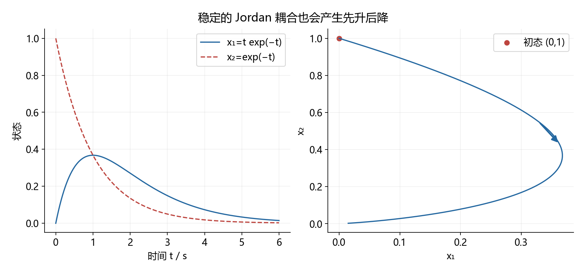

图左是时间响应，图右是状态轨迹。所有特征值都在负一，状态仍可能暂时增大；渐近稳定不要求每个分量每时每刻都下降。

### 12.7.3 输入项为什么是卷积

对非齐次方程，令状态等于传播矩阵乘一个待定向量，求导后消去齐次项并积分：

$$
\begin{aligned}
x(t)&=e^{At}v(t),\\
e^{At}\dot v(t)&=Bu(t),\\
v(t)&=x(0)+\int_0^t e^{-A\tau}Bu(\tau)\,d\tau.
\end{aligned}
$$

所以：

$$
x(t)=e^{At}x(0)+\int_0^t e^{A(t-\tau)}Bu(\tau)\,d\tau.
$$

每个输入时刻的作用先注入，再从该时刻传播到当前时刻，最后叠加。这就是卷积的物理意义。

### 12.7.4 边界与实战

两个任意矩阵的指数不能随便拆乘；需检查可交换性。时变状态矩阵一般也不能直接把积分放进指数，必须使用相应状态转移矩阵。算完至少代入零时刻与微分方程验算。

### 12.7.练习 自测题（自编，附答案）

**题目**：求零输入状态响应，并验算初值。

$$
A=\begin{bmatrix}-2&1\\0&-2\end{bmatrix},\qquad x(0)=\begin{bmatrix}0\\1\end{bmatrix}.
$$

**参考答案与检查**：

$$
e^{At}=e^{-2t}\begin{bmatrix}1&t\\0&1\end{bmatrix},\qquad x(t)=e^{-2t}\begin{bmatrix}t\\1\end{bmatrix}.
$$

代入零时刻得到原初值；对响应求导并左乘状态矩阵，两者一致。

[返回内容导航](#contents)

---

## 12.8 能控能观与 PBH 判据

需要的基础：向量张成空间、秩、特征向量。先用离散系统看传播方向，再连接连续系统；不是把两者的响应公式混用。

### 12.8.1 能控矩阵的列从哪里来

从零初态展开两步离散响应：

$$
x_1=Bu_0,\qquad x_2=ABu_0+Bu_1.
$$

第一步输入沿输入矩阵方向进入，早一步的输入额外经过一次状态矩阵传播。更多步就产生更多次幂。由 Cayley–Hamilton 定理，更高次幂不再提供超过状态维数的新方向，所以检查：

$$
\mathcal C=[B\ AB\ \cdots\ A^{n-1}B],\qquad
\operatorname{rank}\mathcal C=n.
$$

连续系统的输入积分也落在这些传播方向张成的空间中；该秩条件同样适用，但不能直接把上面的离散输入序列当作连续控制。

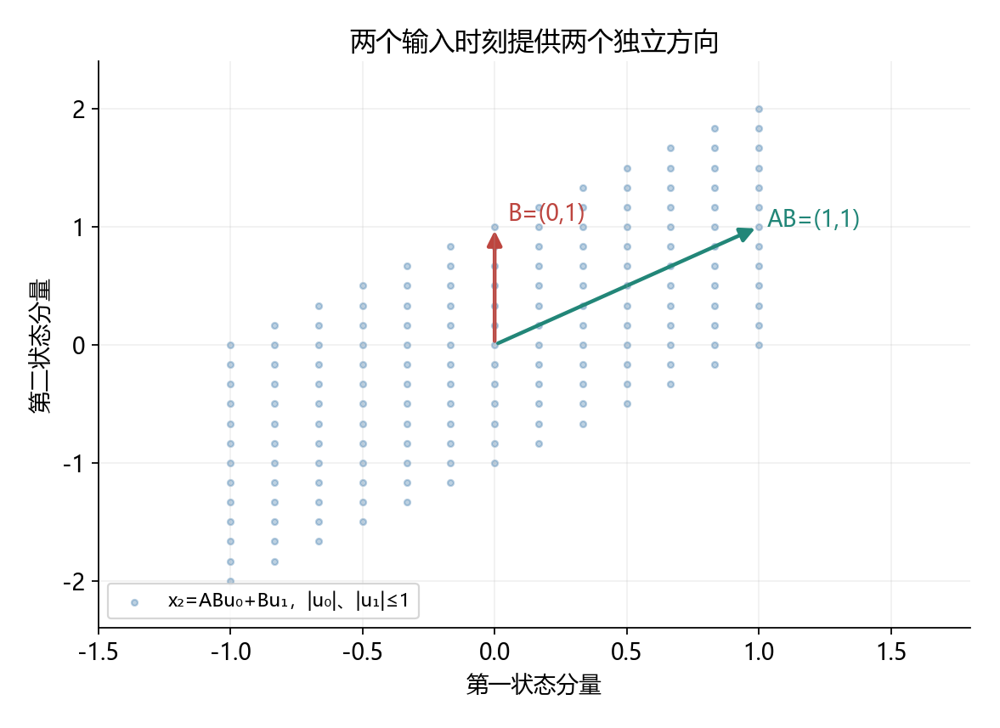

图中具体模型与两步可达状态是：

$$
A=\begin{bmatrix}1&1\\0&1\end{bmatrix},\qquad
B=\begin{bmatrix}0\\1\end{bmatrix},\qquad
x(2)=\begin{bmatrix}u_0\\u_0+u_1\end{bmatrix}.
$$

图中采用二阶积分链的离散形式，两个独立输入时刻生成两个方向。图上的有界区域来自人为限制两次输入幅值，能控性本身讨论的是不施加该幅值限制时能否覆盖整个状态空间。

### 12.8.2 PBH 为什么寻找“输入碰不到的模态”

若有非零左特征向量满足：

$$
w^TA=\lambda w^T,\qquad w^TB=0,
$$

把连续状态方程左乘它：

$$
\frac d{dt}(w^Tx)=\lambda w^Tx.
$$

这个模态完全不受输入影响，因此不可能完全能控。PBH 定理给出其逆命题，等价写成：

$$
\operatorname{rank}[\lambda I-A\ \ B]=n
\quad\text{对每个特征值成立。}
$$

这段模态解释证明了缺失方向为何导致不可控；完整等价性是 PBH 定理，不只靠画箭头得到。

### 12.8.3 能观是相反的问题

已知输入时可以扣除输入对输出的影响。齐次输出及其导数依次给出状态的不同投影，因此：

$$
\mathcal O=\begin{bmatrix}C\\CA\\\vdots\\CA^{n-1}\end{bmatrix}.
$$

若有右特征向量满足：

$$
Av=\lambda v,\qquad Cv=0,
$$

该模态无论怎样自然演化，输出始终看不见。PBH 能观判据于是检查竖向拼接矩阵是否满秩。

### 12.8.4 完整反例

$$
A=\begin{bmatrix}-1&0\\0&2\end{bmatrix},\quad
B=\begin{bmatrix}1\\0\end{bmatrix},\quad
C=\begin{bmatrix}1&0\end{bmatrix}.
$$

能控矩阵与能观矩阵的秩都为 1。第二状态指数增长，却既无法控制又无法从输出观察。系统既不可稳定化，也不可检测。

把第二个特征值改成负二后，秩仍不满，但隐藏模态自己衰减，因此变成可稳定化、可检测。满秩与稳定性是两类不同问题。

### 12.8.练习 自测题（自编，附答案）

**题目**：判断完全能控、完全能观、可稳定化与可检测。

$$
A=\operatorname{diag}(-1,-2),\quad B=[1,0]^T,\quad C=[0,1].
$$

**参考答案与检查**：

$$
\operatorname{rank}\mathcal C=1,\qquad\operatorname{rank}\mathcal O=1.
$$

既不完全能控，也不完全能观；但不可控与不可观模态都稳定，因此可稳定化、可检测。

[返回内容导航](#contents)

---

## 12.9 相似变换与最小实现

需要的基础：可逆矩阵、状态空间到传递函数、能控能观。

### 12.9.1 相似变换只是换一套坐标

定义可逆的坐标变换，代入状态方程：

$$
\begin{gathered}
x=Tz,\qquad \dot x=Ax+Bu,\\
\dot z=T^{-1}ATz+T^{-1}Bu,\qquad y=CTz+Du.
\end{gathered}
$$

三个矩阵必须一起变；只换状态矩阵而不换输入、输出矩阵，通常是在更换系统而不是换坐标。

代入传递函数可验证：

$$
CT(sI-T^{-1}AT)^{-1}T^{-1}B+D
=C(sI-A)^{-1}B+D.
$$

由于左右乘可逆矩阵不改变秩，能控性与能观性也不变。

### 12.9.2 相同传递函数可能隐藏不同内部状态

自编例题：

$$
A=\operatorname{diag}(-1,2),\quad B=[1,0]^T,\quad C=[1,0],\quad D=0.
$$

零初值的输入输出传递函数为：

$$
G(s)=\frac1{s+1}.
$$

但若第二状态初值为 1，完整内部状态含有：

$$
x_2(t)=e^{2t}.
$$

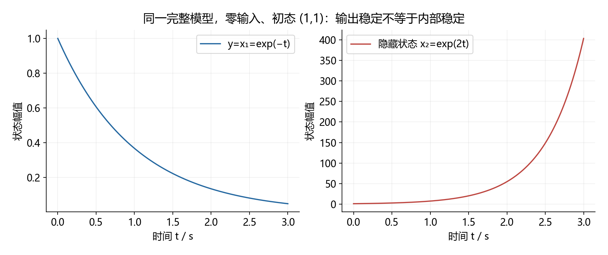

图中的输出看起来衰减，隐藏状态却增长。只看传递函数或者输出曲线，无法断言整个状态模型内部稳定。

### 12.9.3 最小实现到底删了什么

上面的输入输出关系可用一阶模型实现：

$$
\dot z=-z+u,\qquad y=z.
$$

它删除了对零初值输入输出关系没有贡献的状态，不是用一个可逆矩阵把二阶坐标变成一阶。有限维有理传递函数的最小实现等价于同时完全能控、完全能观；两个最小实现描述同一传递函数时可通过相似变换联系。

### 12.9.4 实战检查

题目问“是否同一系统”时，先说明讨论的是输入输出关系还是完整内部模型。约消一个不稳定因子不能让物理内部模态自动消失；非零初值响应更不能只用约消后的传递函数计算。

### 12.9.练习 自测题（自编，附答案）

**题目**：求零初值传递函数及一个最小实现；说明非零第二状态初值能否直接丢掉。

$$
A=\operatorname{diag}(-1,-3),\quad B=[1,0]^T,\quad C=[1,1],\quad D=0.
$$

**参考答案与检查**：

$$
G(s)=\frac1{s+1},\qquad\dot z=-z+u,\quad y=z.
$$

第二状态不可控但可在输出中看见。若它的初值非零，输出还有相应的三倍衰减率指数项，不能用零初值传递函数将其丢掉。

[返回内容导航](#contents)

---

## 12.10 极点配置与分离原理

需要的基础：特征多项式、能控能观、块三角矩阵。采用负状态反馈，输出无直通项。

### 12.10.1 增益是在改闭环微分方程

$$
u=-Kx+Nr\quad\Rightarrow\quad
\dot x=(A-BK)x+BNr.
$$

因此配置极点就是让闭环状态矩阵具有目标特征多项式。任意配置前先查完全能控，不能只因为能解出若干增益就假定所有目标都可实现。

### 12.10.2 用一个二阶系统完成设计

自编例题：

$$
A=\begin{bmatrix}0&1\\-2&-3\end{bmatrix},\quad
B=\begin{bmatrix}0\\1\end{bmatrix},\quad C=[1,0].
$$

能控与能观矩阵均满秩。令目标极点为负二和负四，则：

$$
\begin{aligned}
\det[sI-(A-BK)]&=s^2+(3+k_2)s+2+k_1,\\
(s+2)(s+4)&=s^2+6s+8.
\end{aligned}
$$

比较系数得反馈增益；再由参考通道的直流增益求前馈：

$$
K=[6,3],\qquad \frac Y R=\frac N{s^2+6s+8},\qquad N=8.
$$

极点只决定动态，分子前馈系数另管名义阶跃终值。

### 12.10.3 观测器的关键是误差方程

$$
\dot{\hat x}=A\hat x+Bu+L(y-C\hat x),\qquad e=x-\hat x.
$$

真状态方程减去估计方程，输入项抵消：

$$
\dot e=(A-LC)e.
$$

取误差极点为负五、负六，同样比较二阶特征多项式，得到：

$$
L=[8,4]^T.
$$

### 12.10.4 分离原理不是“估计误差没有影响”

用估计状态代替真状态反馈后：

$$
\begin{bmatrix}\dot x\\\dot e\end{bmatrix}
=\begin{bmatrix}A-BK&BK\\0&A-LC\end{bmatrix}
\begin{bmatrix}x\\e\end{bmatrix}
+\begin{bmatrix}BN\\0\end{bmatrix}r.
$$

块三角矩阵的行列式等于对角块行列式之积，所以联合极点是两组极点的并集。右上角并不为零，估计误差仍会影响控制瞬态。

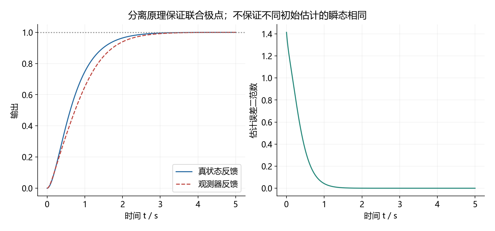

图使用非零初始估计误差。两种输出最终都跟踪到 1，但瞬态不同；不能从分离原理推出两者在所有时刻都相同。

### 12.10.5 实战边界

观测器更快可能放大噪声和控制峰值，不能盲目把极点移得很远。模型有直通项时，创新信号必须扣除已知输入的直通贡献。名义前馈不能代替积分反馈对未知恒值扰动的作用。

### 12.10.练习 自测题（自编，附答案）

**题目**：沿用本节二阶对象，把反馈极点改为负三、负四，观测器极点改为负六、负七；求反馈、前馈及观测器增益。

$$
A=\begin{bmatrix}0&1\\-2&-3\end{bmatrix},\quad B=[0,1]^T,\quad C=[1,0].
$$

**参考答案与检查**：

$$
K=[10,4],\qquad N=12,\qquad L=[10,10]^T.
$$

反馈特征式为平方项加七倍一次项加十二；观测误差特征式为平方项加十三倍一次项加四十二，联合极点为两组的并集。

[返回内容导航](#contents)

---

## 12.11 Lyapunov 方程与能量几何

需要的基础：二次型、正定矩阵、链式求导。这里讨论线性定常连续系统，非线性系统不能直接照搬矩阵充要条件。

### 12.11.1 欧氏长度不一定每时每刻下降

稳定系统可以存在耦合导致的暂时增长。我们需要的不是固定的圆形距离，而是适合这个系统的椭圆形度量：

$$
V(x)=x^TPx,\qquad P=P^T>0.
$$

沿系统轨迹求导：

$$
\dot V=\dot x^TPx+x^TP\dot x=x^T(A^TP+PA)x.
$$

若能使括号内为负定矩阵，就得到了严格下降的量。

### 12.11.2 方程为什么总能在稳定时找到解

对 Hurwitz 状态矩阵，给定正定矩阵 Q，定义：

$$
P=\int_0^\infty e^{A^Tt}Qe^{At}\,dt.
$$

稳定性使积分收敛。任何非零向量对应的二次型积分严格为正，所以 P 正定。再对被积函数求导并使用无穷远衰减边界：

$$
\begin{aligned}
A^TP+PA
&=\int_0^\infty\frac d{dt}(e^{A^Tt}Qe^{At})\,dt\\
&=-Q.
\end{aligned}
$$

反过来，若有正定 P 使该式成立，二次型严格下降可证明渐近稳定。这就把稳定性和矩阵方程连接起来。

### 12.11.3 完整算例

取：

$$
A=\begin{bmatrix}-1&2\\0&-2\end{bmatrix},\qquad Q=I,\qquad
P=\begin{bmatrix}p&q\\q&r\end{bmatrix}.
$$

展开矩阵方程得到：

$$
-2p=-1,\qquad2p-3q=0,\qquad4q-4r=-1.
$$

因此：

$$
P=\begin{bmatrix}1/2&1/3\\1/3&7/12\end{bmatrix},\qquad
\det P=13/72>0.
$$

第一个顺序主子式与行列式都为正，故 P 正定；回代矩阵方程得到：

$$
\dot V=-x_1^2-x_2^2<0\quad(x\ne0).
$$

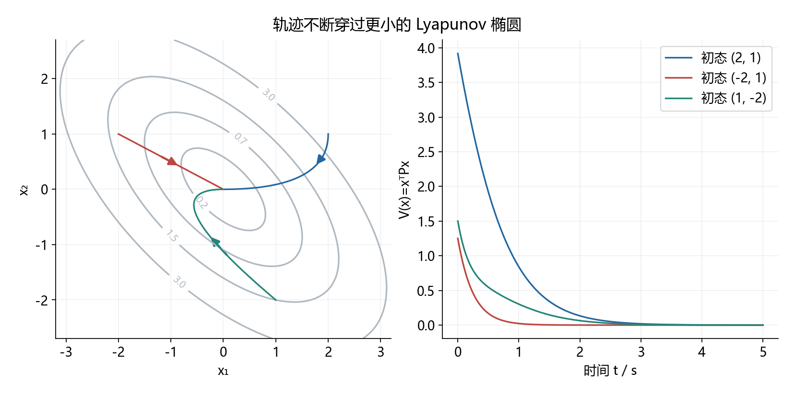

图中的轨迹穿过越来越小的椭圆。圆形距离未必单调，但该椭圆度量严格下降。右图直接计算这个量，帮助核查几何解释。

### 12.11.4 实战边界

解出矩阵后必须检验正定，不能只写“方程有解，所以稳定”。随便选一个候选函数未成功，也不能据此断言不稳定。离散系统使用的是下一步差值，矩阵方程应改为离散形式。

### 12.11.练习 自测题（自编，附答案）

**题目**：取单位正定矩阵作为右端，解连续 Lyapunov 方程并检验正定。

$$
A=\operatorname{diag}(-1,-2),\qquad A^TP+PA=-I.
$$

**参考答案与检查**：

$$
P=\operatorname{diag}(1/2,1/4),\qquad\dot V=-x_1^2-x_2^2.
$$

非对角方程要求对应元素为零，两个对角元素都正。注意没有使用离散 Lyapunov 方程。

[返回内容导航](#contents)

---

## 12.12 LQR 与 Riccati 方程

需要的基础：二次型、矩阵求导、最优性原理。采用无限时域连续 LQR；模型线性，控制输入暂不设幅值约束。

### 12.12.1 要最小化的是状态偏差与控制代价的总和

$$
J=\int_0^\infty(x^TQx+u^TRu)\,dt,
\qquad Q\succeq0,\quad R\succ0.
$$

状态罚得重，倾向于更快纠偏；输入罚得重，倾向于节省控制动作。矩阵的数值依赖状态与输入的单位，不能脱离量纲比较大小。

### 12.12.2 用最优性方程代入二次型

引用连续时间最优性方程，设最优剩余代价为二次型：

$$
V(x)=x^TPx,\qquad P=P^T.
$$

代入后，对输入最小化：

$$
0=\min_u\left[x^TQx+u^TRu+2x^TP(Ax+Bu)\right].
$$

对输入求导为零，因为 R 正定，此驻点就是唯一最小点：

$$
2Ru+2B^TPx=0\quad\Rightarrow\quad u_*=-R^{-1}B^TPx.
$$

把输入项配方可以看清负二次项的来源：

$$
\begin{aligned}
u^TRu+2x^TPBu
&=(u+R^{-1}B^TPx)^TR(u+R^{-1}B^TPx)\\
&\quad-x^TPBR^{-1}B^TPx.
\end{aligned}
$$

最优输入使平方项为零；对任意状态都成立，得到代数 Riccati 方程：

$$
A^TP+PA-PBR^{-1}B^TP+Q=0.
$$

这不是“猜出一个复杂矩阵公式”，而是把最优输入消去后留下的二次型系数条件。

### 12.12.3 一阶系统就能看出为什么要选稳定化解

自编例题：

$$
\dot x=u,\qquad Q=q>0,\quad R=r>0.
$$

Riccati 方程、两根和正确反馈为：

$$
-P^2/r+q=0,\qquad P=\pm\sqrt{qr},\qquad
P_* =\sqrt{qr},\quad K=\sqrt{q/r}.
$$

负根会产生正反馈，不是需要的稳定化解。取初态为 1、输入权重为 1，则：

$$
x(t)=e^{-\sqrt q\,t},\qquad u(t)=-\sqrt q\,e^{-\sqrt q\,t},\qquad J_* =\sqrt q.
$$

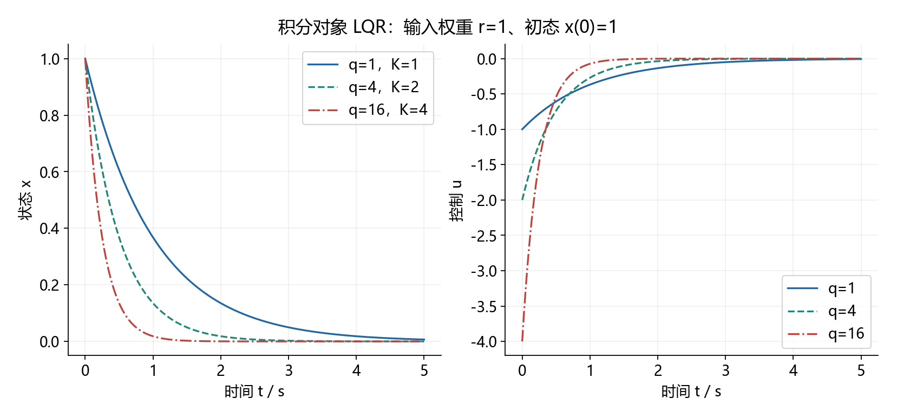

图显示状态权重提高时收敛变快，但初始控制更大。不同权重定义了不同的目标函数，不能直接比较图上各方案的代价数值并宣布某个“总体更优”。

### 12.12.4 实战边界

标准稳定化结论需可稳定化、以及状态代价对应的可检测条件。执行器饱和后不再是这个无约束问题的精确最优解。求出代数解后检查对称性、半正定性和闭环特征值。

### 12.12.练习 自测题（自编，附答案）

**题目**：对积分对象求无限时域连续 LQR 稳定化解、反馈增益及初态为 1 时的最优代价。

$$
\dot x=u,\qquad q=9,\quad r=4.
$$

**参考答案与检查**：

$$
P=\sqrt{qr}=6,\qquad K=P/r=1.5,\qquad J_*=6.
$$

另一代数根为负六，会得到不稳定反馈，不能当作最优代价矩阵。

[返回内容导航](#contents)

---

## 12.13 零阶保持与精确离散化

需要的基础：连续状态响应、采样、矩阵指数。零阶保持表示相邻采样时刻之间的输入恒定，不表示系统状态不变。

### 12.13.1 在一个采样区间积分

连续系统为线性定常模型。每个采样区间输入保持上一采样时刻计算的值，直接使用状态响应公式：

$$
x((k+1)T)=e^{AT}x(kT)
+\int_0^T e^{A(T-\tau)}B u_k\,d\tau.
$$

输入与积分变量无关，提出积分并换元：

$$
x_{k+1}=A_dx_k+B_du_k,\qquad
A_d=e^{AT},\quad B_d=\int_0^T e^{A\tau}B\,d\tau.
$$

状态矩阵可逆时可简写输入矩阵；不可逆时积分仍然成立，但不能使用逆矩阵式。

$$
B_d=A^{-1}(e^{AT}-I)B\quad\text{仅在 A 可逆时使用。}
$$

### 12.13.2 为什么欧拉离散化有时把稳定系统变不稳定

自编例题：

$$
\dot x=-2x+u,\qquad
A_d=e^{-2T},\qquad B_d=\frac{1-e^{-2T}}2.
$$

对正采样周期，精确齐次离散极点总在单位圆内。前向欧拉却给出：

$$
x_{k+1}=(1-2T)x_k+Tu_k.
$$

其渐近稳定条件为：

$$
|1-2T|<1\quad\Rightarrow\quad0<T<1.
$$

取采样周期为 1.2 秒，精确极点约为 0.0907，而欧拉极点为负 1.4，产生交替发散。

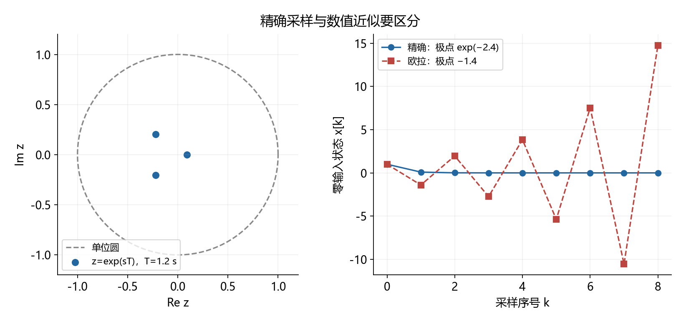

左图说明连续左半平面特征值通过指数映射到单位圆内；右图使用相同初态与零输入，展示近似离散方法引入的不稳定。这里不是说实际数字控制器可以任意降低采样频率。

### 12.13.3 连续闭环与数字闭环不是同一个运算顺序

精确采样一个已闭环的连续系统，与先离散对象、再用保持输入实现数字反馈，得到的矩阵一般不同。后者在采样间隔内没有持续更新控制量：

$$
e^{(A-BK)T}\ \text{一般不等于}\ A_d-B_dK.
$$

因此数字反馈设计应检验实际离散闭环矩阵，且考虑一拍计算延迟；不能只检验原连续反馈极点。

### 12.13.4 实战检查

先标采样周期与保持器位置；用积分求精确模型；再构造数字闭环；最后检查单位圆稳定条件。不要把连续传递函数中的字母直接换成离散变量。

### 12.13.练习 自测题（自编，附答案）

**题目**：积分对象经零阶保持采样后，采用数字比例状态反馈。求精确离散模型及严格稳定条件。

$$
\dot x=u,\qquad u_k=-Kx_k,\qquad T>0.
$$

**参考答案与检查**：

$$
A_d=1,\qquad B_d=T,\qquad x_{k+1}=(1-KT)x_k,\qquad0<KT<2.
$$

连续状态矩阵为零、不可逆，但输入矩阵积分照样可算。两个边界分别对应离散极点正一和负一。

[返回内容导航](#contents)

---

## 12.14 延伸阅读与配图重建

### 其他难点的已有推导
以下已有正文推导，先回查这些位置，不再另复制一套：

| 内容 | 要弄懂的问题 | 现有入口 |
|---|---|---|
| 二阶超调量与调节时间 | 峰值从导数为零得到，包络界不等于精确调节时间 | 第 2 份 2.14—2.15；第 11 份 11.3 |
| Bode 斜率与相位 | 斜率如何来自对数，幅值为何不能唯一确定相位 | 第 2 份 2.17；第 11 份 11.7 |
| Jury 与双线性变换 | 单位圆怎样映到半平面，边界点怎么处理 | 第 3 份 3.15 |
| 描述函数 | 为什么只保留基波，极限环预测为何只是近似 | 第 3 份 3.16 |
| 前馈与积分伺服 | 配置极点为何不自动保证无静差 | 第 5 份第 10、15 节；第 11 份 11.9 |
| Gramian | 积分矩阵如何描述可达方向和控制能量 | 第 5 份 14.3 |

本文使用 13 张全局 Python 配图及梅森原有结构图。配图脚本见 [generate_difficult_concepts.py](scripts/generate_difficult_concepts.py)，编写规范见 [0.编写规则](0.编写规则.md)，总目录见 [1.文档目录](1.文档目录.md)。
