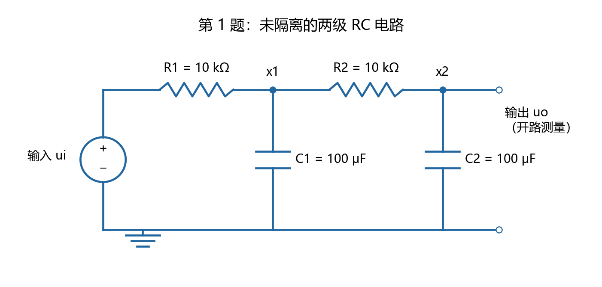
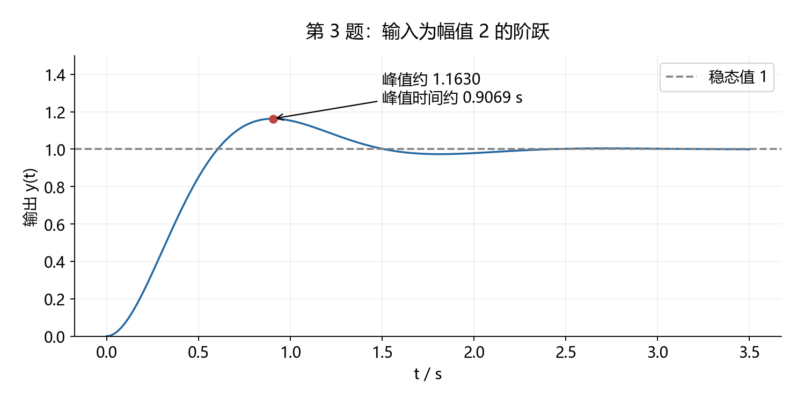
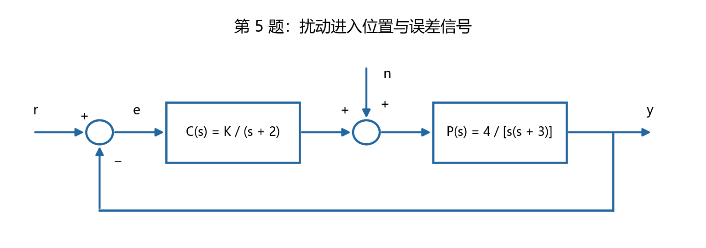
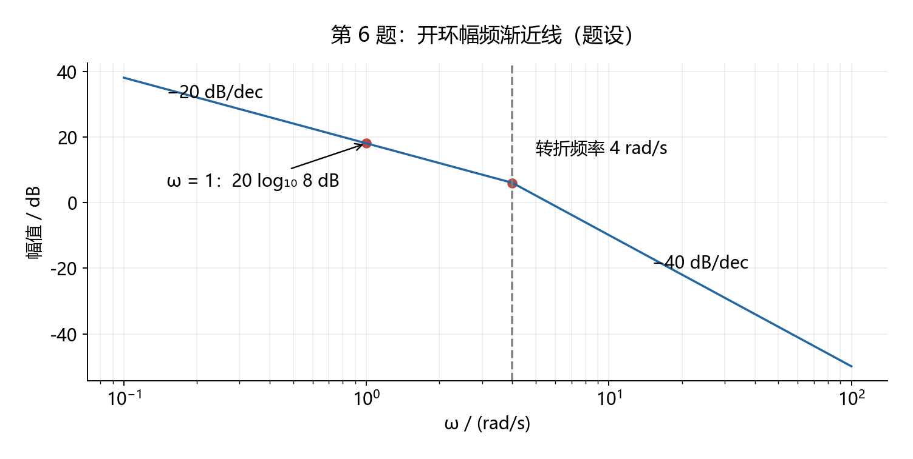
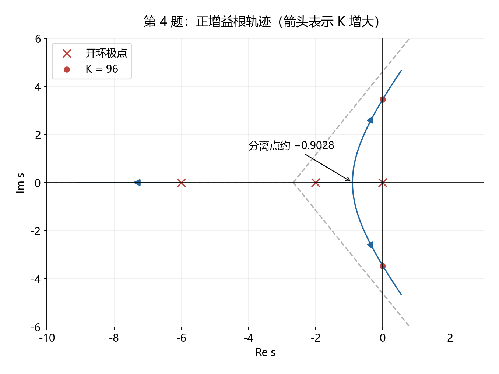
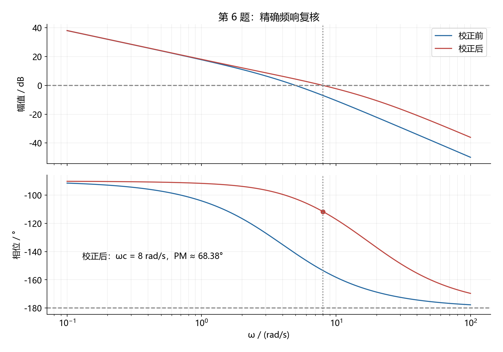
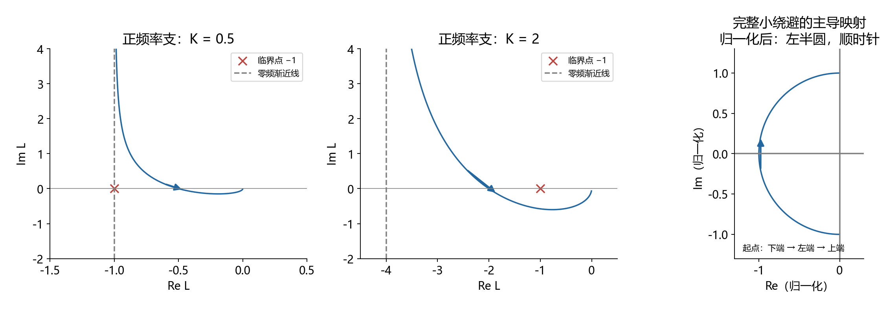
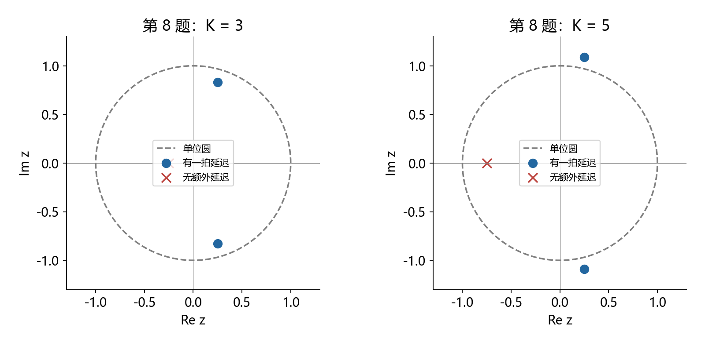

# 13. 厦大 844 风格自编模拟卷一：题目、详解与知识点定位

本卷参考本目录第 8、9 份笔记中记录的厦大 844 题型组合，自行设计模型、参数与设问。**不是厦门大学官方试卷，也不代表官方命题范围或难度承诺。** 本卷自设满分 150 分，建议闭卷用时 180 分钟。

题目在前、答案在后。涉及曲线的必要读数同时以文字或公式给出，避免图片缩放造成歧义。除第二题及题中特别指定的初态外，传递函数与输入输出响应默认零初值；连续时间单位为秒，角频率为弧度每秒。

建议先完成全部题目，再查解答。各题解答末尾列出知识点所在文件和章节；所有图片、关键恒等式、极点及 Nyquist 计数由全局 Python 生成或核验。

<a id="paper"></a>

## 13.1 模拟试卷

| 题号 | 题型 | 分值 | 建议用时 |
|---|---|---:|---:|
| 一 | RC 电路建模与状态方程 | 12 | 14 分钟 |
| 二 | 非零初值完整响应 | 10 | 10 分钟 |
| 三 | 阶跃曲线辨识与闭环反求开环 | 14 | 15 分钟 |
| 四 | 根轨迹、分离点与稳定范围 | 18 | 22 分钟 |
| 五 | 参考与扰动共同作用的稳态误差 | 14 | 16 分钟 |
| 六 | Bode 反求模型与超前校正 | 18 | 24 分钟 |
| 七 | Nyquist、零频补弧与半次穿越 | 18 | 24 分钟 |
| 八 | 零阶保持、计算延迟与 Jury 判据 | 16 | 20 分钟 |
| 九 | 可观标准型、对角型与相似变换 | 14 | 15 分钟 |
| 十 | 能控能观、可稳定化与隐藏模态 | 16 | 15 分钟 |
| 合计 |  | 150 | 175 分钟，余 5 分钟检查 |

### 第一题：两级无缓冲 RC 网络（12 分）

理想电压源驱动下图两级 RC 网络，输出端开路，无其他负载。两个电容均接地，初始电压为零。



$$
R_1=R_2=10\,\mathrm{k\Omega},\qquad
C_1=C_2=100\,\mathrm{\mu F},\qquad R_1C_1=R_2C_2=1\,\mathrm{s}.
$$

1. 用节点电流法求输入电压到输出电压的传递函数。（6 分）
2. 取两个电容电压为状态，写出数值状态空间模型。（4 分）
3. 检查直流增益与高频极限，说明两级环节为什么不能直接按两个独立一阶低通相乘。（2 分）

### 第二题：非零初值完整响应（10 分）

给定系统及其初值：

$$
\ddot y+4\dot y+3y=r(t),\qquad
r(t)=2\quad(t\ge0),\qquad y(0)=1,\quad\dot y(0)=0.
$$

1. 用单边拉普拉斯变换求完整响应。（7 分）
2. 用两个初值和微分方程验证答案，并求终值。（3 分）

### 第三题：由阶跃曲线反求系统（14 分）

某稳定系统的闭环传递函数可精确写成无有限零点的标准欠阻尼二阶形式。给定输入阶跃幅值为 2，输出曲线如下。



图中标注的精确数据为：

$$
y(\infty)=1,\qquad
y_{\max}=1+e^{-\pi/\sqrt3},\qquad
t_p=\frac{\pi}{2\sqrt3}\,\mathrm{s}.
$$

1. 求阻尼比、自然频率和闭环传递函数。（8 分）
2. 若该闭环由单位负反馈形成，求对应开环传递函数。（3 分）
3. 分别按常用 2% 和 5% 误差带近似公式估计调节时间，并说明它们是否是精确越界时刻。（3 分）

### 第四题：完整根轨迹（18 分）

单位负反馈开环为：

$$
L(s)=\frac K{s(s+2)(s+6)},\qquad K>0.
$$

1. 写出特征方程，标明开环零极点、实轴区段、渐近线中心及角度。（6 分）
2. 求实轴分离点及其对应增益，剔除无效候选点。（5 分）
3. 求虚轴交点及严格稳定增益范围。（4 分）
4. 画出概略根轨迹，标明增益增加方向；求“恰有一个实闭环极点且系统严格稳定”的增益范围，实根按重数计。（3 分）

### 第五题：参考输入与对象输入扰动（14 分）

下图采用单位负反馈。扰动在控制器之后、对象之前以正号加入，误差定义为参考减输出。



$$
C(s)=\frac K{s+2},\qquad P(s)=\frac4{s(s+3)},\qquad K>0.
$$

1. 求闭环严格稳定的增益范围。（4 分）
2. 分别求参考和扰动到误差的传递函数。（4 分）
3. 当增益为 3，参考和扰动如下时，求总稳态误差，并解释符号。（6 分）

$$
r(t)=2t,\qquad n(t)=\frac14\quad(t\ge0).
$$

### 第六题：幅频渐近线反求模型与超前设计（18 分）

已知校正前开环恰由正增益、一个积分环节和一个稳定一阶惯性环节组成，无其他零极点、时滞或全通因子。其对数幅频渐近线如下。



低频段斜率为每十倍频负二十分贝，在角频率 4 处变为每十倍频负四十分贝；低频渐近线在角频率 1 处的幅值为：

$$
20\log_{10}8\ \mathrm{dB}.
$$

1. 求校正前开环模型及单位斜坡稳态误差。（5 分）
2. 设计直流增益为一的超前网络，使校正后增益穿越频率为 8，且相位裕度不小于 65 度。规定将超前网络的最大相位频率选在该穿越频率处。（9 分）
3. 验证幅值、相位裕度和低频增益；说明为什么不能只把超前角加到原系统的旧穿越频率上。（4 分）

### 第七题：含原点极点与开环不稳定极点的 Nyquist 判据（18 分）

单位负反馈开环为：

$$
L(s)=\frac{K(s+1)}{s(s-1)},\qquad K>0.
$$

统一采用完整曲线逆时针净绕数为正的约定；开右半平面极点数记作 P，闭环右根数记作 Z。原点极点用右侧小半圆凹陷排除，不计入 P。

$$
Z=P-R,\qquad R=2(N_+-N_-).
$$

上式正负穿越统计正频率半边，包括必要的补弧和端点半次；沿临界点左侧射线，上到下为正，下到上为负。

1. 求开环右极点数、频率响应实虚部、零频主导项与实部渐近线。（5 分）
2. 求正频率的实轴交点及穿越方向，说明何时计入临界点左侧的穿越。（4 分）
3. 画出零频补弧方向。分别对增益小于 1、等于 1、大于 1 的情形，计算或判定闭环稳定性，写清正频率半边的半次贡献。（6 分）
4. 用闭环特征方程独立验证上述结果。（3 分）

### 第八题：采样、零阶保持和一拍计算延迟（16 分）

连续对象由零阶保持输入驱动，在采样时刻读取输出：

$$
P(s)=\frac1{s+2},\qquad T=\frac{\ln2}{2}\,\mathrm{s}.
$$

数字控制器存在一拍延迟：

$$
u_k=K(r_{k-1}-y_{k-1}),\qquad K>0.
$$

1. 求保持器与对象合成后的脉冲传递函数。（5 分）
2. 写出含一拍延迟的闭环特征多项式，用二阶 Jury 判据求严格稳定范围。（6 分）
3. 若忽略这拍延迟，稳定范围变成什么？说明两种模型不能混用。（3 分）
4. 判断含延迟系统上边界的闭环极点位置。（2 分）

### 第九题：可观标准型与对角型（14 分）

给定传递函数：

$$
W(s)=\frac{2s+5}{s^2+5s+6}.
$$

1. 写出可观伴随标准型。本题约定输出为最后一个状态，输出矩阵为行向量零、一，状态矩阵最后一列是按常数项到一次项排列的分母系数负值。（5 分）
2. 用部分分式给出一种对角实现。（4 分）
3. 求将对角坐标映到上述可观标准型坐标的变换矩阵，并验证输入、输出矩阵也满足该变换；判断实现是否最小。（5 分）

### 第十题：结构性质与被传递函数隐藏的模态（16 分）

实参数为 η 的系统如下，输入、输出都是标量：

$$
A=\operatorname{diag}(-1,-2,1),\qquad
B=\begin{bmatrix}1\\1\\0\end{bmatrix},\qquad
C=\begin{bmatrix}1&0&\eta\end{bmatrix},\qquad D=0.
$$

1. 求能控矩阵的秩，判断完全能控性。（4 分）
2. 按参数分情况求能观矩阵的秩。（4 分）
3. 判断可稳定化、可检测；是否存在常数状态反馈使整个内部系统渐近稳定？（4 分）
4. 求零初值传递函数及其最小实现。若零输入、初态为第三个坐标方向，给出输出，并解释为什么传递函数不能代替完整内部稳定性判断。（4 分）

---

<a id="solutions"></a>

## 13.2 完整解答、得分点与知识定位

以下是解答区。先做题时请停在此处。

<a id="solution-01"></a>

### 第一题解答

取两个电容电压为状态，分别是中间节点和输出节点电压。对两个节点列 KCL：

$$
\begin{aligned}
\frac{U_i-X_1}{R_1}&=sC_1X_1+\frac{X_1-X_2}{R_2},\\
\frac{X_1-X_2}{R_2}&=sC_2X_2.
\end{aligned}
$$

将给定阻容值代入，以秒为时间单位，得到：

$$
U_i=(s+2)X_1-X_2,\qquad X_1=(s+1)X_2.
$$

消去中间节点：

$$
U_i=[(s+2)(s+1)-1]X_2
\Rightarrow\boxed{\frac{U_o}{U_i}=\frac1{s^2+3s+1}.}
$$

回到时域可直接写状态模型：

$$
\dot x=\begin{bmatrix}-2&1\\1&-1\end{bmatrix}x
+\begin{bmatrix}1\\0\end{bmatrix}u_i,\qquad
u_o=\begin{bmatrix}0&1\end{bmatrix}x.
$$

直流时电容开路且无负载，没有电阻压降，输出等于输入；高频时电容近似短路接地，输出趋于零：

$$
G(0)=1,\qquad\lim_{s\to\infty}G(s)=0.
$$

两级之间没有缓冲器，第二级从第一级取电流，构成负载效应。把两个独立一阶模型相乘会得到一次项系数为 2 的错误分母，漏掉了耦合。

**得分检查**：两条 KCL 3 分，消元与传递函数 3 分，状态模型 4 分，物理极限和负载说明 2 分。

**知识点位置**：[第 3 份 3.2、3.3：传递函数与闭环](3.经典控制理论（公理化推导与简例）.md)；[第 5 份第 1 节：从物理方程建立状态](5.现代控制理论（公理化推导与简例）.md)；[第 9 份 9.1：电路节点消元](9.厦门大学2025年844真题逐题技巧与知识连接.md)。

<a id="solution-02"></a>

### 第二题解答

单边拉普拉斯变换必须保留初值项：

$$
(s^2Y-s)+4(sY-1)+3Y=\frac2s.
$$

因此：

$$
Y=\frac{s+4}{(s+1)(s+3)}+\frac2{s(s+1)(s+3)}.
$$

前一项来自初值，后一项来自输入。合并作部分分式：

$$
Y=\frac2{3s}+\frac1{2(s+1)}-\frac1{6(s+3)}.
$$

所以完整响应为：

$$
\boxed{y(t)=\frac23+\frac12e^{-t}-\frac16e^{-3t}.}
$$

代零时刻得到输出为 1、导数为零。对响应求导后代回微分方程，两种指数项各自消去，常数项给出右端 2。终值为三分之二；闭环自然模态分别按负一、负三衰减，故初值影响消失。

**得分检查**：初值项 3 分，部分分式和响应 4 分，两项初值、原方程与终值核验 3 分。

**知识点位置**：[第 2 份 2.0.2：导数的拉普拉斯变换](2.数学预备与教材常略去的“为什么”（隐含推导）.md)；[第 11 份 11.2：完整响应](11.实战技巧手册（题型识别、完整步骤与易错补全）.md)；[第 9 份 9.2：非零初值题](9.厦门大学2025年844真题逐题技巧与知识连接.md)。

<a id="solution-03"></a>

### 第三题解答

直流增益先用输出终值除以输入幅值，不能把输出终值直接当增益：

$$
k=\frac12,\qquad
M_p=\frac{y_{\max}-y_\infty}{y_\infty}=e^{-\pi/\sqrt3}.
$$

将超调率代入标准二阶关系并取对数：

$$
\frac\zeta{\sqrt{1-\zeta^2}}=\frac1{\sqrt3}
\Rightarrow\boxed{\zeta=\frac12.}
$$

由峰值时间反求自然频率：

$$
\frac\pi{\omega_n\sqrt{1-\zeta^2}}=\frac\pi{2\sqrt3}
\Rightarrow\boxed{\omega_n=4.}
$$

于是闭环与开环分别为：

$$
\begin{gathered}
\boxed{\Phi(s)=\frac8{s^2+4s+16}},\\
\boxed{L(s)=\frac{\Phi(s)}{1-\Phi(s)}=\frac8{s^2+4s+8}}.
\end{gathered}
$$

这里反求开环依赖于单位负反馈条件。常用调节时间近似为：

$$
t_{s,2\%}\approx\frac4{\zeta\omega_n}=2\,\mathrm{s},\qquad
t_{s,5\%}\approx\frac3{\zeta\omega_n}=1.5\,\mathrm{s}.
$$

这些是约定误差带下的工程近似，不是精确最后越界时刻。生成题图采用的精确输出是：

$$
y(t)=1-e^{-2t}\left[\cos(2\sqrt3t)+\frac1{\sqrt3}\sin(2\sqrt3t)\right].
$$

它在所给峰值时刻的导数为零，代入得到题设峰值，终值为一。

**得分检查**：直流增益 2 分，阻尼比 3 分，自然频率与闭环 3 分，开环 3 分，两种误差带及近似说明 3 分。

**知识点位置**：[第 2 份 2.14—2.15：超调和包络](2.数学预备与教材常略去的“为什么”（隐含推导）.md)；[第 11 份 11.3：曲线反算](11.实战技巧手册（题型识别、完整步骤与易错补全）.md)；[第 12 份 12.15.11：误差带写法](12.难点专题详解（讲解、配图、例题与公式）.md#formula-variants)。

<a id="solution-04"></a>

### 第四题解答

闭环特征式：

$$
D(s)=s^3+8s^2+12s+K.
$$

三个开环极点在零、负二、负六，无有限零点。正增益实轴区段与渐近线为：

$$
\begin{gathered}
(-\infty,-6)\cup(-2,0),\\
\sigma_a=-\frac83,\qquad\theta=60^\circ,180^\circ,300^\circ.
\end{gathered}
$$

把增益写成位置函数再求导：

$$
K(s)=-s(s+2)(s+6),\qquad
3s^2+16s+12=0.
$$

两个候选点为：

$$
s=\frac{-8\pm2\sqrt7}{3}.
$$

负号对应点约为负 4.431，不在正增益实轴区段，应剔除。有效分离点及增益为：

$$
\boxed{s_b=\frac{-8+2\sqrt7}{3}\approx-0.902832},\qquad
\boxed{K_b=\frac{112\sqrt7-160}{27}\approx5.049042}.
$$

劳斯第一列为：

$$
1,\quad8,\quad\frac{96-K}{8},\quad K.
$$

故严格稳定范围为零到 96，不含端点。上边界可因式分解：

$$
K=96:\quad D(s)=(s+8)(s^2+12),\qquad s=\pm j2\sqrt3.
$$



两条分支从零、负二沿实轴靠近，分离后成为共轭根；另一条从负六向左移动。因另一个实轴驻点对应负增益，正增益范围内不会再次并入实轴。

所以“恰有一个实极点且严格稳定”的交集是：

$$
\boxed{\frac{112\sqrt7-160}{27}<K<96.}
$$

分离点处是二重实根，按重数仍有三个实根，不能取等号。

**得分检查**：特征式、零极点、实轴和渐近线 6 分；求导、筛选和增益 5 分；劳斯与虚轴根 4 分；图形方向和最终交集 3 分。

**知识点位置**：[第 12 份 12.4：根轨迹规则的共同来源](12.难点专题详解（讲解、配图、例题与公式）.md#topic-04)；[第 7 份 7.3：重根与稳定范围取交集](7.考研真题通法（从条件翻译到验算）.md)；[第 3 份 3.5、3.7：劳斯和根轨迹](3.经典控制理论（公理化推导与简例）.md)。

<a id="solution-05"></a>

### 第五题解答

完整闭环特征多项式为：

$$
D(s)=s(s+2)(s+3)+4K=s^3+5s^2+6s+4K.
$$

三阶劳斯条件给出：

$$
\boxed{0<K<\frac{15}{2}.}
$$

由节点方程推导两个误差通道：

$$
Y=P(CE+N),\qquad E=R-Y
\Rightarrow E=\frac R{1+CP}-\frac{PN}{1+CP}.
$$

于是：

$$
\boxed{\frac E R=\frac{s(s+2)(s+3)}{D(s)}},\qquad
\boxed{\frac E N=-\frac{4(s+2)}{D(s)}}.
$$

增益为 3 时在稳定范围内。环路为 I 型，速度误差系数为：

$$
K_v=\lim_{s\to0}sCP=\frac{2K}{3}=2.
$$

参考为两倍斜坡，所以参考分量误差为 1。扰动为四分之一阶跃，直接由对应通道取终值：

$$
\begin{gathered}
e_{\infty,r}=\frac2{K_v}=1,\\
e_{\infty,n}=\lim_{s\to0}s\left[-\frac{4(s+2)}{D(s)}\frac1{4s}\right]
=-\frac1{2K}=-\frac16,\\
\boxed{e_\infty=1-\frac16=\frac56.}
\end{gathered}
$$

总误差为正，表示输出在长期跟踪中比参考小六分之五；正向输入扰动会把输出抬高，因此它对“参考减输出”的误差贡献是负数。参考与输出都不断增大，不妨碍两者之差趋于常数。

**得分检查**：稳定性 4 分，两个通道各 2 分，参考分量、扰动分量与叠加解释各 2 分。

**知识点位置**：[第 11 份 11.5：误差定义和注入点](11.实战技巧手册（题型识别、完整步骤与易错补全）.md)；[第 7 份 7.2：参考和扰动逐源分析](7.考研真题通法（从条件翻译到验算）.md)；[第 12 份 12.5：系统型别](12.难点专题详解（讲解、配图、例题与公式）.md#topic-05)。

<a id="solution-06"></a>

### 第六题解答

低频负二十斜率对应一个积分环节，角频率 4 处再下降二十对应一个稳定一阶极点。题目已经排除全通与额外因子，故模型唯一为：

$$
\boxed{L_0(s)=\frac8{s(1+s/4)}=\frac{32}{s(s+4)}}.
$$

闭环特征式为平方项加四倍一次项加三十二，稳定；速度误差系数为 8，单位斜坡误差为八分之一。

取超前网络：

$$
C_a(s)=\frac{1+T_as}{1+\alpha T_as},\qquad0<\alpha<1.
$$

按题设将最大超前频率选为 8，原对象在此处的幅值为：

$$
|L_0(j8)|=\frac8{8\sqrt{1+(8/4)^2}}=\frac1{\sqrt5}.
$$

最大相位处超前网络幅值为比例参数平方根的倒数，因而幅值配平给出：

$$
\frac1{\sqrt5}\frac1{\sqrt\alpha}=1
\Rightarrow\alpha=\frac15,\qquad
T_a=\frac1{8\sqrt\alpha}=\frac{\sqrt5}{8}.
$$

所以可取：

$$
\boxed{C_a(s)=\frac{1+(\sqrt5/8)s}{1+s/(8\sqrt5)}
\approx\frac{1+0.279508s}{1+0.055902s}.}
$$

在同一个频率检查相位裕度：

$$
\begin{gathered}
\phi_m=\arcsin\frac{1-1/5}{1+1/5}=\arcsin\frac23\approx41.8103^\circ,\\
\mathrm{PM}=90^\circ-\arctan2+\phi_m
\approx68.3754^\circ>65^\circ.
\end{gathered}
$$



校正后实际幅值在角频率 8 处为一。该环路的幅值严格随频率递减，因此不存在另一个隐藏的增益交越：零点贡献的对数导数小于积分环节负导数的绝对值，剩余两个极点仍提供负导数。

直流校正增益为一，速度误差系数仍为 8。还可独立检验闭环特征式：

$$
D_a(s)=\alpha T_as^3+(1+4\alpha T_a)s^2+(4+32T_a)s+32.
$$

各系数正，且满足三阶 Hurwitz 的中间乘积条件，所以闭环严格稳定。只在旧穿越频率上加超前角会漏掉穿越频率移动，不能替代这次回代。

**得分检查**：模型 3 分、误差 2 分；幅值配平 4 分、时间常数与网络 3 分、相位计算 2 分；完整幅值、裕度、低频及频率移动解释 4 分。

**知识点位置**：[第 11 份 11.7：渐近线反推](11.实战技巧手册（题型识别、完整步骤与易错补全）.md)；[第 12 份 12.6：超前公式推导](12.难点专题详解（讲解、配图、例题与公式）.md#topic-06)；[第 7 份 7.5：设计顺序](7.考研真题通法（从条件翻译到验算）.md)。

<a id="solution-07"></a>

### 第七题解答

开环在正一处有一个右半平面极点；原点被凹陷排除，故右极点数为 1。直接代入并乘分母共轭：

$$
\boxed{L(j\omega)=-\frac{2K}{1+\omega^2}
+j\frac{K(1-\omega^2)}{\omega(1+\omega^2)}}.
$$

零频展开为：

$$
L(s)=-\frac K s-2K+O(s)
\Rightarrow L(j\omega)\sim j\frac K\omega-2K.
$$

正频率从上方无穷远出发，实部渐近线为负二倍增益。这里低频主系数为负，不能照搬“单积分一定从负虚无穷远出发”。

虚部在角频率 1 处为零，由正变负，是正穿越；交点是：

$$
L(j)=-K.
$$

因此只有增益大于 1 时，这一次正穿越才落在临界点左侧。

**零频补弧**：沿小右半圆绕避原点：

$$
s=\varepsilon e^{j\theta},\quad-\pi/2\le\theta\le\pi/2,
\qquad L(s)\sim-\frac K\varepsilon e^{-j\theta}.
$$

完整像弧沿左侧大半圆顺时针从下方无穷远转到上方无穷远，产生一次负穿越。正频率只取上半小绕避的像，从负实无穷远离开到上侧，分担负半次：

$$
N_{-,\rm arc}=\frac12.
$$



图右是归一化主导像弧，用来解释方向，真实半径随小绕避半径趋零而趋于无穷；其旋转中心近似在原点，但计数临界点仍是负一。有限小半径算法与完整绕数在脚本中独立核验。

分情况计数：

$$
\begin{array}{c|c|c|c|c}
\text{增益范围}&N_+&N_-&R=2(N_+-N_-)&Z=1-R\\\hline
0<K<1&0&1/2&-1&2\\
K>1&1&1/2&1&0
\end{array}
$$

增益等于 1 时经过临界点，不能用普通绕数宣布严格稳定。直接核验特征式：

$$
D(s)=s(s-1)+K(s+1)=s^2+(K-1)s+K.
$$

二阶 Hurwitz 条件恰好给出增益大于 1；小于 1 时两根均有正实部或为两个正实根；等于 1 时根为正负虚数单位。因此：

$$
\boxed{K>1\text{ 时严格稳定；}\quad0<K<1\text{ 时有两个右根；}\quad K=1\text{ 时有虚轴根。}}
$$

**得分检查**：右极点数与实虚部、低频 5 分；交点与方向 4 分；负半次、补弧和分区 6 分；特征式及核验 3 分。若只画正频率轨迹而漏补弧，第三问计数不成立。

**知识点位置**：[第 12 份 12.3.4—12.3.12：计数约定、零频与补弧](12.难点专题详解（讲解、配图、例题与公式）.md#nyquist-conventions)；[第 4 份 4.8：Nyquist 速查](4.经典控制知识框架速查.md)；[第 12 份 12.15：不同公式写法对照](12.难点专题详解（讲解、配图、例题与公式）.md#formula-variants)。

<a id="solution-08"></a>

### 第八题解答

取输出本身为状态，保持区间内输入恒定。精确离散化得到：

$$
y_{k+1}=ay_k+bu_k,\qquad
a=e^{-2T}=\frac12,\quad b=\frac{1-e^{-2T}}2=\frac14.
$$

所以保持器与对象的脉冲传递函数为：

$$
\boxed{G_d(z)=\frac{1/4}{z-1/2}.}
$$

控制器的一拍延迟额外贡献一个离散变量的倒数，闭环特征式为：

$$
1+\frac{K}{4z(z-1/2)}=0
\Rightarrow p(z)=z^2-\frac12z+\frac K4.
$$

二阶 Jury 三个条件为：

$$
1-\frac K4>0,\qquad\frac12+\frac K4>0,\qquad\frac32+\frac K4>0.
$$

与正增益条件取交集：

$$
\boxed{0<K<4.}
$$

若无额外计算延迟，闭环只有一个极点：

$$
z=\frac12-\frac K4,\qquad
|z|<1\Rightarrow\boxed{0<K<6\quad(K>0).}
$$

后一个范围不适用于原题。含延迟系统在上边界的两根为：

$$
K=4:\qquad z=\frac{1\pm j\sqrt{15}}4,\qquad|z|=1.
$$



图中无延迟与一拍延迟使用相同对象、相同采样周期和增益，仅控制器时序不同。增益为 5 时，无延迟稳定而含延迟不稳定。

**得分检查**：精确离散参数与脉冲传递函数 5 分；延迟因子、特征式和 Jury 条件 6 分；无延迟对照 3 分；单位圆边界 2 分。

**知识点位置**：[第 12 份 12.13：零阶保持与精确离散化](12.难点专题详解（讲解、配图、例题与公式）.md#topic-13)；[第 12 份 12.15.3：Jury 等价条件](12.难点专题详解（讲解、配图、例题与公式）.md#formula-variants)；[第 3 份 3.15：采样与双线性变换](3.经典控制理论（公理化推导与简例）.md)。

<a id="solution-09"></a>

### 第九题解答

按题目指定的可观伴随形式：

$$
\boxed{
A_o=\begin{bmatrix}0&-6\\1&-5\end{bmatrix},\quad
B_o=\begin{bmatrix}5\\2\end{bmatrix},\quad
C_o=\begin{bmatrix}0&1\end{bmatrix},\quad D=0.}
$$

它等价于以下积分器方程，不能只写可控标准型冒充：

$$
\dot x_1=-6x_2+5u,\qquad
\dot x_2=x_1-5x_2+2u,\qquad y=x_2.
$$

部分分式为：

$$
W(s)=\frac1{s+2}+\frac1{s+3}.
$$

故一种对角实现为：

$$
\boxed{A_d=\operatorname{diag}(-2,-3),\quad
B_d=[1,1]^T,\quad C_d=[1,1],\quad D=0.}
$$

设可观标准型状态等于变换矩阵乘对角状态，选择各特征向量为列：

$$
x=Tz,\qquad
\boxed{T=\begin{bmatrix}3&2\\1&1\end{bmatrix}},\qquad\det T=1.
$$

直接回代全部三个矩阵关系：

$$
A_oT=TA_d,\qquad B_o=TB_d,\qquad C_oT=C_d.
$$

能控、能观矩阵行列式均为负一：

$$
\det[B_o,A_oB_o]=-1,\qquad
\det\begin{bmatrix}C_o\\C_oA_o\end{bmatrix}=-1.
$$

所以两种实现都最小，并且由可逆相似变换相连。注意本题的下标 d 表示“对角形式”，不是“离散时间”；两种模型都是连续系统。

**得分检查**：可观标准型 5 分，对角实现 4 分，变换及三组矩阵核对 3 分，最小性 2 分。

**知识点位置**：[第 9 份 9.9：可观标准型与对角型](9.厦门大学2025年844真题逐题技巧与知识连接.md)；[第 2 份 2.3—2.4：分子和坐标变换](2.数学预备与教材常略去的“为什么”（隐含推导）.md)；[第 12 份 12.9：相似变换与最小实现](12.难点专题详解（讲解、配图、例题与公式）.md#topic-09)。

<a id="solution-10"></a>

### 第十题解答

能控矩阵为：

$$
\mathcal C=\begin{bmatrix}1&-1&1\\1&-2&4\\0&0&0\end{bmatrix},\qquad
\operatorname{rank}\mathcal C=2.
$$

前两行独立，第三状态永远不受输入影响，所以系统不完全能控，与输出参数无关。

能观矩阵为：

$$
\mathcal O=\begin{bmatrix}1&0&\eta\\-1&0&\eta\\1&0&\eta\end{bmatrix}.
$$

当参数为零时只有第一列有效，秩为 1；参数非零时第一、三列独立，秩为 2。第二状态始终不可观，因此不存在完全能观的参数值。

不可控模态为正一，故系统对所有参数都不可稳定化。任何状态反馈都无法改变第三行的自主不稳定模态，不存在使整个内部系统渐近稳定的常数反馈。

可检测性分为两种情况：参数非零时，唯一不可观模态为稳定的负二，因此可检测；参数为零时，正一模态也不可观，因此不可检测。

零初值传递函数与其最小实现为：

$$
\boxed{G(s)=C(sI-A)^{-1}B=\frac1{s+1}},\qquad
\dot z=-z+u,\quad y=z.
$$

第三状态虽然可能在输出中出现，但输入无法激发它，因此零初值传递函数不含该模态。对题设非零初态和零输入：

$$
x(0)=[0,0,1]^T\Rightarrow
x(t)=[0,0,e^t]^T,\qquad\boxed{y(t)=\eta e^t.}
$$

参数非零时输出显出不稳定增长；参数为零时输出始终为零，但内部状态仍发散。这说明零初值输入输出稳定、内部稳定和可检测性必须分开判断。

**得分检查**：能控矩阵与秩 4 分；能观矩阵及分情况秩 4 分；可稳定化、可检测和反馈限制 4 分；传递函数、最小实现与非零初态解释 4 分。

**知识点位置**：[第 12 份 12.8：能控能观与 PBH](12.难点专题详解（讲解、配图、例题与公式）.md#topic-08)；[第 12 份 12.9：隐藏模态](12.难点专题详解（讲解、配图、例题与公式）.md#topic-09)；[第 5 份 14.1—14.4：PBH、可稳定化、最小实现](5.现代控制理论（公理化推导与简例）.md)。

---

## 13.3 错题对应知识点速查

| 错误表现 | 优先回查 | 本卷解答 |
|---|---|---|
| 把有负载的两级 RC 当成独立串联 | 第 3 份 3.2；第 9 份 9.1 | [第一题](#solution-01) |
| 用传递函数乘输入漏掉初值 | 第 11 份 11.2；第 2 份 2.0.2 | [第二题](#solution-02) |
| 忘记阶跃幅值或把超调率当峰值 | 第 11 份 11.3；第 12 份 12.15.11 | [第三题](#solution-03) |
| 分离点不筛选、稳定范围漏交集 | 第 12 份 12.4；第 7 份 7.3 | [第四题](#solution-04) |
| 扰动通道分子或符号错误 | 第 11 份 11.5；第 7 份 7.2 | [第五题](#solution-05) |
| 原穿越频率与新穿越频率混用 | 第 12 份 12.6；第 7 份 7.5 | [第六题](#solution-06) |
| 零频方向套口诀、漏掉负半次 | 第 12 份 12.3.4—12.3.12 | [第七题](#solution-07) |
| 忘记一拍延迟或把连续判据套到离散 | 第 12 份 12.13、12.15.3 | [第八题](#solution-08) |
| 写成可控型、只变换状态矩阵 | 第 9 份 9.9；第 12 份 12.9 | [第九题](#solution-09) |
| 传递函数稳定就宣布内部稳定 | 第 12 份 12.8—12.9；第 5 份 14.2 | [第十题](#solution-10) |

章节定位以当前目录中的编号为准；每题解答末尾都有文件链接，难点合订本还提供直接跳转到专题的锚点。

## 13.4 全局 Python 配图与核验

生成脚本：[generate_mock01.py](scripts/generate_mock01.py)。全局运行命令：

```powershell
& 'D:\Python310\python.exe' scripts/generate_mock01.py
```

输出目录为 `assets/mock01`；数值和符号检查摘要见 [verification.json](assets/mock01/verification.json)。脚本覆盖两条电路 KCL、非零初值响应、曲线峰值、根轨迹边界、扰动终值、校正后频域与极点、完整 Nyquist 绕数及半边计数、采样稳定性、相似变换和参数化秩。

图形与计算用于核验本卷，不替代试卷要求的手写推导。做题时不需要运行 Python；它保证图形数据与给定模型一致，并帮助复盘。

[返回试卷](#paper) · [返回解答区](#solutions) · [返回总目录](1.文档目录.md)
