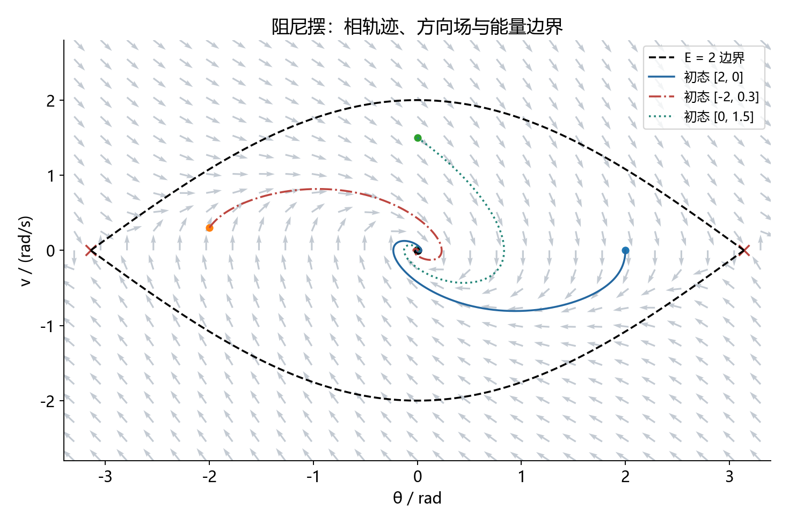
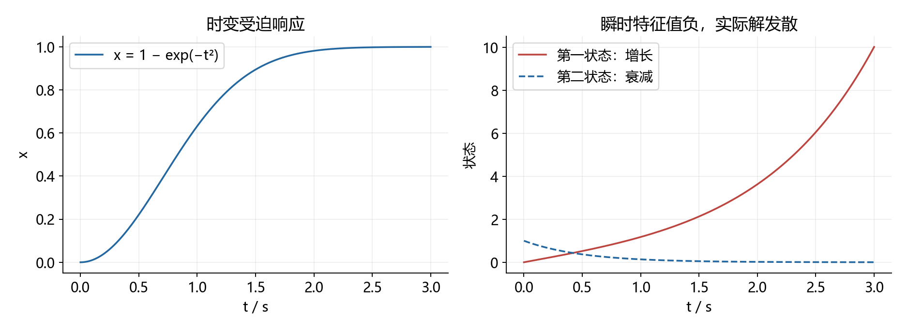
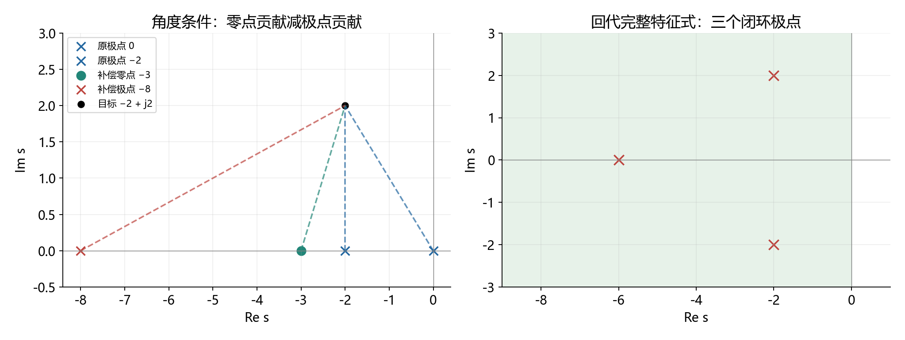

# 14. 考纲缺口补齐：非线性、时变系统与根轨迹校正

本文件按本次要求独立编写。它补充第 1.12 节识别出的基础训练缺口，不声称覆盖官方范围内所有可能题型。先完成本文件，再进入第 15 份高分训练。所有例题均为自编，连续时间单位为秒，公式统一使用独立公式块。

厦大官方范围包含简单非线性与时变系统分析，以及多种控制设计方法，参见 [2026 年学校范围说明](https://zs.xmu.edu.cn/info/1055/34612.htm) 和 [2027 年航空航天学院公告](https://aerospace.xmu.edu.cn/info/2723/63954.htm)。具体报考项目以对应年度最终目录为准。

| 学习顺序 | 本节解决的问题 | 完成标准 |
|---|---|---|
| 14.1 | 非线性平衡点、线性化及零特征值 | 会找全部平衡点，知道何时线性化无结论 |
| 14.2 | 相平面、能量与局部吸引域 | 能解释相轨迹方向，不把局部当全局 |
| 14.3 | 描述函数与自振候选 | 能从基波算公式，分清近似预测与证明 |
| 14.4 | 时变状态转移和受迫响应 | 不把定常指数公式随意套到时变系统 |
| 14.5 | 瞬时特征值陷阱 | 会用实际解检查稳定性 |
| 14.6 | 根轨迹超前设计 | 角度定位置、幅值定增益、全阶回代 |

<a id="nonlinear"></a>

## 14.1 非线性：先求平衡点，再线性化

设自治系统光滑。平衡点使右端为零；在平衡点附近保留一阶 Taylor 项，得到 Jacobian 线性模型。

$$
\dot x=f(x),\quad f(x_e)=0,\quad
\delta\dot x=J(x_e)\delta x,\quad
J(x_e)=\left.\frac{\partial f}{\partial x}\right|_{x_e}.
$$

线性化间接法：所有特征值实部负，原非线性系统在该点局部渐近稳定；存在正实部特征值，则不稳定；若有零实部且其余不正，一般不能仅凭线性化判断。

**自编题 1**：按实参数讨论一维系统的全部平衡点和稳定性。

$$
\dot x=\mu x-x^3.
$$

解平衡条件，再计算导数：

$$
x(\mu-x^2)=0,\qquad f'(x)=\mu-3x^2.
$$

- 参数负：只有原点，导数负，局部渐近稳定。
- 参数正：原点导数正，不稳定；正负平方根两个平衡点的导数均为负两倍参数，局部渐近稳定。
- 参数零：线性化为零，须看高阶项，不能宣布临界稳定。

最后一种取二次能量：

$$
\mu=0:\quad V=\frac{x^2}{2},\quad\dot V=-x^4<0\ (x\ne0).
$$

能量径向无界，因此原点全局渐近稳定。也可直接求解：

$$
x(t)=\frac{x_0}{\sqrt{1+2x_0^2t}}.
$$

它以代数速度衰减，不是指数衰减。参数负时同一能量也给出全局渐近稳定，而线性化本身只提供局部结论。

**自测**：把参数零时的右端改为正的三次方。线性化仍为零，但能量导数变正，原点不稳定。结论来自非线性项，不是零特征值本身。

回查：[第 3.16 节](3.经典控制理论（公理化推导与简例）.md)。

<a id="phase"></a>

## 14.2 相平面与能量：画箭头之前先写两个导数

**自编题 2**：分析有阻尼摆模型的平衡点，并给出原点附近可保证收敛的区域。

$$
\dot\theta=v,\qquad\dot v=-\sin\theta-v.
$$

角度按实数坐标讨论，平衡点为任意整数倍圆周率、速度为零。Jacobian 为：

$$
J=\begin{bmatrix}0&1\\-\cos\theta_e&-1\end{bmatrix}.
$$

偶数倍圆周率处特征式为二次项加一次项加一，稳定焦点；奇数倍处特征式为二次项加一次项减一，行列式负，是鞍点。

$$
\theta_e=2m\pi:\quad\lambda=\frac{-1\pm j\sqrt3}{2};\qquad
\theta_e=(2m+1)\pi:\quad\lambda=\frac{-1\pm\sqrt5}{2}.
$$

为了扩大局部分析，构造机械能：

$$
E=\frac{v^2}{2}+1-\cos\theta,\qquad\dot E=-v^2\le0.
$$

导数半负定不能直接宣布渐近稳定。用 LaSalle 不变性原理：在某个小于二的闭合能量子水平集、且位于两相邻鞍点之间的连通分支内，能量不增加；导数为零要求速度零，而要永远保持速度零还要求正弦角度为零。该分支内只有原点满足，故轨迹趋于原点。

$$
|\theta_0|<\pi,\qquad E(\theta_0,v_0)<2
\quad\Rightarrow\quad(\theta(t),v(t))\to(0,0).
$$

严格地，对每个上述初态可选初始能量与二之间的常数，构造紧致正不变子水平集后应用该原理。这个区域是足够条件，不声称是完整吸引域；有其他平衡点存在，不能把原点称为整个实数相平面上全局渐近稳定。



**怎么看**：右半平面的速度符号决定角度向左还是向右移动；箭头由两个导数共同决定。虚线是能量等于二的边界，实线是若干初态轨迹。图不能替代吸引域证明，也不能推出边界外所有初态都不收敛。

**自测**：去掉阻尼，能量导数恒零，原点附近通常出现闭合轨道；稳定但不渐近稳定。回查：[Lyapunov 专题](12.难点专题详解（讲解、配图、例题与公式）.md#topic-11)。

<a id="describing"></a>

## 14.3 描述函数：从基波积分到候选振幅

考虑无滞环、对称理想继电器，输出幅值为正数 M，输入为近似正弦。用 a 表示输入振幅，避免和状态矩阵混淆。

$$
u=a\sin\omega t,\qquad q=M\operatorname{sgn}(u).
$$

继电器输出为方波。正弦基波系数与描述函数为：

$$
\begin{gathered}
b_1=\frac1\pi\int_{-\pi}^{\pi}M\operatorname{sgn}(\sin\vartheta)\sin\vartheta\,d\vartheta
=\frac{4M}{\pi},\\
N(a)=\frac{b_1}{a}=\frac{4M}{\pi a}.
\end{gathered}
$$

余弦基波为零，因此本例描述函数为正实数。带滞环、死区或非对称偏置时不能直接套此式。

**自编题 3**：继电器与以下线性环节组成负反馈闭环，参考为零，预测自振振幅和频率。

$$
G(s)=\frac1{s(s+1)(s+2)},\qquad M=1.
$$

若输入继电器的信号近似正弦，忽略高次谐波后须满足：

$$
1+G(j\omega)N(a)=0.
$$

线性环节的负实轴交点为：

$$
\omega=\sqrt2,\qquad G(j\sqrt2)=-\frac16.
$$

所以描述函数应等于六，从而：

$$
\boxed{a=\frac2{3\pi}\approx0.21221,\qquad\omega=\sqrt2\ \mathrm{rad/s}}.
$$

这里 a 是继电器输入信号的基波振幅；零参考单位反馈下，它等于线性环节输出的基波振幅，但不保证等于实际波形峰值。

线性部分具有低通作用才可能削弱高次谐波。本例在三倍候选频率处，线性频响幅值相对基波约为零点零六九；再乘方波第三谐波输入幅值比三分之一，输出第三谐波相对基波约为百分之二点三。这支持近似的合理性，不证明实际闭环存在稳定极限环。

**不能跳过的边界**：谐波平衡交点只是候选，不是极限环存在性、唯一性或轨道稳定性的严格证明；如需实际周期与波形，应进一步对含继电器切换的非线性模型分析或数值验证。

**自测**：继电器输出幅值改为二，候选频率不变，候选输入振幅变为四除以三倍圆周率。回查：[第 3.16.2 节](3.经典控制理论（公理化推导与简例）.md)。

<a id="timevarying"></a>

## 14.4 时变状态转移：两个时间参数都不能省

对时变线性系统，状态转移矩阵由微分方程定义：

$$
\begin{gathered}
\dot x=A(t)x+B(t)u,\\
\frac{\partial\Phi(t,\tau)}{\partial t}=A(t)\Phi(t,\tau),\qquad\Phi(\tau,\tau)=I,\\
x(t)=\Phi(t,t_0)x(t_0)+\int_{t_0}^t\Phi(t,\tau)B(\tau)u(\tau)\,d\tau.
\end{gathered}
$$

它满足分段传播的乘法性质。标量或不同时刻的矩阵两两可交换时，可以使用积分的矩阵指数；一般情形不能直接这样写。

**自编题 4A：标量**。

$$
\dot x=-2tx+u,\qquad t\ge0.
$$

齐次解和完整响应为：

$$
\begin{gathered}
\Phi(t,\tau)=e^{-(t^2-\tau^2)},\\
x(t)=e^{-t^2}x_0+\int_0^t e^{-(t^2-\tau^2)}u(\tau)\,d\tau.
\end{gathered}
$$

取初态零、输入为两倍时间，积分得到：

$$
u(t)=2t\Rightarrow\boxed{x(t)=1-e^{-t^2}}.
$$

直接求导为两倍时间乘负时间平方指数，与原方程右端一致。这一步同时检查了积分上下限和传播方向。

**自编题 4B：分段矩阵**。前一秒和后一秒分别为：

$$
A_1=\begin{bmatrix}0&1\\0&0\end{bmatrix},\qquad
A_2=\begin{bmatrix}0&0\\1&0\end{bmatrix}.
$$

无输入时，从零到两秒的传播顺序是后发生的矩阵左乘：

$$
\begin{gathered}
\Phi(2,0)=e^{A_2}e^{A_1}=(I+A_2)(I+A_1)
=\begin{bmatrix}1&1\\1&2\end{bmatrix},\\
e^{A_1+A_2}=\begin{bmatrix}\cosh1&\sinh1\\\sinh1&\cosh1\end{bmatrix}
\ne\Phi(2,0).
\end{gathered}
$$

两矩阵不交换，所以把积分放进指数会得到错误答案。若初态为第一坐标向量，正确终态为两个分量都为一。

**自测**：交换两个时间段，传播矩阵变成：

$$
e^{A_1}e^{A_2}=\begin{bmatrix}2&1\\1&1\end{bmatrix}.
$$

回查：[第 12.7 节矩阵指数](12.难点专题详解（讲解、配图、例题与公式）.md#topic-07)。

## 14.5 每一时刻的特征值都负，仍可能发散

**自编题 5**：判断下列时变系统是否渐近稳定。

$$
A(t)=\begin{bmatrix}-1&e^{3t}\\0&-2\end{bmatrix},\qquad
x(0)=\begin{bmatrix}0\\1\end{bmatrix}.
$$

虽然每个瞬时矩阵的特征值恒为负一、负二，但逐行解微分方程得到：

$$
\begin{gathered}
x_2=e^{-2t},\qquad\dot x_1+x_1=e^t,\\
\boxed{x_1=\frac{e^t-e^{-t}}2}.
\end{gathered}
$$

第一状态发散。初态缩小任意倍后，同样最终增长，因此零解也不是 Lyapunov 稳定。这里增长的时变耦合项不能被两个“冻结特征值”反映出来。



图左是时变受迫响应的正确解，图右是本节反例。仿真仅验证解析解；反例的数学结论由明确指数增长给出。本例系数无界，并不声称有界时变矩阵可用同样公式解释。

**实战步骤**：识别时变 → 先看标量、三角或分段结构 → 求状态转移或逐行积分 → 代回方程 → 根据实际解或适用定理判稳定。

<a id="lead"></a>

## 14.6 根轨迹设计：先补角度，再算增益

**自编题 6**：单位负反馈对象如下，希望闭环包含指定共轭极点。限制超前零点为负三，设计极点和增益。

$$
G(s)=\frac1{s(s+2)},\quad s_d=-2+j2,\qquad
C(s)=K\frac{s+3}{s+p},\quad p>3,\quad K>0.
$$

目标点处两个原极点向量的相角为一百三十五度和九十度，开环相角连续取负二百二十五度，缺少四十五度超前。

$$
\arg(s_d+3)=\arctan2\approx63.435^\circ.
$$

为使零点角减极点角等于四十五度，补偿极点向量角应为约十八点四三五度，其正切为三分之一。因此：

$$
\frac2{p-2}=\frac13\Rightarrow p=8.
$$

幅值条件决定增益：

$$
K=\frac{|s_d(s_d+2)(s_d+8)|}{|s_d+3|}=16.
$$

必须回到完整三阶特征多项式验算，不能只验证那一对极点：

$$
\begin{gathered}
D(s)=s(s+2)(s+8)+16(s+3)\\
=s^3+10s^2+32s+48=(s+6)(s^2+4s+8).
\end{gathered}
$$

第三极点为负六，完整闭环稳定。速度误差系数为三，因此单位斜坡稳态误差为三分之一。



**怎么看图**：左侧画的是从各零极点到目标点的向量；右侧标出回代后的全部闭环极点。二阶近似给出约两秒的 2% 调节时间，但三阶闭环带零点，实际调节时间需要完整响应计算。

**自测**：若有人只验证目标点满足角度条件就停止，至少还漏了幅值增益、其他闭环极点及稳态指标三项。回查：[根轨迹专题](12.难点专题详解（讲解、配图、例题与公式）.md#topic-04)。

## 14.7 做完后怎样确认缺口确实补上

遮住解答重新完成六类题，至少能写出：全部平衡点、线性化局限、半负定能量的补充论证、描述函数的近似条件、时变传播次序、超前校正的完整特征式。再换参数练一次。只看懂图还不能代替独立计算。

本文件补了先前缺少的基础说明与算例；更多非线性类型、一般时变系统理论、不同设计指标组合仍需教材与习题训练。可靠原卷数量不足的问题不会因为新增讲义自动解决。

全局 Python：[generate_gap_highscore.py](scripts/generate_gap_highscore.py)；[核验记录](assets/gaps_highscore/verification.json)。

```powershell
& 'D:\Python310\python.exe' scripts/generate_gap_highscore.py
```

原理参考：[Caltech 线性系统与线性化资料](https://www.cds.caltech.edu/~murray/FBS/Linear_Systems.html)、[Michigan State 根轨迹超前设计讲义](https://www.egr.msu.edu/classes/me451/jchoi/2012/notes/ME451_L20_RootLocusLead.pdf)。数值例题和配图为自编。

[下一份：冲击高分](15.冲击高分（综合训练、完整解答与取分策略）.md) · [返回目录](1.文档目录.md)
