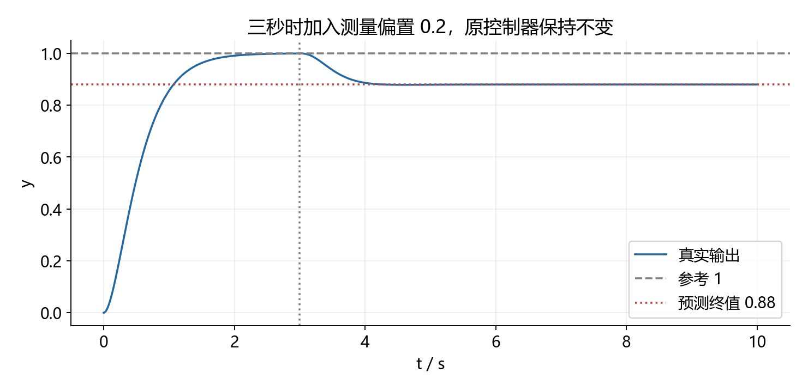
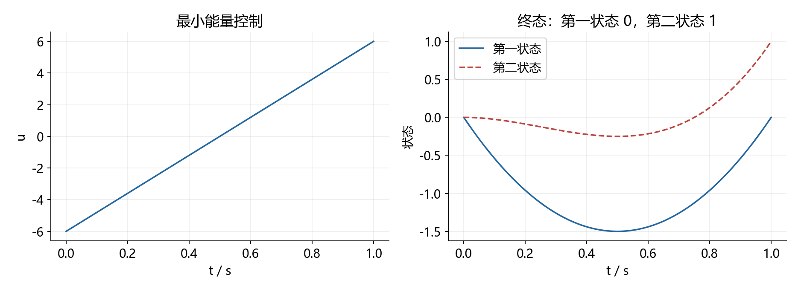

# 15. 冲击高分：综合训练、完整解答与取分策略

本文件是第 14 份之后的提高训练。先具备基础题独立正确率，再练“条件联合、符号边界、模型完整性和解释能力”。本套自编训练共 80 分，建议 100 分钟；不是厦大官方试卷，不用于预测考场分数。

以 150 分制为例，可把 130 分左右作为训练愿景，但本文件不承诺得分。先稳住常规题，再提高综合题的完成度；可靠原卷与陌生题限时训练仍不可省。

<a id="paper"></a>

## 15.1 先做四道综合题

| 题目 | 分值 | 建议时间 | 高分能力 |
|---|---:|---:|---|
| 一 | 25 | 30 分钟 | 衰减区域与稳态精度联合设计 |
| 二 | 20 | 25 分钟 | 反馈、观测器、前馈与测量偏置 |
| 三 | 20 | 25 分钟 | 时变能控性、Gramian 与最小能量 |
| 四 | 15 | 20 分钟 | 极零相消与完整内部稳定性 |

### 第一题：稳定不仅要在左半平面

单位负反馈对象与 PI 控制器为：

$$
G(s)=\frac1{s(s+2)},\qquad C(s)=\frac{k(s+a)}s,\qquad k>0,\quad a>0.
$$

1. 求闭环渐近稳定参数范围。（5 分）
2. 进一步要求所有闭环根实部严格小于负二分之一，写出精确参数不等式。（8 分）
3. 对参考为半倍时间平方、零初值且无扰动，要求稳态误差不超过四分之一。与第二问联立，给出一组可行参数。（7 分）
4. 满足全部要求时，比例参数 k 是否存在最小值？区分最小值与下确界。（5 分）

### 第二题：观测器收敛，为什么有偏置时仍跟不准

对象与控制器为：

$$
\begin{gathered}
A=\begin{bmatrix}0&1\\-2&-3\end{bmatrix},\quad
B=\begin{bmatrix}0\\1\end{bmatrix},\quad C=\begin{bmatrix}1&0\end{bmatrix},\\
u=-K_x\hat x+Nr,\\
\dot{\hat x}=A\hat x+Bu+L(y_m-C\hat x).
\end{gathered}
$$

1. 配置控制极点负三、负四，观测误差极点负五、负六，求两个增益。（6 分）
2. 无测量偏置时选择前馈，实现常值参考的零稳态误差，并给出完整闭环极点。（4 分）
3. 传感器存在未知常值偏置，测量输出等于真实输出加偏置。保持原控制器，求真实输出相对参考的稳态偏差。（7 分）
4. 将偏置增广成导数为零的状态，判断增广对象是否能观；说明它为改进设计提供什么可能。（3 分）

### 第三题：瞬时输入列只有一列，能否到达二维任意终态

给定时变系统，控制区间零到一：

$$
\dot x=\begin{bmatrix}1\\t\end{bmatrix}u(t),\qquad
x(0)=0,\qquad x(1)=\begin{bmatrix}0\\1\end{bmatrix}.
$$

1. 写出终态与输入的积分关系，计算可达 Gramian，判断是否能到达任意二维终态。（6 分）
2. 求满足题设终态、使输入平方积分最小的控制。（8 分）
3. 用正交分解证明该控制确实最优，给出最小能量。（6 分）

允许平方可积控制，不加幅值约束。若增加幅值限制，不能直接沿用本题结论。

### 第四题：约分后稳定，完整系统呢

单位负反馈对象与控制器如下，增益正：

$$
G(s)=\frac1{s-1},\qquad C(s)=k\frac{s-1}{s+2},\qquad k>0.
$$

1. 求约分后的参考到输出传函，判断其零初值输入输出稳定性。（3 分）
2. 采用如下实现，写出完整闭环矩阵及全部极点。（6 分）

$$
\dot x=x+u,\quad y=x,\qquad
\dot z=-2z+e,\quad u=ke-3kz,\quad e=r-y.
$$

3. 增益一、参考零、初态中对象状态一、控制器状态零时，求真实输出，解释为什么第一问不足以说明内部稳定。（6 分）

---

<a id="answers"></a>

## 15.2 完整解答与取分点

<a id="h1"></a>

### 第一题：先分开三个约束，最后求交集

完整特征式为：

$$
D(s)=s^3+2s^2+ks+ka.
$$

三阶 Hurwitz 条件在两参数均正时给出：

$$
2k>ka\Rightarrow\boxed{k>0,\quad0<a<2}.
$$

要求根位于指定竖线左侧，令新变量等于原变量加二分之一，得到：

$$
D(z-1/2)=z^3+\frac12z^2+\left(k-\frac54\right)z
+ka-\frac k2+\frac38.
$$

对它做三阶 Hurwitz，三项严格约束为：

$$
\boxed{\begin{gathered}
k>\frac54,\\
ka>\frac k2-\frac38,\\
ka<k-1.
\end{gathered}}
$$

最后一项来自二次项系数乘一次项系数大于常数项。不能把大于写成大于等于，否则会包含新坐标虚轴根。

闭环稳定后才算误差。环路为 II 型，半倍时间平方的拉普拉斯变换为三次积分因子：

$$
\begin{gathered}
R(s)=\frac1{s^3},\qquad K_a=\lim_{s\to0}s^2C(s)G(s)=\frac{ka}{2},\\
e_\infty=\frac1{K_a}=\frac2{ka}\le\frac14
\Rightarrow\boxed{ka\ge8}.
\end{gathered}
$$

可取比例参数十二、零点参数四分之三。其乘积九同时满足全部不等式，稳态误差为九分之二。闭环极点由 Python 独立计算检查实部均小于负二分之一。

寻找最小比例参数时，由乘积至少八、又严格小于比例参数减一，必有比例参数严格大于九。接近九且从上方趋近时，可取乘积恰为八；在足够小的邻域内，另一个下界也满足。

$$
\boxed{\inf k=9,\qquad\text{不存在可取到的最小 }k}.
$$

当比例参数等于九、乘积等于八时，移轴后的多项式恰有虚轴根，不满足严格衰减要求。这一问考的是开区间，不是计算器精度。

**取分路线**：先写特征式拿模型分 → 分别列衰减和误差条件 → 写可行点 → 最后处理极值端点。即使最后求界卡住，也不要丢掉前三问。

知识定位：[第 14.6 节设计回代](14.考纲缺口补齐（非线性、时变系统与根轨迹校正）.md#lead)；[第 12.17 节移轴与计算](12.难点专题详解（讲解、配图、例题与公式）.md#calculation-clinic)。

<a id="h2"></a>

### 第二题：稳定的误差系统也会被持续偏置驱动

分别匹配两个目标多项式：

$$
\begin{gathered}
K_x=\begin{bmatrix}10&4\end{bmatrix},\qquad L=\begin{bmatrix}8\\4\end{bmatrix},\\
A_K=A-BK_x,\quad A_o=A-LC,\\
N=-\frac1{CA_K^{-1}B}=12.
\end{gathered}
$$

无偏置时，真实状态与估计误差组成的增广矩阵上三角化，完整闭环极点为负三、负四、负五、负六。

现在将常值偏置记为 b，并始终定义估计误差为真实状态减估计状态。不能沿用无偏置的齐次误差方程：

$$
\begin{gathered}
y_m=Cx+b,\qquad e_o=x-\hat x,\\
\dot e_o=(A-LC)e_o-Lb.
\end{gathered}
$$

误差矩阵稳定只保证受常值输入驱动后趋向平衡点，不保证平衡点为零。解平衡方程：

$$
\begin{gathered}
e_{o,\rm ss}=A_o^{-1}Lb
=\begin{bmatrix}-14/15\\8/15\end{bmatrix}b,\\
K_xe_{o,\rm ss}=-\frac{36}{5}b.
\end{gathered}
$$

对象实际受到的附加输入为前馈加估计误差反馈，因此：

$$
0=A_Kx_{\rm ss}+B(K_xe_{o,\rm ss}+12r)
\Rightarrow\boxed{y_{\rm ss}-r=-\frac35b}.
$$

不是简单写成负的全部偏置，也不是零；本题要按具体观测器和控制结构计算。



图中参考为一，三秒时加入幅值零点二的偏置，真实输出最终趋于零点八八。图展示指定模型的结果，不能推广为所有观测器偏差都乘同一个系数。

将常值偏置作为第三状态时：

$$
\begin{gathered}
A_b=\operatorname{diag}(A,0),\qquad C_b=\begin{bmatrix}1&0&1\end{bmatrix},\\
\mathcal O_b=\begin{bmatrix}1&0&1\\0&1&0\\-2&-3&0\end{bmatrix},\quad
\det\mathcal O_b=2\ne0.
\end{gathered}
$$

本模型下可以设计增广观测器估计偏置，再修正测量或控制结构。能观只说明有这种设计可能，不代表原二阶观测器已经自动估计了偏置；还需实际配置并验证新设计。

**取分路线**：注明误差定义 → 写清偏置从哪一项进入 → 解稳定系统平衡点。不要把“稳定”与“零平衡点”当成一回事。

知识定位：[第 12.16 节观测器与通道](12.难点专题详解（讲解、配图、例题与公式）.md#classic-linear-bridge)。

<a id="h3"></a>

### 第三题：一个输入可在不同时间提供不同方向

本题状态矩阵为零，状态转移为单位阵，终态为：

$$
x(1)=\int_0^1 B(t)u(t)\,dt,\qquad B(t)=\begin{bmatrix}1\\t\end{bmatrix}.
$$

区间可达 Gramian 与其逆为：

$$
\begin{gathered}
W=\int_0^1B(t)B(t)^Tdt
=\begin{bmatrix}1&1/2\\1/2&1/3\end{bmatrix},\quad\det W=\frac1{12}>0,\\
W^{-1}=\begin{bmatrix}4&-6\\-6&12\end{bmatrix}.
\end{gathered}
$$

因此对任意二维终态都能找到输入。每个时刻输入方向只有一维，不妨碍整个时间区间提供两维可达方向。不能用某一个时刻的输入矩阵秩代替时变系统的区间能控性。

构造控制并代入终态：

$$
\begin{gathered}
u_*(t)=B(t)^TW^{-1}x_f=\boxed{-6+12t},\\
\int_0^1u_*dt=0,\qquad\int_0^1tu_*dt=1.
\end{gathered}
$$

为证明最优，任取另一可行控制，写成最优候选加修正项。两者终态相同意味着修正项的加权积分为零：

$$
\begin{gathered}
u=u_*+v,\qquad\int_0^1B(t)v(t)dt=0,\\
\int_0^1u_*vdt=x_f^TW^{-1}\int_0^1B(t)v(t)dt=0,\\
J=\int_0^1u^2dt=\int_0^1u_*^2dt+\int_0^1v^2dt\ge12.
\end{gathered}
$$

故最小能量为十二，最优解在平方可积函数意义下几乎处处唯一。



图中控制前半段为负、后半段为正；第一状态最终回零，第二状态到一。图不能证明最优，最优性来自上面的正交分解。

**变化条件**：若限制控制绝对值不超过三，本解不再可行；必须重新解受约束问题，不能裁剪曲线后仍声称保持最优与终态。

知识定位：[第 14.4 节时变响应](14.考纲缺口补齐（非线性、时变系统与根轨迹校正）.md#timevarying)；[第 5.14.3 节 Gramian](5.现代控制理论（公理化推导与简例）.md)。

<a id="h4"></a>

### 第四题：先保留完整实现，再讨论约分

约分后的环路与参考到输出传函为：

$$
L(s)=\frac{k}{s+2},\qquad T(s)=\frac{k}{s+2+k}.
$$

对于正增益，参考到输出的零初值传函稳定。但把控制器内部状态保留，得：

$$
\frac d{dt}\begin{bmatrix}x\\z\end{bmatrix}
=\begin{bmatrix}1-k&-3k\\-1&-2\end{bmatrix}\begin{bmatrix}x\\z\end{bmatrix}
+\begin{bmatrix}k\\1\end{bmatrix}r.
$$

其完整特征式为：

$$
\det(sI-A_{\rm full})=(s-1)(s+2+k).
$$

正一模态始终存在，内部不稳定。参考通道在零初值下不激发这个模态，因此约分传函没有显示它。

增益一、指定初态下，输出满足两个模态的线性组合。利用初始值一、初始导数零，求得：

$$
\boxed{y(t)=\frac34e^t+\frac14e^{-3t}}.
$$

零输入输出仍发散，说明内部不稳定。正确结论应同时保留两层：指定参考通道零初值 BIBO 稳定，完整内部系统不稳定。

**取分路线**：约分传函计算正确仍能拿第一问分；后两问必须保留对象和控制器状态。不能为了和第一问保持“同一个答案”而删去不稳定模态。

知识定位：[最小实现与隐藏模态](12.难点专题详解（讲解、配图、例题与公式）.md#topic-09)；[第 13 卷第十题](13.厦大844风格自编模拟卷一（题目、详解与知识点定位）.md#solution-10)。

## 15.3 从做对到高分：四轮训练

| 轮次 | 做法 | 达标证据 |
|---|---|---|
| 第一轮 | 不限时做四题，卡住再回查 | 模型、条件、结果都有，不只写最后数值 |
| 第二轮 | 换参数练同一方法 | 能重新算，不靠记住本题数字 |
| 第三轮 | 隔数天按 100 分钟闭卷重做 | 记录时间与独立完成程度；熟题成绩不预测考场 |
| 第四轮 | 用未看过答案的可靠整卷限时 | 记录多套波动，检查失分是否集中在固定模块 |

本套每题评分只是训练用分配：不清楚中间分如何给时保守自评，不把写了一行公式自动算成拿到整问分。目标提高时最值得保住的是正确建模、完整特征式、条件交集和边界结论。

**实战时间分配**：先扫题找会做的问，遇到某一步长时间卡住先保留已知方程并跳到独立小问。最后检查符号、单位、根的和积、严格不等号和输入注入点。不要为了完成一道综合题漏掉后面的基础题。

**继续练的变式**：第一题将衰减竖线或抛物线幅值改变；第二题改偏置注入位置后重列误差方程；第三题改目标终态后重算最优输入；第四题改初态并求未被约分保留的响应。以上都能直接用本题方程求解，无需另背公式。

高分训练没有替代第 14 份缺口基础，也没有替代原卷题源核验。若陌生整卷仍在基础计算上失分，先回第 12.17 节，不必继续堆更难理论。

## 15.4 全局 Python 与重建

[统一脚本](scripts/generate_gap_highscore.py)同时核验两份文件：符号恒等式、稳定区域、观测器偏置平衡点、时变 Gramian、最小能量与隐藏模态。数值积分与配图作独立旁证。

```powershell
& 'D:\Python310\python.exe' scripts/generate_gap_highscore.py
```

[核验结果](assets/gaps_highscore/verification.json) · [返回题目](#paper) · [返回缺口补齐](14.考纲缺口补齐（非线性、时变系统与根轨迹校正）.md) · [返回目录](1.文档目录.md)
