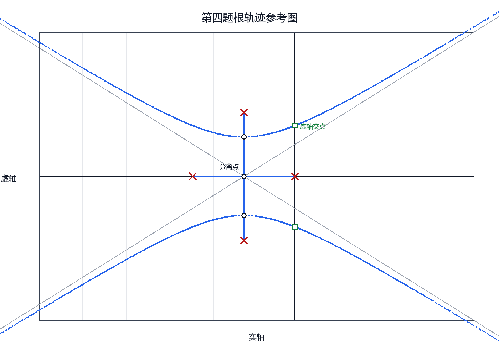
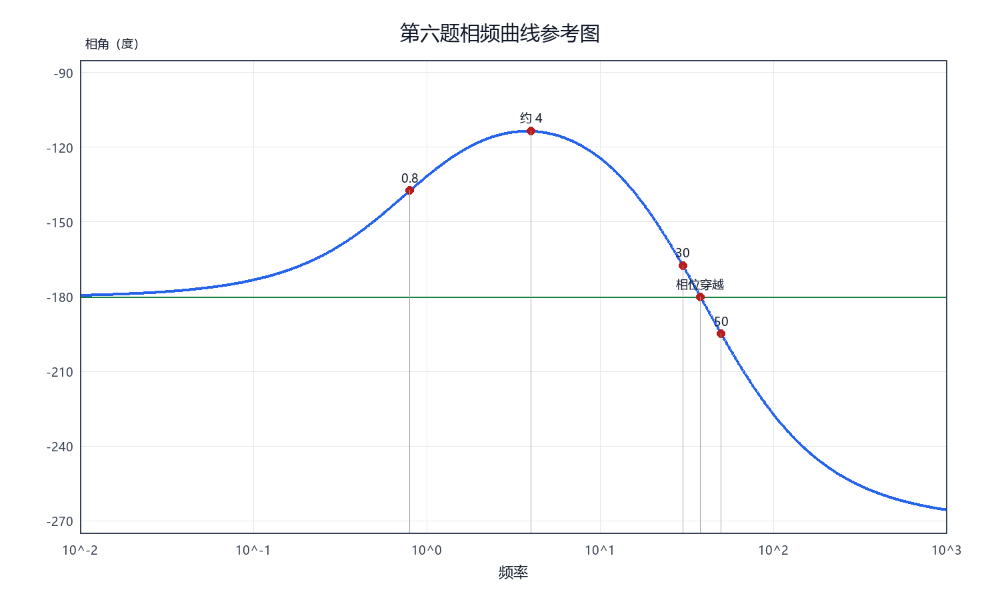
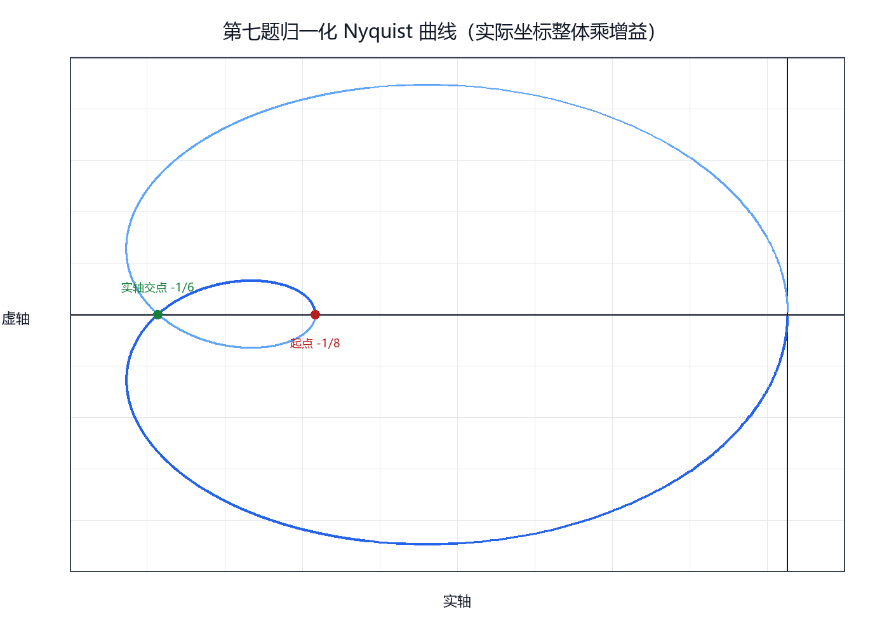
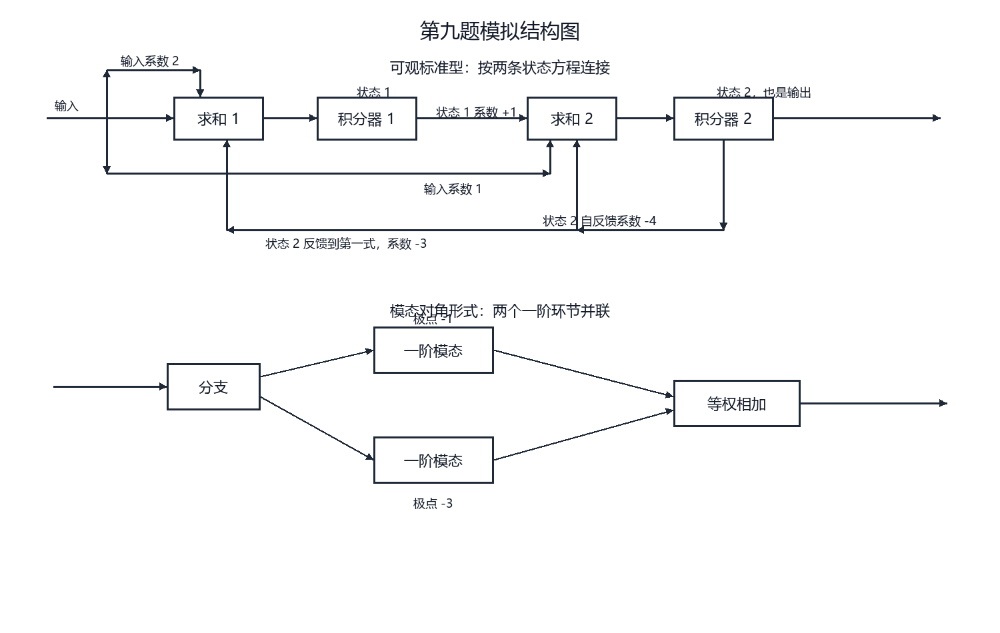

# 7. 厦门大学 2025 年 844 真题完整解答

## 7.0 说明

本文件依据第三方扫描件逐题独立计算。扫描件并非厦门大学官方公开文件，第三方附带答案也不是本解答的依据。

本解答按考研答题要求书写：

1. 先列方程或判据，再计算；
2. 能保留精确量时不提前化成小数；
3. 需要近似时给出手算方法或合理区间；
4. 作图题列出所有决定图形的关键点；
5. 所有公式均使用独立公式块。

> @重点：第九题原题要求的是“可观标准型”，不是“可控标准型”；第十题按卷面参数计算得到系统不完全能观，与第三方解析结论不同。

---

## 7.1 第一题：桥式 RC 电路

### 题目目标

求输入电压到输出电压的传递函数。

### 解

设中间节点电压为

$$
U_m(s).
$$

电容采用复频域导纳

$$
Y_C=sC.
$$

对中间节点列 KCL：

$$
\frac{U_m-U_i}{R_1}
+\frac{U_m-U_o}{R_2}
+sC_2U_m=0.
$$

对输出节点列 KCL：

$$
\frac{U_o-U_m}{R_2}
+sC_1(U_o-U_i)=0.
$$

由第二式先解出中间节点电压：

$$
U_m
=
\left(1+sR_2C_1\right)U_o
-sR_2C_1U_i.
$$

代回第一式，乘去分母并按输入、输出分别整理：

$$
\left[
1+s\left(R_1C_1+R_2C_1+R_1C_2\right)
+s^2R_1R_2C_1C_2
\right]U_o
$$

$$
=
\left[
1+s\left(R_1C_1+R_2C_1\right)
+s^2R_1R_2C_1C_2
\right]U_i.
$$

因此

$$
\boxed{
\frac{U_o(s)}{U_i(s)}
=
\frac{
R_1R_2C_1C_2s^2
+\left(R_1C_1+R_2C_1\right)s
+1
}{
R_1R_2C_1C_2s^2
+\left(R_1C_1+R_2C_1+R_1C_2\right)s
+1
}.
}
$$

### 验算

直流时两个电容开路：

$$
\lim_{s\to0}\frac{U_o(s)}{U_i(s)}=1.
$$

高频时跨接电容近似短路，分子、分母最高次项相同：

$$
\lim_{s\to\infty}\frac{U_o(s)}{U_i(s)}=1.
$$

两个极限均符合电路直观。

---

## 7.2 第二题：非零初值微分方程

### 已知

$$
\ddot y+2\dot y-3y=e^{-t},
$$

$$
y(0)=1,
$$

$$
\dot y(0)=0.
$$

### 解法一：待定系数法

齐次特征方程为

$$
r^2+2r-3=0.
$$

因式分解：

$$
(r-1)(r+3)=0.
$$

齐次解为

$$
y_h=C_1e^t+C_2e^{-3t}.
$$

令特解为

$$
y_p=Ae^{-t}.
$$

代入原方程：

$$
A-2A-3A=1.
$$

所以

$$
A=-\frac14.
$$

通解为

$$
y=C_1e^t+C_2e^{-3t}-\frac14e^{-t}.
$$

代入第一个初值：

$$
C_1+C_2-\frac14=1.
$$

即

$$
C_1+C_2=\frac54.
$$

求导：

$$
\dot y=C_1e^t-3C_2e^{-3t}+\frac14e^{-t}.
$$

代入第二个初值：

$$
C_1-3C_2+\frac14=0.
$$

即

$$
C_1-3C_2=-\frac14.
$$

联立解得

$$
C_1=\frac78,
$$

$$
C_2=\frac38.
$$

最终答案：

$$
\boxed{
y(t)
=
\frac78e^t
+\frac38e^{-3t}
-\frac14e^{-t}.
}
$$

### 初值验算

$$
y(0)
=
\frac78+\frac38-\frac14
=1.
$$

$$
\dot y(0)
=
\frac78-\frac98+\frac14
=0.
$$

响应中含有增长项，原因是齐次特征方程存在右半平面根：

$$
r=1.
$$

---

## 7.3 第三题：由二阶阶跃曲线反求系统

### 从图中读取

稳态值：

$$
c(\infty)=1.
$$

峰值：

$$
c_{\max}=1.36.
$$

峰值时间：

$$
t_p=\frac12\ \mathrm{s}.
$$

### 第一问：求自然频率

相对超调量为

$$
M_p
=
\frac{c_{\max}-c(\infty)}{c(\infty)}
=
\frac{1.36-1}{1}
=
\frac9{25}.
$$

标准二阶系统满足

$$
M_p
=
\exp\left(
-\frac{\pi\zeta}{\sqrt{1-\zeta^2}}
\right).
$$

令

$$
\ell
=
\ln\frac{25}{9}.
$$

则

$$
\frac{\pi\zeta}{\sqrt{1-\zeta^2}}
=
\ell.
$$

平方并整理：

$$
\boxed{
\zeta
=
\frac{\ell}{\sqrt{\pi^2+\ell^2}}.
}
$$

不使用计算器时，可用对数级数估计。因为

$$
\ell
=
2\ln\frac53,
$$

并且

$$
\frac53
=
\frac{1+\frac14}{1-\frac14},
$$

所以

$$
\ln\frac53
=
2\left[
\frac14
+\frac{1}{3\cdot4^3}
+\frac{1}{5\cdot4^5}
+\cdots
\right].
$$

从而

$$
\ell
=
1+\frac1{48}+\frac1{1280}+\cdots.
$$

保留前三项即可判断

$$
1.02<\ell<1.03.
$$

因此

$$
0.30<\zeta<0.31.
$$

峰值时间公式为

$$
t_p
=
\frac{\pi}{\omega_n\sqrt{1-\zeta^2}}.
$$

由前面的精确表达式：

$$
\sqrt{1-\zeta^2}
=
\frac{\pi}{\sqrt{\pi^2+\ell^2}}.
$$

再代入峰值时间：

$$
\frac12
=
\frac{\sqrt{\pi^2+\ell^2}}{\omega_n}.
$$

因此

$$
\boxed{
\omega_n
=
2\sqrt{\pi^2+\ell^2},
\qquad
\ell=\ln\frac{25}{9}.
}
$$

若只需给出手算近似，使用

$$
\pi\approx\frac{22}{7},
$$

以及

$$
\ell\approx1.02,
$$

可得

$$
\omega_n\approx6.6\ \mathrm{rad/s}.
$$

### 第二问：求开环传递函数

闭环标准型为

$$
\Phi(s)
=
\frac{\omega_n^2}
{s^2+2\zeta\omega_ns+\omega_n^2}.
$$

单位负反馈满足

$$
\Phi(s)
=
\frac{G(s)}{1+G(s)}.
$$

所以

$$
G(s)
=
\frac{\Phi(s)}{1-\Phi(s)}
=
\frac{\omega_n^2}
{s\left(s+2\zeta\omega_n\right)}.
$$

由前面的精确关系：

$$
\omega_n^2
=
4\left(\pi^2+\ell^2\right),
$$

$$
2\zeta\omega_n
=
4\ell.
$$

所以不使用计算器也可直接写成

$$
\boxed{
G(s)
=
\frac{
4\left(\pi^2+\ell^2\right)
}{
s\left(s+4\ell\right)
},
\qquad
\ell=\ln\frac{25}{9}.
}
$$

手算近似为

$$
G(s)
\approx
\frac{43.6}{s(s+4.08)}.
$$

### 第三问：求调节时间

若采用百分之二误差带：

$$
t_s
\approx
\frac{4}{\zeta\omega_n}.
$$

由于

$$
\zeta\omega_n=2\ell,
$$

所以

$$
\boxed{
t_{s,2\%}
\approx
\frac{2}{\ell}.
}
$$

若采用百分之五误差带：

$$
t_s
\approx
\frac{3}{\zeta\omega_n}.
$$

所以

$$
\boxed{
t_{s,5\%}
\approx
\frac{3}{2\ell}.
}
$$

使用前面得到的手算范围：

$$
t_{s,2\%}\approx1.96\ \mathrm{s},
$$

$$
t_{s,5\%}\approx1.47\ \mathrm{s}.
$$

答题时必须注明采用的误差带。

---

## 7.4 第四题：完整根轨迹

### 已知

$$
G(s)
=
\frac{K^*}
{s(s+4)(s+2-j4)(s+2+j4)}.
$$

增益范围为

$$
0\le K^*<\infty.
$$

### 第一步：开环极点和零点

开环极点：

$$
s=0,
$$

$$
s=-4,
$$

$$
s=-2+j4,
$$

$$
s=-2-j4.
$$

没有有限零点，所以四条分支全部趋于无穷远。

### 第二步：实轴根轨迹

实轴上一点右侧若有奇数个实开环极点或实开环零点，该点位于根轨迹上。

因此实轴根轨迹只有

$$
\boxed{-4<s<0.}
$$

两条实轴分支分别从

$$
s=-4
$$

和

$$
s=0
$$

出发，相向运动。

### 第三步：渐近线

渐近线中心：

$$
\sigma_a
=
\frac{\sum p_i-\sum z_i}{4}
=
\frac{-4-2-2}{4}
=
-2.
$$

渐近线角度：

$$
\varphi_k
=
\frac{(2k+1)180^\circ}{4}.
$$

所以

$$
\boxed{
\varphi_k
=
45^\circ,\ 135^\circ,\ 225^\circ,\ 315^\circ.
}
$$

### 第四步：分离点和复重合点

闭环特征方程为

$$
s(s+4)\left[(s+2)^2+16\right]+K^*=0.
$$

令

$$
x=s+2.
$$

则

$$
s(s+4)=x^2-4.
$$

于是

$$
K^*
=
-(x^2-4)(x^2+16)
=
64-12x^2-x^4.
$$

令导数为零：

$$
\frac{dK^*}{dx}
=
-24x-4x^3
=
-4x(x^2+6)
=0.
$$

候选点为

$$
x=0,
$$

$$
x=\pm j\sqrt6.
$$

换回原变量：

$$
s=-2,
$$

$$
s=-2\pm j\sqrt6.
$$

实轴分离点为

$$
\boxed{s=-2.}
$$

对应增益：

$$
\boxed{K^*=64.}
$$

两个复数候选点是复根轨迹的重合点，对应增益：

$$
\boxed{K^*=100.}
$$

### 第五步：复极点出射角

以上半平面极点为例：

$$
p=-2+j4.
$$

由其余三个极点指向该极点的角度分别为

$$
180^\circ-\arctan2,
$$

$$
\arctan2,
$$

$$
90^\circ.
$$

三者之和为

$$
270^\circ.
$$

角度条件给出出射角：

$$
\theta_d
=
180^\circ-270^\circ
=
-90^\circ.
$$

因此

$$
\boxed{
\theta_{d,\mathrm{upper}}=-90^\circ,
\qquad
\theta_{d,\mathrm{lower}}=90^\circ.
}
$$

### 第六步：虚轴交点

闭环特征多项式展开为

$$
D(s)
=
s^4+8s^3+36s^2+80s+K^*.
$$

令

$$
s=j\omega.
$$

实部方程：

$$
\omega^4-36\omega^2+K^*=0.
$$

虚部方程：

$$
-8\omega^3+80\omega=0.
$$

除去原点：

$$
\omega^2=10.
$$

所以

$$
\omega=\sqrt{10}.
$$

代回实部：

$$
K^*
=
36\cdot10-10^2
=
260.
$$

虚轴交点为

$$
\boxed{
s=\pm j\sqrt{10},
\qquad
K^*=260.
}
$$

### 第七步：按增益确定轨迹运动过程

把特征方程写成

$$
x^4+12x^2+K^*-64=0.
$$

令

$$
y=x^2.
$$

则

$$
y^2+12y+K^*-64=0.
$$

因此

$$
y=-6\pm\sqrt{100-K^*}.
$$

由此可以不用试画直接判断：

- 增益从零增至六十四时，实轴两根向负二移动；
- 复极点沿直线实部等于负二向内移动；
- 增益等于六十四时，实轴两根在负二处分离；
- 增益等于一百时，两组分支在两个复重合点相遇；
- 增益继续增大后，四条分支分别趋向四条渐近线；
- 增益等于二百六十时，一对分支穿越虚轴。

> @作图得分点：必须标出四个开环极点、实轴区段、渐近线中心、四个渐近角、实轴分离点、复极点出射角、复重合点和虚轴交点。

---

## 7.5 第五题：参考输入和扰动共同作用的稳态误差

### 已知

控制器：

$$
C(s)=\frac{1}{0.1s+1}
=
\frac{10}{s+10}.
$$

对象：

$$
P(s)=\frac{10}{s(s+4)}.
$$

参考输入：

$$
x_i(t)=t.
$$

扰动：

$$
n(t)=\frac12\,1(t).
$$

### 第一步：闭环稳定性

开环传递函数：

$$
L(s)
=
C(s)P(s)
=
\frac{100}{(s+10)s(s+4)}.
$$

闭环特征方程：

$$
(s+10)s(s+4)+100=0.
$$

展开：

$$
s^3+14s^2+40s+100=0.
$$

三阶系统稳定条件：

$$
14>0,
$$

$$
40>0,
$$

$$
100>0,
$$

$$
14\cdot40>100.
$$

条件成立，可以使用终值定理。

### 第二步：参考输入产生的误差

令扰动为零。系统为一型系统，速度误差系数：

$$
K_v
=
\lim_{s\to0}sL(s)
=
\frac{100}{10\cdot4}
=
\frac52.
$$

单位斜坡稳态误差：

$$
e_{ss,r}
=
\frac1{K_v}
=
\frac25.
$$

### 第三步：扰动产生的误差

令参考输入为零。系统关系为

$$
y=P(Ce+n),
$$

$$
e=-y.
$$

所以

$$
\frac{E(s)}{N(s)}
=
-\frac{P(s)}{1+C(s)P(s)}.
$$

在低频处：

$$
\lim_{s\to0}
\frac{E(s)}{N(s)}
=
-1.
$$

扰动为幅值二分之一的阶跃，因此

$$
e_{ss,n}
=
-\frac12.
$$

### 第四步：线性叠加

$$
e_{ss}
=
e_{ss,r}+e_{ss,n}.
$$

所以

$$
\boxed{
e_{ss}
=
\frac25-\frac12
=
-\frac1{10}.
}
$$

负号表示稳态输出比参考输入大。

---

## 7.6 第六题：由对数幅频渐近线反求系统并画相频曲线

### 第一问：求开环传递函数

低频初始斜率为

$$
-40\ \mathrm{dB/dec}.
$$

所以原点有两个极点：

$$
\frac1{s^2}.
$$

在第一处转折频率，斜率由负四十增加到负二十，说明有一个一阶零点：

$$
\omega_z=0.8.
$$

对应因子：

$$
1+\frac{s}{0.8}.
$$

在后两处转折频率，斜率各下降二十，说明有两个一阶极点：

$$
\omega_{p1}=30,
$$

$$
\omega_{p2}=50.
$$

对应因子：

$$
1+\frac{s}{30},
$$

$$
1+\frac{s}{50}.
$$

已知开环增益：

$$
k=3.2=\frac{16}{5}.
$$

因此

$$
\boxed{
G(s)
=
\frac{
\frac{16}{5}\left(1+\frac{s}{0.8}\right)
}{
s^2
\left(1+\frac{s}{30}\right)
\left(1+\frac{s}{50}\right)
}.
}
$$

### 第二问：写出穿越频率的计算式

穿越频率满足

$$
\left|G(j\omega_c)\right|=1.
$$

代入各因子的精确幅值：

$$
\frac{
\frac{16}{5}
\sqrt{1+\left(\frac{\omega_c}{0.8}\right)^2}
}{
\omega_c^2
\sqrt{1+\left(\frac{\omega_c}{30}\right)^2}
\sqrt{1+\left(\frac{\omega_c}{50}\right)^2}
}
=1.
$$

这就是题目要求的具体表达式。

为了手绘，可利用图上关系：

$$
0.8\ll\omega_c\ll30<50.
$$

所以

$$
\sqrt{1+\left(\frac{\omega_c}{0.8}\right)^2}
\approx
\frac{\omega_c}{0.8},
$$

$$
\sqrt{1+\left(\frac{\omega_c}{30}\right)^2}
\approx1,
$$

$$
\sqrt{1+\left(\frac{\omega_c}{50}\right)^2}
\approx1.
$$

于是

$$
\left|G(j\omega_c)\right|
\approx
\frac{
\frac{16}{5}\cdot\frac{\omega_c}{0.8}
}{
\omega_c^2
}
=
\frac4{\omega_c}.
$$

令其等于一：

$$
\boxed{
\omega_c\approx4\ \mathrm{rad/s}.
}
$$

这个数是渐近图手算值；精确值由前面的幅值方程定义。

### 第三问：画相频曲线

相角由各因子相加：

$$
\boxed{
\varphi(\omega)
=
-180^\circ
+\arctan\frac{\omega}{0.8}
-\arctan\frac{\omega}{30}
-\arctan\frac{\omega}{50}.
}
$$

低频起点：

$$
\varphi(0^+)=-180^\circ.
$$

高频终点：

$$
\varphi(\infty)
=
-180^\circ+90^\circ-90^\circ-90^\circ
=
-270^\circ.
$$

在第一个转折频率处：

$$
\varphi(0.8)
=
-180^\circ
+45^\circ
-\arctan\frac{2}{75}
-\arctan\frac{2}{125}.
$$

在手算穿越频率附近：

$$
\varphi(4)
=
-180^\circ
+\arctan5
-\arctan\frac{2}{15}
-\arctan\frac{2}{25}.
$$

利用常见角度和小角近似可判断：

$$
-114^\circ<\varphi(4)<-113^\circ.
$$

因此相位裕度约为

$$
66^\circ<\gamma<67^\circ.
$$

在第一个极点转折频率处：

$$
\varphi(30)
=
-180^\circ
+\arctan\frac{75}{2}
-45^\circ
-\arctan\frac35.
$$

在第二个极点转折频率处：

$$
\varphi(50)
=
-180^\circ
+\arctan\frac{125}{2}
-\arctan\frac53
-45^\circ.
$$

相位再次穿越负一百八十度时：

$$
\arctan\frac{\omega}{0.8}
=
\arctan\frac{\omega}{30}
+\arctan\frac{\omega}{50}.
$$

使用正切和角公式：

$$
\frac{5\omega}{4}
=
\frac{
\frac{\omega}{30}+\frac{\omega}{50}
}{
1-\frac{\omega^2}{1500}
}.
$$

约去非零频率并整理：

$$
\omega^2=1436.
$$

所以相位穿越频率为

$$
\boxed{
\omega_{pc}=2\sqrt{359}.
}
$$

该值位于两个极点转折频率之间：

$$
30<2\sqrt{359}<50.
$$

据此依次标出低频起点、零点转折、幅值穿越点、两个极点转折、相位穿越点和高频终点，再用光滑曲线连接。

---

## 7.7 第七题：Nyquist 曲线、稳定范围和不稳定根数

### 已知

$$
G(s)
=
\frac{k(s-1)}{(s-2)(s-4)}.
$$

开环右半平面极点数：

$$
P=2.
$$

### 第一问：绘制 Nyquist 曲线

令

$$
s=j\omega.
$$

代入并乘分母共轭，可得

$$
G(j\omega)
=
k\,
\frac{
-\left(8+5\omega^2\right)
+j\omega\left(2-\omega^2\right)
}{
\omega^4+20\omega^2+64
}.
$$

因此实部为

$$
\operatorname{Re}G(j\omega)
=
-k\,
\frac{8+5\omega^2}
{\omega^4+20\omega^2+64}.
$$

虚部为

$$
\operatorname{Im}G(j\omega)
=
k\,
\frac{\omega(2-\omega^2)}
{\omega^4+20\omega^2+64}.
$$

正频率曲线的起点：

$$
G(j0)=-\frac{k}{8}.
$$

当频率满足

$$
0<\omega<\sqrt2
$$

时，虚部为正，曲线进入上半平面。

再次与实轴相交时：

$$
\omega=\sqrt2.
$$

代入实部：

$$
G(j\sqrt2)
=
-k\frac{18}{108}
=
-\frac{k}{6}.
$$

当频率满足

$$
\omega>\sqrt2
$$

时，虚部为负，曲线进入下半平面。

高频极限：

$$
\lim_{\omega\to\infty}G(j\omega)=0.
$$

并且正频率曲线从负虚轴方向趋近原点。

负频率部分关于实轴共轭对称。

图中画的是增益等于一时的归一化曲线；一般增益下，所有坐标整体乘以增益。

### 第二问：求稳定增益范围

第一个临界值来自实轴交点通过负一：

$$
-\frac{k}{6}=-1.
$$

因此

$$
k=6.
$$

第二个临界值来自低频起点落在负一：

$$
-\frac{k}{8}=-1.
$$

因此

$$
k=8.
$$

结合开环右半平面极点数：

$$
P=2.
$$

按 Nyquist 判据得到闭环稳定范围：

$$
\boxed{
6<k<8.
}
$$

可用闭环特征方程验算：

$$
(s-2)(s-4)+k(s-1)=0.
$$

展开：

$$
s^2+(k-6)s+(8-k)=0.
$$

二阶连续系统稳定要求：

$$
k-6>0,
$$

$$
8-k>0.
$$

仍得到

$$
6<k<8.
$$

### 第三问：不稳定时的右半平面根数

当

$$
k<6
$$

时，二阶多项式的一次项系数为负、常数项为正，两个闭环根均位于右半平面：

$$
\boxed{Z=2.}
$$

当

$$
k>8
$$

时，常数项为负，两根乘积为负，所以一正一负：

$$
\boxed{Z=1.}
$$

两个边界均为临界稳定而不是渐近稳定：

$$
k=6
$$

时

$$
s^2+2=0.
$$

而

$$
k=8
$$

时

$$
s(s+2)=0.
$$

---

## 7.8 第八题：脉冲传递函数、特征方程和双线性变换

### 已知

连续环节：

$$
G_0(s)
=
\frac{k}{s(s+1)}.
$$

采样周期：

$$
T=1\ \mathrm{s}.
$$

卷面结构图只画出理想采样器，没有零阶保持器。

### 第一问：求开环脉冲传递函数

连续环节的单位脉冲响应：

$$
g(t)
=
\mathcal L^{-1}
\left[
\frac{k}{s(s+1)}
\right]
=
k(1-e^{-t}).
$$

在采样时刻取值：

$$
g(nT)
=
k(1-e^{-n}).
$$

所以脉冲传递函数：

$$
G(z)
=
k
\left[
\frac{z}{z-1}
-\frac{z}{z-e^{-1}}
\right].
$$

合并：

$$
\boxed{
G(z)
=
\frac{
k(1-e^{-1})z
}{
(z-1)(z-e^{-1})
}.
}
$$

整个过程不需要把指数常数化成小数。

### 第二问：求闭环特征方程

单位负反馈：

$$
1+G(z)=0.
$$

因此

$$
(z-1)(z-e^{-1})
+k(1-e^{-1})z
=0.
$$

展开：

$$
\boxed{
z^2
+\left[
k(1-e^{-1})-(1+e^{-1})
\right]z
+e^{-1}
=0.
}
$$

### 第三问：用双线性变换求稳定范围

采用变换

$$
w=\frac{z-1}{z+1},
$$

等价地

$$
z=\frac{1+w}{1-w}.
$$

该变换把单位圆内部映射到左半平面。

把特征方程中的变量替换后，乘以

$$
(1-w)^2
$$

消去分母，得到

$$
\left[
2(1+e^{-1})-k(1-e^{-1})
\right]w^2
+2(1-e^{-1})w
+k(1-e^{-1})
=0.
$$

二阶连续多项式的各项系数同号时全部根位于左半平面。由于

$$
1-e^{-1}>0,
$$

需要

$$
k>0,
$$

以及

$$
2(1+e^{-1})-k(1-e^{-1})>0.
$$

所以

$$
\boxed{
0<k<
\frac{2(1+e^{-1})}{1-e^{-1}}
=
\frac{2(e+1)}{e-1}.
}
$$

不使用计算器时保留此精确范围即可。若要估计，可用

$$
2.7<e<2.8
$$

得到上界约在

$$
4.2
$$

与

$$
4.4
$$

之间。

---

## 7.9 第九题：可观标准型、对角型及模拟结构图

### 已知

$$
G(s)
=
\frac{s+2}{(s+1)(s+3)}
=
\frac{s+2}{s^2+4s+3}.
$$

### 第一问：可观标准型

采用可观标准型的一种常用约定：

$$
\boxed{
A_o
=
\begin{bmatrix}
0&-3\\
1&-4
\end{bmatrix},
\qquad
B_o
=
\begin{bmatrix}
2\\
1
\end{bmatrix},
}
$$

$$
\boxed{
C_o
=
\begin{bmatrix}
0&1
\end{bmatrix},
\qquad
D=0.
}
$$

验算：

$$
sI-A_o
=
\begin{bmatrix}
s&3\\
-1&s+4
\end{bmatrix}.
$$

其行列式：

$$
\det(sI-A_o)
=
s^2+4s+3.
$$

矩阵逆乘输入矩阵：

$$
(sI-A_o)^{-1}B_o
=
\frac1{s^2+4s+3}
\begin{bmatrix}
2s+5\\
s+2
\end{bmatrix}.
$$

再左乘输出矩阵：

$$
C_o(sI-A_o)^{-1}B_o
=
\frac{s+2}{s^2+4s+3}.
$$

与原传递函数一致。

对应状态方程为

$$
\dot x_1=-3x_2+2u,
$$

$$
\dot x_2=x_1-4x_2+u,
$$

$$
y=x_2.
$$

模拟结构图按这三式连接：每个状态方程对应一个求和点和一个积分器，两个输入系数分别进入两个求和点，状态反馈系数按矩阵对应位置接回。

### 第二问：对角型

先作部分分式：

$$
\frac{s+2}{(s+1)(s+3)}
=
\frac{A}{s+1}
+\frac{B}{s+3}.
$$

令

$$
s=-1,
$$

得到

$$
A=\frac12.
$$

令

$$
s=-3,
$$

得到

$$
B=\frac12.
$$

所以

$$
G(s)
=
\frac{1/2}{s+1}
+\frac{1/2}{s+3}.
$$

可取对角型实现：

$$
\boxed{
A_d
=
\begin{bmatrix}
-1&0\\
0&-3
\end{bmatrix},
\qquad
B_d
=
\begin{bmatrix}
1\\
1
\end{bmatrix},
}
$$

$$
\boxed{
C_d
=
\begin{bmatrix}
\frac12&\frac12
\end{bmatrix},
\qquad
D=0.
}
$$

对应状态方程：

$$
\dot z_1=-z_1+u,
$$

$$
\dot z_2=-3z_2+u,
$$

$$
y=\frac12z_1+\frac12z_2.
$$

因此模拟结构由两个一阶模态并联，再将两个输出等权相加。

> @易错：原题是可观标准型。若写成末行含分母系数、输入矩阵末项为一的形式，那是可控标准型，虽然传递函数可能正确，但没有回答原题。

---

## 7.10 第十题：电路状态方程和能观性

### 状态、输入与输出

$$
x
=
\begin{bmatrix}
i_1\\
i_2
\end{bmatrix}.
$$

输入：

$$
u=u_i.
$$

输出：

$$
y=u_o.
$$

节点电流关系：

$$
i_{R_0}=i_1-i_2.
$$

因此输出为

$$
u_o=R_0(i_1-i_2).
$$

### 第一步：建立状态方程

输入回路 KVL：

$$
u_i
=
Ri_1
+L\frac{di_1}{dt}
+u_o.
$$

代入输出关系：

$$
L\frac{di_1}{dt}
=
u_i-(R+R_0)i_1+R_0i_2.
$$

竖直支路 KVL：

$$
u_o
=
Ri_2
+L\frac{di_2}{dt}.
$$

代入输出关系：

$$
L\frac{di_2}{dt}
=
R_0i_1-(R+R_0)i_2.
$$

所以

$$
\boxed{
\dot x
=
\begin{bmatrix}
-\dfrac{R+R_0}{L}&\dfrac{R_0}{L}\\
\dfrac{R_0}{L}&-\dfrac{R+R_0}{L}
\end{bmatrix}x
+\begin{bmatrix}
\dfrac1L\\
0
\end{bmatrix}u_i.
}
$$

输出方程：

$$
\boxed{
y
=
\begin{bmatrix}
R_0&-R_0
\end{bmatrix}x.
}
$$

### 第二步：构造能观矩阵

记

$$
A
=
\begin{bmatrix}
-\dfrac{R+R_0}{L}&\dfrac{R_0}{L}\\
\dfrac{R_0}{L}&-\dfrac{R+R_0}{L}
\end{bmatrix},
$$

$$
C
=
\begin{bmatrix}
R_0&-R_0
\end{bmatrix}.
$$

计算：

$$
CA
=
-\frac{R+2R_0}{L}
\begin{bmatrix}
R_0&-R_0
\end{bmatrix}.
$$

即

$$
CA
=
-\frac{R+2R_0}{L}C.
$$

能观矩阵为

$$
\mathcal O
=
\begin{bmatrix}
C\\
CA
\end{bmatrix}.
$$

所以

$$
\mathcal O
=
\begin{bmatrix}
R_0&-R_0\\
-\dfrac{R_0(R+2R_0)}{L}
&
\dfrac{R_0(R+2R_0)}{L}
\end{bmatrix}.
$$

第二行始终是第一行的倍数，因此

$$
\operatorname{rank}\mathcal O=1<2.
$$

最终结论：

$$
\boxed{
\text{系统不完全能观。}
}
$$

### 物理解释

输出只含差模：

$$
i_1-i_2.
$$

而共模：

$$
i_1+i_2
$$

不出现在输出中。由于状态矩阵具有对称结构，差模和共模不会相互混合，所以仅由输出无法恢复全部两个状态。

> @核验：第三方解析在计算能观矩阵时发生了代数错误。按卷面相同的两个电阻参数计算，结论与参数是否相等无关，系统始终不完全能观。

---

## 7.11 最终答案速查

第一题：

$$
\frac{U_o}{U_i}
=
\frac{
R_1R_2C_1C_2s^2
+(R_1C_1+R_2C_1)s+1
}{
R_1R_2C_1C_2s^2
+(R_1C_1+R_2C_1+R_1C_2)s+1
}.
$$

第二题：

$$
y(t)
=
\frac78e^t+\frac38e^{-3t}-\frac14e^{-t}.
$$

第三题：

$$
\omega_n
=
2\sqrt{
\pi^2+\left(\ln\frac{25}{9}\right)^2
}.
$$

第四题关键增益：

$$
K^*=64,\qquad K^*=100,\qquad K^*=260.
$$

第五题：

$$
e_{ss}=-\frac1{10}.
$$

第六题：

$$
G(s)
=
\frac{
\frac{16}{5}\left(1+\frac{s}{0.8}\right)
}{
s^2
\left(1+\frac{s}{30}\right)
\left(1+\frac{s}{50}\right)
}.
$$

第七题：

$$
6<k<8.
$$

第八题：

$$
0<k<\frac{2(e+1)}{e-1}.
$$

第九题采用可观标准型与对角型；第十题结论：

$$
\operatorname{rank}\mathcal O=1<2.
$$
